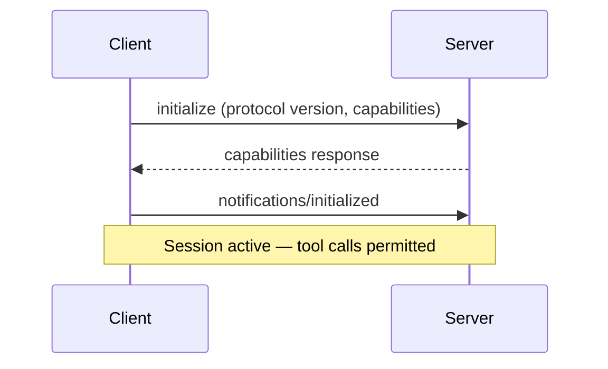

# MCP Client Design: Building Robust Host-Side Logic

> MCP client design is the host-side logic that connects to MCP servers, negotiates capabilities, routes tool calls, caches descriptions, enforces timeouts, and degrades gracefully on failure.

## Host, Client, Server

MCP separates three participants. Each client handles one server connection with its own session state, capabilities, and transport:

| Role | Responsibility |
|------|---------------|
| **Host** | The AI application; creates and manages client instances |
| **Client** | One instance per server connection; handles protocol lifecycle |
| **Server** | Exposes tools, resources, and prompts over MCP |

## Connection Lifecycle

Initialization is a strict three-step sequence ([MCP spec](https://modelcontextprotocol.io/specification/2025-03-26/basic/lifecycle)):



Client rules: do not batch `initialize`; send no non-ping requests before the capability response; disconnect on unsupported protocol versions; use only negotiated features.

### Shutdown

Shutdown differs by transport:

| Transport | Shutdown sequence |
|-----------|------------------|
| **stdio** | Close stdin, wait for server exit, send SIGTERM, then SIGKILL |
| **Streamable HTTP** | Send HTTP DELETE with session ID; closing the connection also signals termination |

## Multi-Server Tool Routing

MCP defines no collision resolution. When servers share a tool name, the host picks:

- **Namespace by server ID.** Maintain a `serverId -> tools[]` map; route `tools/call` to the owning client.
- **Priority ordering.** Assign precedence; higher-priority server wins on collision.
- **User disambiguation.** Ask the user. Interactive sessions only.

## Tool Description Caching

Two approaches cut `tools/list` latency and tokens:

- **Static caching.** Cache `tools/list` locally; re-fetch on `notifications/tools/list_changed`, TTL expiry, or explicit refresh.
- **Dynamic discovery.** Expose a search interface; the agent fetches schemas only for matched tools at call time — Anthropic's Tool Search Tool reports ~85% token reduction versus loading all definitions upfront ([advanced tool use](https://www.anthropic.com/engineering/advanced-tool-use)).

## Timeout and Cancellation

On timeout: send `notifications/cancelled` with the request ID, stop waiting, log. Progress notifications MAY reset the clock; enforce a hard maximum to prevent stalling.

### Health checks

Either side can send `ping` to verify liveness. Multiple failures trigger reconnection or session reset. Keep ping frequency configurable — aggressive pinging wastes resources.

## Streamable HTTP Session Management

For remote servers using Streamable HTTP:

- Servers MAY assign `Mcp-Session-Id` at init; clients MUST include it on later requests
- On 404 for a known session, the client MUST reinitialize — the session expired or was invalidated
- SSE event IDs and `Last-Event-ID` enable resumability after disconnects, preventing message loss

## Security

### Tool description integrity

A server can change descriptions post-approval without re-consent — a "rug pull" attack. Defenses:

- **Version-pin descriptions.** Hash the manifest at approval; flag post-approval changes.
- **Treat descriptions as untrusted.** Poisoned descriptions can manipulate reasoning to exfiltrate data or trigger unintended actions.

### Authorization

OAuth 2.1 for remote servers: PKCE with S256, [Dynamic Client Registration (RFC 7591)](https://datatracker.ietf.org/doc/html/rfc7591), and [Resource Indicators (RFC 8707)](https://datatracker.ietf.org/doc/html/rfc8707) against confused-deputy attacks.

### Defense layers

| Layer | What it protects | Implementation |
|-------|-----------------|----------------|
| **Sandboxing** | Host system | Container/VM isolation, network egress default-deny |
| **Authorization** | Server identity | OAuth 2.1, per-client consent, resource indicators |
| **Tool integrity** | Model reasoning | Description hashing, version pinning, change detection |
| **Monitoring** | Operational safety | Audit trails, behavioral baselines, anomaly detection |

### Local server hardening

Local Streamable HTTP servers must validate `Origin`, bind to localhost, and require auth — preventing DNS rebinding.

## Observability

| Metric | Why it matters |
|--------|---------------|
| Session init success/failure rate | Flaky connections surface as tool call failures |
| `tools/list` latency | Slow discovery delays agent startup |
| `call_tool` latency (avg, p95) | Identifies slow or degraded servers |
| Error rate per tool and server | Surfaces reliability issues per integration |
| Tool registry size (token count) | Tracks context window cost of tool descriptions |

## When This Backfires

**Caching stales tool schemas.** Static TTL caching fails against servers pushing frequent updates. If a required parameter changes between refreshes, the agent issues malformed calls. Short TTLs or `notifications/tools/list_changed` cut risk but raise `tools/list` traffic.

**Tool list churn invalidates provider prompt caches.** Providers key prompt caching on the tool list; mid-session changes raise per-turn costs. Avoid designs that shift the visible tool set between turns.

**Full routing stack overhead on single-server agents.** Namespace maps, priority ordering, and per-server lifecycle yield no benefit with one server. Apply multi-server routing only when collision risk is real.

**OAuth 2.1 PKCE assumes a capable HTTP client.** CLI or embedded agents may lack the browser or system capabilities the flow expects.

## Example

A TypeScript host with namespace routing and cached tool lists:

```typescript
interface ServerSession {
  id: string;
  client: McpClient;
  tools: Map<string, ToolDefinition>;
  lastToolsFetch: number;
}

class McpHost {
  private sessions: Map<string, ServerSession> = new Map();

  async routeToolCall(toolName: string): Promise<ServerSession> {
    // Namespace lookup: find which server owns this tool
    for (const [id, session] of this.sessions) {
      if (session.tools.has(toolName)) return session;
    }
    throw new Error(`No server provides tool: ${toolName}`);
  }

  async refreshToolsIfStale(session: ServerSession, ttlMs = 300_000) {
    if (Date.now() - session.lastToolsFetch > ttlMs) {
      const response = await session.client.listTools();
      session.tools = new Map(response.tools.map(t => [t.name, t]));
      session.lastToolsFetch = Date.now();
    }
  }
}
```

One `ServerSession` per MCP server; tool calls route through the namespace map; lists refresh only on TTL expiry or a `listChanged` notification.

## Related

- [MCP Client/Server Architecture](mcp-client-server-architecture.md)
- [MCP Server Design](mcp-server-design.md)
- [MCP: The Plumbing Behind Agent Tool Access](../standards/mcp-protocol.md)
- [MCP Elicitation: Servers Requesting Structured Input Mid-Task](mcp-elicitation.md)
- [MCP LLM Sampling: Servers Requesting AI Inference Mid-Tool](mcp-llm-sampling.md)
- [MCP Tool Result Persistence via _meta Annotation](mcp-result-persistence-annotation.md)
- [Token-Efficient Tool Design: Tools That Don't Eat Your Context](token-efficient-tool-design.md)
- [Copilot Extensions to MCP Migration](copilot-extensions-to-mcp-migration.md)
- [Circuit Breakers for Agent Loops](../observability/circuit-breakers.md)
- [Blast Radius Containment: Least Privilege for AI Agents](../security/blast-radius-containment.md)
- [Advanced Tool Use: Scaling Agent Tool Libraries](advanced-tool-use.md)
- [Tool Description Quality for Effective Agent Guidance](tool-description-quality.md)
