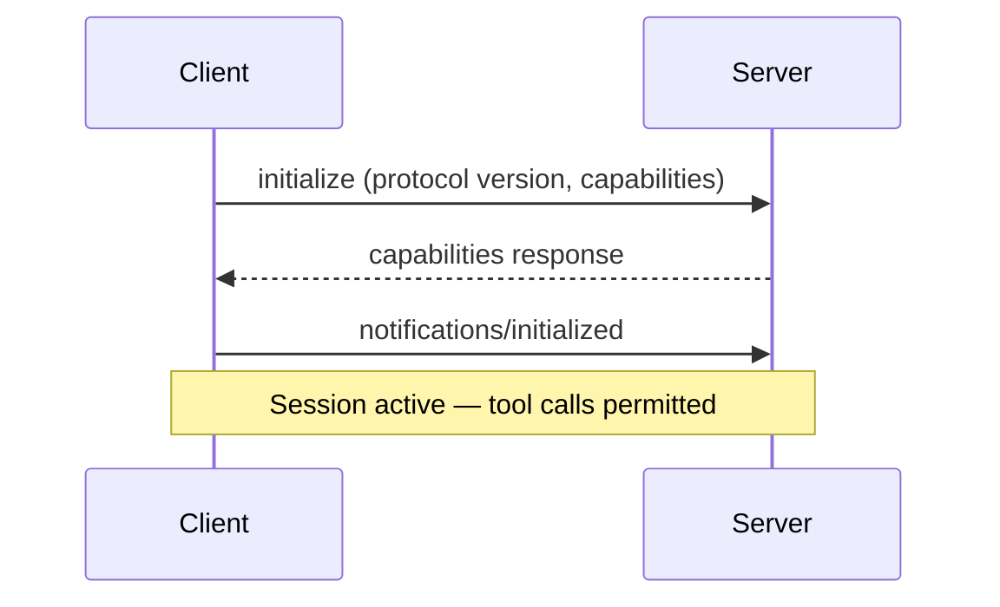

# MCP Client Design: Building Robust Host-Side Logic

> MCP client design is the host-side logic that connects to one or more MCP servers, negotiates capabilities, routes tool calls to the right server, caches tool descriptions, enforces timeouts, and degrades gracefully when servers fail.

## Host, Client, Server

MCP architecture separates three participants:

| Role | Responsibility |
|------|---------------|
| **Host** | The AI application; creates and manages client instances |
| **Client** | One instance per server connection; handles protocol lifecycle |
| **Server** | Exposes tools, resources, and prompts over MCP |

The host creates one client per server; each client maintains its own session state, capabilities, and transport.

## Connection Lifecycle

Initialization is a strict three-step sequence ([MCP lifecycle spec](https://modelcontextprotocol.io/specification/2025-03-26/basic/lifecycle)):



Client rules: do not batch `initialize` with other requests; send no non-ping requests until capability response arrives; disconnect on unsupported protocol version; only use negotiated capabilities.

### Shutdown

Shutdown differs by transport:

| Transport | Shutdown sequence |
|-----------|------------------|
| **stdio** | Close stdin, wait for server exit, send SIGTERM, then SIGKILL |
| **Streamable HTTP** | Send HTTP DELETE with session ID; closing the connection also signals termination |

## Multi-Server Tool Routing

MCP defines no collision resolution. When servers expose tools with the same name, the host resolves routing:

**Namespace by server ID.** Maintain a `serverId -> tools[]` map; route `tools/call` to the correct client based on namespace.

**Priority ordering.** Assign precedence to servers; higher-priority server wins on name collision.

**User disambiguation.** Let the user choose. Interactive sessions only.

## Tool Description Caching

Two approaches to cut `tools/list` latency and token cost:

### Static caching

Cache `tools/list` locally; re-fetch on `notifications/tools/list_changed`, TTL expiry, or explicit refresh.

### Dynamic discovery

Expose a search interface; the agent fetches schemas only for matched tools at execution time — Anthropic's Tool Search Tool reports ~85% token reduction versus loading all definitions upfront ([advanced tool use](https://www.anthropic.com/engineering/advanced-tool-use)).

## Timeout and Cancellation

Establish per-request timeouts. When a timeout fires:

1. Send `notifications/cancelled` with the request ID
2. Stop waiting for the response
3. Log the timeout

Progress notifications MAY reset the clock, but enforce a hard maximum to prevent stalling.

### Health checks

Either side can send a `ping` request to verify liveness. Multiple failed pings should trigger a reconnection attempt or session reset. Make ping frequency configurable — aggressive pinging wastes resources on stable connections.

## Streamable HTTP Session Management

For remote servers using Streamable HTTP:

- Servers MAY assign an `Mcp-Session-Id` at initialization; clients MUST include it on all subsequent requests
- If the server returns 404 for a known session ID, the client MUST reinitialize — the session has expired or been invalidated
- SSE event IDs and the `Last-Event-ID` header enable resumability after disconnects, protecting against message loss

## Security

### Tool description integrity

A server can change tool descriptions post-approval without triggering re-consent — a "rug pull" attack. Defenses:

- **Version-pin descriptions.** Hash the manifest at approval and flag post-approval changes.
- **Treat descriptions as untrusted.** Poisoned descriptions can manipulate reasoning to exfiltrate data or trigger unintended actions.

### Authorization

OAuth 2.1 for remote servers: use PKCE with S256; [Dynamic Client Registration (RFC 7591)](https://datatracker.ietf.org/doc/html/rfc7591) for registration; consider [Resource Indicators (RFC 8707)](https://datatracker.ietf.org/doc/html/rfc8707) against confused deputy attacks.

### Defense layers

| Layer | What it protects | Implementation |
|-------|-----------------|----------------|
| **Sandboxing** | Host system | Container/VM isolation, network egress default-deny |
| **Authorization** | Server identity | OAuth 2.1, per-client consent, resource indicators |
| **Tool integrity** | Model reasoning | Description hashing, version pinning, change detection |
| **Monitoring** | Operational safety | Audit trails, behavioral baselines, anomaly detection |

### Local server hardening

Local Streamable HTTP servers must validate `Origin`, bind to localhost, and require auth to prevent DNS rebinding.

## Observability

| Metric | Why it matters |
|--------|---------------|
| Session init success/failure rate | Flaky connections surface as tool call failures |
| `tools/list` latency | Slow discovery delays agent startup |
| `call_tool` latency (avg, p95) | Identifies slow or degraded servers |
| Error rate per tool and server | Surfaces reliability issues per integration |
| Tool registry size (token count) | Tracks context window cost of tool descriptions |

## When This Backfires

**Caching stales tool schemas.** Static TTL caching works against servers that push frequent schema updates. If a server changes a required parameter between cache refreshes, the agent issues malformed calls. Short TTLs or relying on `notifications/tools/list_changed` reduce this risk but increase `tools/list` traffic.

**Tool list stability affects provider-side caching.** Model providers use prompt caching keyed on the tool list. Adding or removing tools mid-session invalidates that cache, raising per-turn costs. Avoid routing designs that change the visible tool set between turns in a session.

**Full routing stack is overhead for single-server agents.** Namespace maps, priority ordering, and session-per-server lifecycle add complexity that yields no benefit when connecting to one server. Apply multi-server routing only when collision risk is real.

**OAuth 2.1 PKCE + resource indicators assumes a browser or capable HTTP client.** For CLI tools or embedded agents running in constrained environments, the authorization flow may require human interaction or unavailable system capabilities.

## Example

A TypeScript host managing two MCP servers with namespace-based routing and cached tool lists:

```typescript
interface ServerSession {
  id: string;
  client: McpClient;
  tools: Map<string, ToolDefinition>;
  lastToolsFetch: number;
}

class McpHost {
  private sessions: Map<string, ServerSession> = new Map();

  async routeToolCall(toolName: string): Promise<ServerSession> {
    // Namespace lookup: find which server owns this tool
    for (const [id, session] of this.sessions) {
      if (session.tools.has(toolName)) return session;
    }
    throw new Error(`No server provides tool: ${toolName}`);
  }

  async refreshToolsIfStale(session: ServerSession, ttlMs = 300_000) {
    if (Date.now() - session.lastToolsFetch > ttlMs) {
      const response = await session.client.listTools();
      session.tools = new Map(response.tools.map(t => [t.name, t]));
      session.lastToolsFetch = Date.now();
    }
  }
}
```

The host creates one `ServerSession` per MCP server. Tool calls are routed by scanning the namespace map. Tool lists are cached and refreshed only after the TTL expires or a `listChanged` notification arrives.

## Related

- [MCP Client/Server Architecture](mcp-client-server-architecture.md)
- [MCP Server Design](mcp-server-design.md)
- [MCP: The Plumbing Behind Agent Tool Access](../standards/mcp-protocol.md)
- [Token-Efficient Tool Design: Tools That Don't Eat Your Context](token-efficient-tool-design.md)
- [Copilot Extensions to MCP Migration](copilot-extensions-to-mcp-migration.md)
- [Circuit Breakers for Agent Loops](../observability/circuit-breakers.md)
- [Blast Radius Containment: Least Privilege for AI Agents](../security/blast-radius-containment.md)
- [Advanced Tool Use: Scaling Agent Tool Libraries](advanced-tool-use.md)
- [Tool Description Quality for Effective Agent Guidance](tool-description-quality.md)
