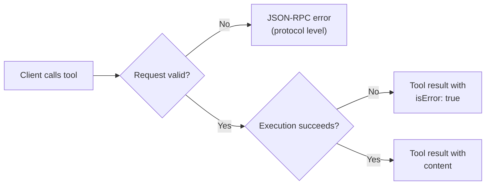
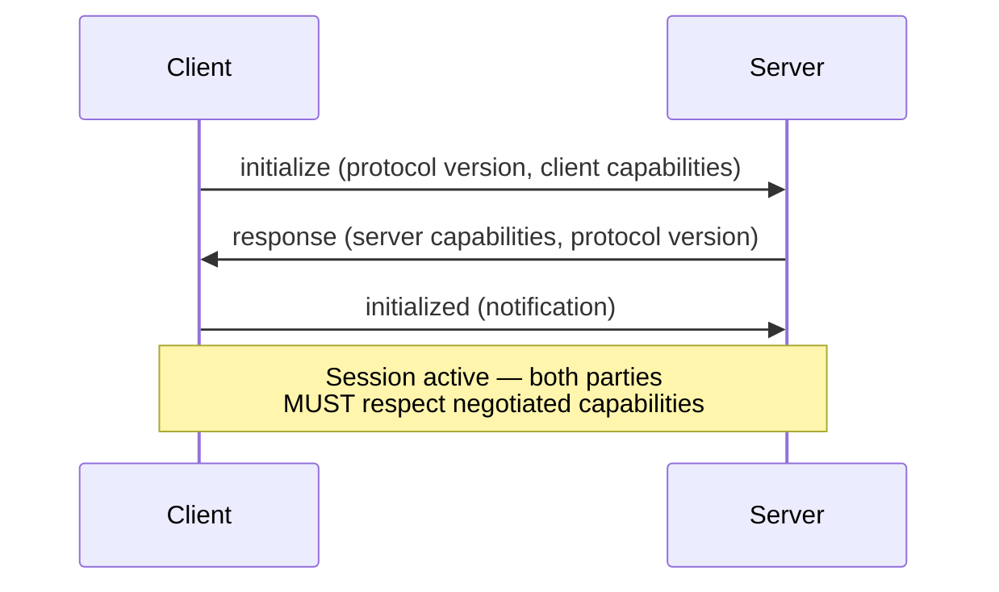

# MCP Client/Server Architecture

> A well-designed MCP server is invisible to the agent. A poorly designed one creates systematic failures across every client that connects — wrong tool selection, bloated context, silent error swallowing, and security gaps.

Five decisions determine whether an MCP integration is reliable or fragile: transport, tool surface, error handling, capability negotiation, and security. The [MCP protocol page](../standards/mcp-protocol.md) covers what MCP is.

## Transport Selection

Transport is a deployment topology decision, not just a latency choice.

| Factor | stdio | Streamable HTTP |
|--------|-------|-----------------|
| **Deployment** | Subprocess of the client | Runs independently |
| **Clients** | Single client per instance | Multiple concurrent clients |
| **Infrastructure** | None — no network, no ports | HTTP server, session management |
| **Security surface** | Process isolation only | Network exposure, requires auth |
| **Use case** | Local dev tools | Shared team servers, cloud services |

**Decision rule:** Use stdio unless you need multiple clients or the server must run on a different machine.

Streamable HTTP requires [specific security measures](https://modelcontextprotocol.io/docs/concepts/transports): validate `Origin` headers (DNS rebinding), bind local servers to localhost, and implement authentication.

## Tool Surface Design

Tool count directly affects agent performance — [Anthropic identifies bloated tool sets as a top failure mode](https://www.anthropic.com/engineering/effective-context-engineering-for-ai-agents).

### Keep tools focused and few

Each tool should have a single, clear purpose. Overlapping tools force selection reasoning that costs tokens and introduces compounding errors.

### Use tool search for large surfaces

When a server must expose many tools, use lazy loading. Claude Code defers MCP tool definitions exceeding 10% of the context window, achieving an [85% token reduction](https://www.anthropic.com/engineering/advanced-tool-use) versus pre-loading. Servers supporting `listChanged` can emit `notifications/tools/list_changed` so clients refresh dynamically.

### Apply poka-yoke to parameters

Design parameters so misuse is structurally impossible — see [Poka-Yoke for Agent Tools](poka-yoke-agent-tools.md). Absolute paths over relative [eliminated path errors entirely](https://www.anthropic.com/engineering/building-effective-agents). Prefer enums over free-text.

### Write self-contained descriptions

Each description must stand alone — include domain context, return shape, and selection signals. Better descriptions [reduced task completion time by 40%](https://www.anthropic.com/engineering/multi-agent-research-system). See [Tool Description Quality](tool-description-quality.md).

### Annotate behavioral hints

Tool annotations — `readOnlyHint`, `destructiveHint`, `idempotentHint`, `openWorldHint` — signal properties to clients for confirmation decisions. Per the [MCP spec](https://modelcontextprotocol.io/specification/2025-03-26/server/tools), clients MUST treat annotations as untrusted unless the server is trusted. `idempotentHint` maps to the [idempotent operations pattern](../agent-design/idempotent-agent-operations.md).

## Error Handling

MCP has two distinct error reporting mechanisms. Conflating them causes silent failures.



**Protocol-level errors** (JSON-RPC): unknown tool, malformed arguments, server unavailable. The call never reached tool logic.

**Tool execution errors** (`isError: true`): the tool ran but failed — invalid input, API down, permission denied. The agent can reason about these.

Servers MUST implement both. A generic JSON-RPC error for a database timeout hides recovery information. `isError: true` with `"Database connection timed out — retry in 5 seconds"` gives an actionable path.

### Output schemas

Tools can declare an `outputSchema` for [structured results](typed-schemas-at-agent-boundaries.md). Servers MUST conform; clients SHOULD validate — enabling typed integrations without free-text parsing.

## Capability Negotiation

Capability negotiation is a mandatory initialization handshake, not an optional feature.



**Version negotiation:** client sends its latest supported version; if the server cannot match, it responds with its own latest. If the client cannot support that version, it SHOULD disconnect — no silent degradation.

Both parties MUST respect negotiated capabilities for the entire session.

## Security Boundaries

MCP enforces server isolation by design. Each connection is isolated, servers receive only necessary context, conversation history stays with the host, and cross-server interactions are controlled by the host.

### Server requirements (from the spec)

- MUST validate all tool inputs
- MUST implement appropriate access controls
- MUST rate-limit tool invocations
- MUST sanitize tool outputs

### Client requirements (from the spec)

- SHOULD implement timeouts for tool calls
- SHOULD log tool usage for audit
- SHOULD show tool inputs to users before calling ([confirmation gates](../security/human-in-the-loop-confirmation-gates.md))

### Enterprise governance

For team deployments: centralized configuration via `managed-mcp.json`, allowlist/denylist policies, project-scoped `.mcp.json` for sharing, and OAuth 2.0 for authentication. Prefer OAuth over personal access tokens.

## Example

A well-designed MCP server for a deployment tool applies the principles above: focused tools, poka-yoke parameters, both error types, and behavioral annotations.

```json
{
  "tools": [
    {
      "name": "deploy_service",
      "description": "Deploy a service to the specified environment. Use this for production and staging deployments. For rollbacks, use rollback_service instead.",
      "inputSchema": {
        "type": "object",
        "properties": {
          "service": { "type": "string", "description": "Service name from the service registry" },
          "environment": { "type": "string", "enum": ["staging", "production"] },
          "version": { "type": "string", "pattern": "^v\\d+\\.\\d+\\.\\d+$" }
        },
        "required": ["service", "environment", "version"]
      },
      "annotations": {
        "destructiveHint": true,
        "idempotentHint": true,
        "openWorldHint": false
      }
    }
  ]
}
```

The `environment` uses an enum, `version` enforces semver via regex, and the description includes a selection signal pointing to `rollback_service`. `destructiveHint` tells clients to require confirmation. On failure, the server returns `isError: true` with a domain-specific message — not a generic JSON-RPC error.

## Unverified Claims

- Tool annotation hints (`readOnlyHint`, `destructiveHint`, `idempotentHint`, `openWorldHint`) — confirmed in spec schema, but the annotation reference page returned 404; defaults could not be independently verified

## Related

- [MCP Server Design](mcp-server-design.md)
- [MCP Client Design](mcp-client-design.md)
- [MCP: The Plumbing Behind Agent Tool Access](../standards/mcp-protocol.md)
- [Tool Description Quality](tool-description-quality.md)
- [Token-Efficient Tool Design](token-efficient-tool-design.md)
- [Consolidate Agent Tools](consolidate-agent-tools.md)
- [Blast Radius Containment](../security/blast-radius-containment.md)
- [Proprietary-to-Open-Standard Migration](copilot-extensions-to-mcp-migration.md)
- [Typed Schemas at Agent Boundaries](typed-schemas-at-agent-boundaries.md)
- [RFC 9457 Machine-Readable Errors](rfc9457-machine-readable-errors.md)
