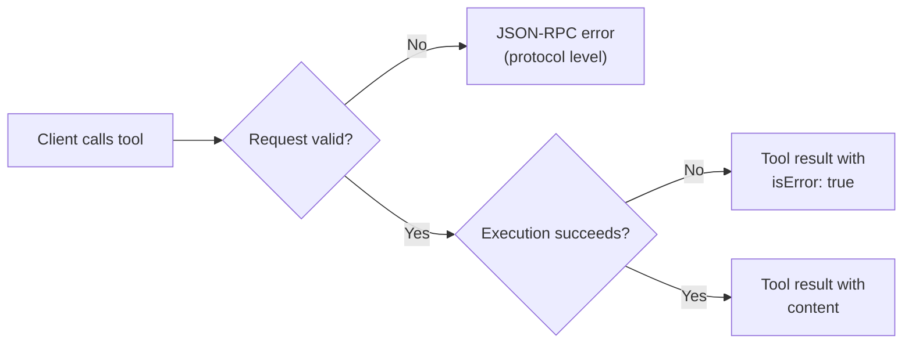
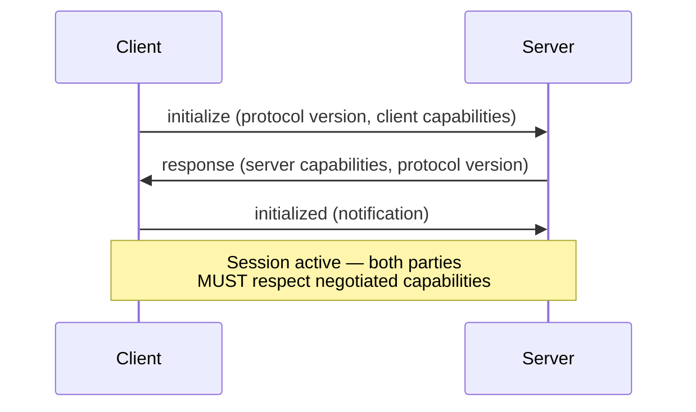

# MCP Client/Server Architecture

> A well-designed MCP server is invisible to the agent. A poor one fails systematically across every client — wrong tool selection, bloated context, silent error swallowing, security gaps.

Five decisions determine whether an MCP integration holds up: transport, tool surface, error handling, capability negotiation, security. See [MCP protocol](../standards/mcp-protocol.md) for background.

## Transport Selection

Transport is a deployment topology decision, not a latency choice.

| Factor | stdio | Streamable HTTP |
|--------|-------|-----------------|
| **Deployment** | Subprocess of the client | Independent process |
| **Clients** | Single per instance | Multiple concurrent |
| **Infrastructure** | None | HTTP server, session management |
| **Security surface** | Process isolation | Network exposure, requires auth |
| **Use case** | Local dev tools | Shared team servers, cloud services |

Use stdio unless you need multiple clients or remote hosting. Streamable HTTP adds [required security measures](https://modelcontextprotocol.io/docs/concepts/transports): validate `Origin` (DNS rebinding), bind local servers to localhost, authenticate callers.

## Tool Surface Design

Tool count directly affects agent performance — [Anthropic names bloated tool sets as a top failure mode](https://www.anthropic.com/engineering/effective-context-engineering-for-ai-agents).

### Keep tools focused and few

One tool, one clear purpose. Overlapping tools force selection reasoning that costs tokens and compounds errors.

### Use tool search for large surfaces

Lean on client-side deferral for big tool sets. [Claude Code defers MCP tool definitions by default](https://code.claude.com/docs/en/mcp); `ENABLE_TOOL_SEARCH=auto` loads schemas upfront when they fit in 10% of context, deferring the overflow. Anthropic's benchmark on 50+ MCP tools reports an [85% token reduction](https://www.anthropic.com/engineering/advanced-tool-use) (77K → 8.7K). Servers supporting `listChanged` emit `notifications/tools/list_changed` for dynamic refresh.

### Apply poka-yoke to parameters

Make misuse structurally impossible — see [Poka-Yoke for Agent Tools](poka-yoke-agent-tools.md). Prefer enums to free-text; absolute paths [eliminated path errors entirely](https://www.anthropic.com/engineering/building-effective-agents).

### Write self-contained descriptions

Each description stands alone — domain context, return shape, selection signals. Better descriptions [cut task completion time by 40%](https://www.anthropic.com/engineering/multi-agent-research-system). See [Tool Description Quality](tool-description-quality.md).

### Annotate behavioral hints

`readOnlyHint`, `destructiveHint`, `idempotentHint`, `openWorldHint` signal properties clients use for confirmation. Per the [MCP spec schema](https://raw.githubusercontent.com/modelcontextprotocol/specification/main/schema/2025-03-26/schema.ts), defaults are `destructiveHint: true`, `openWorldHint: true`, `readOnlyHint: false`, `idempotentHint: false` — servers must explicitly override destructive/open-world defaults. Clients MUST treat annotations as untrusted unless the server is trusted. `idempotentHint` maps to the [idempotent operations pattern](../agent-design/idempotent-agent-operations.md).

## Error Handling

MCP has two error mechanisms — conflating them causes silent failures.



**Protocol-level errors** (JSON-RPC): unknown tool, malformed arguments, server unavailable — the call never reached tool logic.

**Tool execution errors** (`isError: true`): the tool ran but failed — invalid input, API down, permission denied. Agents can reason about these.

Servers MUST implement both. A generic JSON-RPC error for a database timeout hides recovery info; `isError: true` with `"Database timed out — retry in 5s"` is actionable.

### Output schemas

Tools can declare an `outputSchema` for [structured results](typed-schemas-at-agent-boundaries.md) — servers MUST conform, clients SHOULD validate.

## Capability Negotiation

Capability negotiation is a mandatory initialization handshake.



Client sends its latest version; the server matches or replies with its own. If the client cannot support that, it SHOULD disconnect — no silent degradation. Both parties MUST respect negotiated capabilities for the whole session.

## Security Boundaries

MCP isolates servers by design: each connection is isolated, servers see only necessary context, conversation history stays with the host, cross-server interactions are host-controlled.

**Server MUSTs:** validate inputs, enforce access controls, rate-limit, sanitize outputs.

**Client SHOULDs:** timeout calls, log for audit, show inputs before calling ([confirmation gates](../security/human-in-the-loop-confirmation-gates.md)).

**Team deployments:** centralized `managed-mcp.json`, allowlist/denylist policies, project-scoped `.mcp.json`, OAuth 2.0 over PATs.

## Example

A deployment-tool MCP server applying the principles above — focused tools, poka-yoke parameters, both error types, behavioral annotations.

```json
{
  "tools": [
    {
      "name": "deploy_service",
      "description": "Deploy a service to the specified environment. Use this for production and staging deployments. For rollbacks, use rollback_service instead.",
      "inputSchema": {
        "type": "object",
        "properties": {
          "service": { "type": "string", "description": "Service name from the service registry" },
          "environment": { "type": "string", "enum": ["staging", "production"] },
          "version": { "type": "string", "pattern": "^v\\d+\\.\\d+\\.\\d+$" }
        },
        "required": ["service", "environment", "version"]
      },
      "annotations": {
        "destructiveHint": true,
        "idempotentHint": true,
        "openWorldHint": false
      }
    }
  ]
}
```

`environment` is an enum, `version` enforces semver via regex, and the description routes rollbacks to a separate tool. `destructiveHint` triggers confirmation. On failure, the server returns `isError: true` with a domain-specific message — not a generic JSON-RPC error.

## When This Backfires

**stdio couples server lifecycle to client.** Client restart drops in-flight operations — prefer Streamable HTTP for long-running tools or shared state.

**Annotations are advisory.** `destructiveHint: true` prompts confirmation but does not block execution. Servers leaning on annotations for access control break when clients ignore hints.

**Capability negotiation is silent on gaps.** A client expecting sampling or elicitation sees method-not-found, not a structured error. Build explicit fallbacks for optional capabilities.

**Lazy loading doesn't fix selection accuracy.** An agent searching 200 tools still chooses worse than one with 10 focused tools — deferral mitigates but does not substitute for curation.

## Related

- [MCP Server Design](mcp-server-design.md)
- [MCP Client Design](mcp-client-design.md)
- [MCP: The Plumbing Behind Agent Tool Access](../standards/mcp-protocol.md)
- [Tool Description Quality](tool-description-quality.md)
- [Token-Efficient Tool Design](token-efficient-tool-design.md)
- [Consolidate Agent Tools](consolidate-agent-tools.md)
- [Blast Radius Containment](../security/blast-radius-containment.md)
- [Proprietary-to-Open-Standard Migration](copilot-extensions-to-mcp-migration.md)
- [Typed Schemas at Agent Boundaries](typed-schemas-at-agent-boundaries.md)
- [RFC 9457 Machine-Readable Errors](rfc9457-machine-readable-errors.md)
- [MCP LLM Sampling](mcp-llm-sampling.md)
- [MCP Elicitation](mcp-elicitation.md)
- [MCP Tool Result Persistence via _meta Annotation](mcp-result-persistence-annotation.md)
- [Advanced Tool Use](advanced-tool-use.md)
- [Browser Automation for Research](browser-automation-for-research.md)
