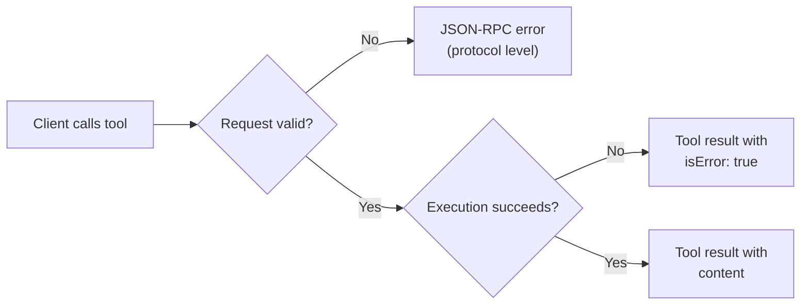
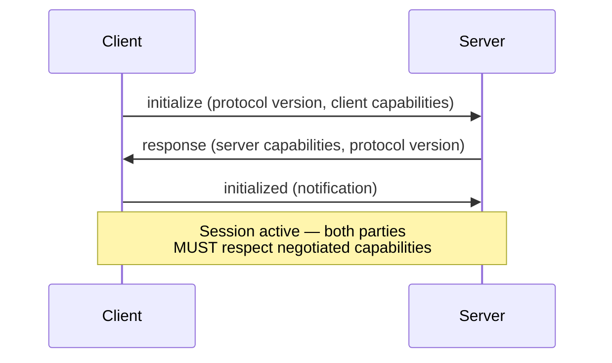

# Five Design Decisions for MCP Servers and Clients

> A well-designed MCP server is invisible to the agent — a poor one fails systematically: wrong tool selection, bloated context, silent errors, security gaps.

Learn it hands-on with the [MCP Tool Exposure lesson](https://learn.agentpatterns.ai/tool-engineering/mcp-tool-exposure/) — a guided lesson with quizzes.

Five decisions determine whether an MCP integration works: transport, tool surface, error handling, capability negotiation, security. See [MCP protocol](../standards/mcp-protocol.md) for background.

## Transport selection

Transport is a deployment topology decision, not a latency choice.

| Factor | stdio | Streamable HTTP |
|--------|-------|-----------------|
| Deployment | Subprocess of the client | Independent process |
| Clients | Single per instance | Multiple concurrent |
| Infrastructure | None | HTTP server, session management |
| Security surface | Process isolation | Network exposure, requires auth |
| Use case | Local dev tools | Shared team servers, cloud services |

Use stdio unless you need multiple clients or remote hosting. Streamable HTTP adds [required security measures](https://modelcontextprotocol.io/docs/concepts/transports). The [MCP spec's security warning](https://modelcontextprotocol.io/specification/2025-06-18/basic/transports) makes `Origin` validation a **MUST for every Streamable HTTP server, local or remote** — it's the DNS-rebinding defense, not a local-only concern. A locally-running server should additionally bind to localhost; all Streamable HTTP servers should authenticate callers. The session management in the table above applies to spec revisions before `2026-07-28`, which made the protocol core stateless — see [Stateless MCP: One Request per Tool Call](../standards/stateless-mcp.md).

## Tool surface design

Tool count directly affects agent performance — [Anthropic names bloated tool sets as a top failure mode](https://www.anthropic.com/engineering/effective-context-engineering-for-ai-agents).

### Keep tools focused and few

One tool, one clear purpose. Overlapping tools force selection reasoning that costs tokens and compounds errors.

### Use tool search for large surfaces

Use client-side deferral for big tool sets. [Claude Code defers MCP tool definitions by default](https://code.claude.com/docs/en/mcp); `ENABLE_TOOL_SEARCH=auto` loads schemas upfront when they fit in 10% of context, deferring the overflow. Anthropic's benchmark on 50+ MCP tools reports an [85% token reduction](https://www.anthropic.com/engineering/advanced-tool-use) (77K → 8.7K). Servers supporting `listChanged` emit `notifications/tools/list_changed` for dynamic refresh.

### Apply poka-yoke to parameters

Make misuse structurally impossible — see [Poka-Yoke for Agent Tools](poka-yoke-agent-tools.md). Prefer enums to free-text; absolute paths [eliminated path errors entirely](https://www.anthropic.com/engineering/building-effective-agents).

### Write self-contained descriptions

Each description stands alone — domain context, return shape, selection signals. Better descriptions [cut task completion time by 40%](https://www.anthropic.com/engineering/multi-agent-research-system). See [Tool Description Quality](tool-description-quality.md).

### Annotate behavioral hints

`readOnlyHint`, `destructiveHint`, `idempotentHint`, `openWorldHint` signal properties clients use for confirmation. Per the [MCP spec schema](https://raw.githubusercontent.com/modelcontextprotocol/specification/main/schema/2025-03-26/schema.ts), defaults are `destructiveHint: true`, `openWorldHint: true`, `readOnlyHint: false`, `idempotentHint: false` — servers must explicitly override destructive/open-world defaults. Clients MUST treat annotations as untrusted unless the server is trusted. `idempotentHint` maps to the [idempotent operations pattern](../patterns/agent-design/idempotent-agent-operations.md).

## Error handling

MCP has two error mechanisms — conflating them causes silent failures.


```mermaid
flowchart LR
    A[Client calls tool] --> B{Request valid?}
    B -->|No| C["JSON-RPC error
    (protocol level)"]
    B -->|Yes| D{Execution succeeds?}
    D -->|No| E["Tool result with
    isError: true"]
    D -->|Yes| F[Tool result with
    content]
```

Protocol-level errors (JSON-RPC): unknown tool, malformed arguments, server unavailable — the call never reached tool logic.

Tool execution errors (`isError: true`): the tool ran but failed — invalid input, API down, permission denied. Agents can reason about these.

Servers MUST implement both. A generic JSON-RPC error for a database timeout hides recovery info; `isError: true` with `"Database timed out — retry in 5s"` is actionable.

### Output schemas

Tools can declare an `outputSchema` for [structured results](../patterns/multi-agent/typed-schemas-at-agent-boundaries.md) — servers MUST conform, clients SHOULD validate.

## Capability negotiation

Capability negotiation is a mandatory MCP initialization handshake.


```mermaid
sequenceDiagram
    participant C as Client
    participant S as Server
    C->>S: initialize (protocol version, client capabilities)
    S->>C: response (server capabilities, protocol version)
    C->>S: initialized (notification)
    Note over C,S: Session active — both parties<br/>MUST respect negotiated capabilities
```

Client sends its latest version; the server matches or replies with its own. If the client cannot support that, it SHOULD disconnect — no silent degradation. Both parties MUST respect negotiated capabilities for the whole session.

## Security boundaries

MCP isolates servers by design: each connection is isolated, servers see only necessary context, conversation history stays with the host, cross-server interactions are host-controlled.

Server MUSTs: validate inputs, enforce access controls, rate-limit, sanitize outputs.

Client SHOULDs: timeout calls, log for audit, show inputs before calling ([confirmation gates](../security/human-in-the-loop-confirmation-gates.md)).

Team deployments: centralized `managed-mcp.json`, allowlist/denylist policies, project-scoped `.mcp.json`, OAuth 2.0 over PATs.

## Example

A deployment-tool MCP server applying the principles above — focused tools, poka-yoke parameters, both error types, behavioral annotations.

```json
{
  "tools": [
    {
      "name": "deploy_service",
      "description": "Deploy a service to the specified environment. Use this for production and staging deployments. For rollbacks, use rollback_service instead.",
      "inputSchema": {
        "type": "object",
        "properties": {
          "service": { "type": "string", "description": "Service name from the service registry" },
          "environment": { "type": "string", "enum": ["staging", "production"] },
          "version": { "type": "string", "pattern": "^v\\d+\\.\\d+\\.\\d+$" }
        },
        "required": ["service", "environment", "version"]
      },
      "annotations": {
        "destructiveHint": true,
        "idempotentHint": true,
        "openWorldHint": false
      }
    }
  ]
}
```

`environment` is an enum, `version` enforces semver via regex, and the description routes rollbacks to a separate tool. `destructiveHint` triggers confirmation. On failure, the server returns `isError: true` with a domain-specific message — not a generic JSON-RPC error.

## When this backfires

stdio couples server lifecycle to client. Client restart drops in-flight operations — prefer Streamable HTTP for long-running tools or shared state.

Annotations are advisory. `destructiveHint: true` prompts confirmation but does not block execution. Servers that rely on annotations for access control break when clients ignore hints.

Capability negotiation is silent on gaps. A client expecting sampling or elicitation sees method-not-found, not a structured error. Build explicit fallbacks for optional capabilities.

Lazy loading does not fix selection accuracy. An agent searching 200 tools still chooses worse than one with 10 focused tools — deferral mitigates but does not substitute for curation.

## Key Takeaways

- Transport choice is a deployment-topology decision: stdio for single-client local tools, Streamable HTTP for shared or remote servers. `Origin` validation is a spec MUST on every Streamable HTTP server regardless of topology, plus auth (and localhost binding when locally-running).
- Tool surface drives agent accuracy — keep tools focused, defer schemas with tool search for large surfaces, and apply poka-yoke to parameters.
- Implement both error mechanisms: JSON-RPC errors for protocol failures, `isError: true` results for execution failures the agent can reason about.
- Capability negotiation is mandatory and silent on gaps — build explicit fallbacks for optional capabilities like sampling and elicitation.
- Annotations (`destructiveHint`, `readOnlyHint`, `idempotentHint`, `openWorldHint`) are advisory hints to clients, not access controls — enforce security on the server.

## Related

- [MCP Server Design](mcp-server-design.md)
- [MCP Client Design](mcp-client-design.md)
- [MCP: The Plumbing Behind Agent Tool Access](../standards/mcp-protocol.md)
- [Tool Description Quality](tool-description-quality.md)
- [MCP alwaysLoad: Eager vs Just-in-Time Server Classification](mcp-eager-vs-jit-loading.md)
- [MCP LLM Sampling](mcp-llm-sampling.md)
- [MCP Elicitation](mcp-elicitation.md)
- [MCP Tool Result Persistence via _meta Annotation](mcp-result-persistence-annotation.md)
