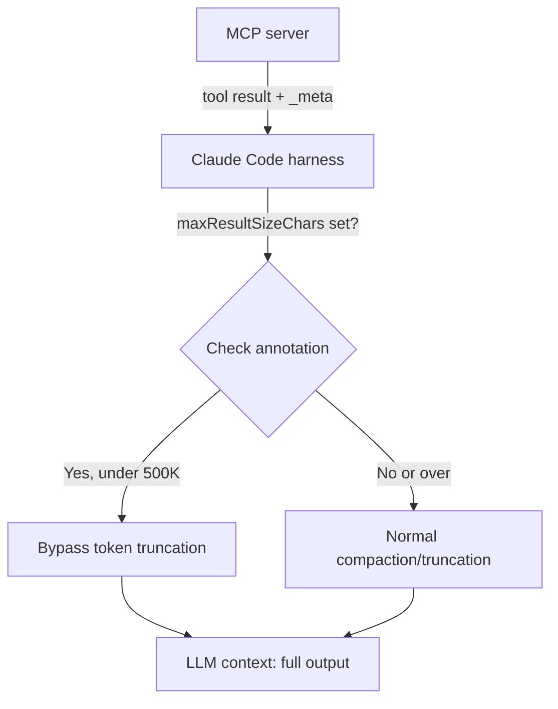

# MCP Tool Result Persistence via _meta Annotation

> Claude Code lets MCP servers flag individual tool outputs as durable — up to 500,000 characters survive context compaction verbatim when the server sets the right `_meta` key.

## What the Annotation Does

Claude Code v2.1.91 added an MCP tool result persistence override via the `_meta["anthropic/maxResultSizeChars"]` annotation, allowing results up to 500K characters to pass through without truncation ([Claude Code changelog](https://code.claude.com/docs/en/changelog)). A subsequent release fixed tools annotated this way not bypassing the token-based persist layer, confirming the enforcement point is the Claude Code harness — not the model.

The decision is per tool call, made by the server. The LLM never sees the annotation; it only sees the preserved bytes in its context.



## Where It Lives in the MCP Shape

MCP reserves the `_meta` object on requests, responses, and tool results as a vendor-namespaced extension point for implementation-specific metadata that travels with the payload without polluting the protocol schema. Claude Code reads the `anthropic/maxResultSizeChars` key from that object:

```json
{
  "content": [
    {
      "type": "text",
      "text": "CREATE TABLE orders (...); CREATE TABLE line_items (...); ..."
    }
  ],
  "_meta": {
    "anthropic/maxResultSizeChars": 500000
  }
}
```

Set the value to the maximum number of characters you want preserved. The cap is 500,000.

## When to Set It

Durability costs window budget. Transformer attention is computed across all tokens in the window, and [Anthropic documents](https://www.anthropic.com/engineering/effective-context-engineering-for-ai-agents) that attention spreads thin as context grows. Preserved outputs consume that budget for the rest of the session. Set the annotation only when the output meets all three conditions:

| Condition | Example |
|-----------|---------|
| Reference material re-read across turns | Database schema, generated API spec, config dump |
| Verbatim fidelity matters | Column names, types, constraints that must not be paraphrased |
| No cheaper offload path | Cannot be written to disk and re-fetched via filesystem tools |

## When Not to Set It

- **Single-consumption outputs.** The agent reads the result once and moves on. Default compaction is correct.
- **Large outputs with offload paths.** A generated SQL file the agent could write to disk and re-read via Read/Grep is cheaper than persisting it in-window. Manus's [file-system-as-memory pattern](https://manus.im/blog/Context-Engineering-for-AI-Agents-Lessons-from-Building-Manus) generalises this.
- **Blanket defaults.** Setting the annotation on every tool's output inflates context for sessions that did not need the payload, accelerating [dumb-zone](../context-engineering/context-window-dumb-zone.md) onset on smaller-window models.
- **Outputs that compress well.** If a summary of the result is good enough for downstream reasoning, let auto-compaction summarise and save the budget.

## Tool Design Implication

The annotation creates a natural split in MCP server tool design: small default outputs versus opt-in large-reference outputs.

- Default tools return a semantic, filtered response ([Semantic Tool Output](semantic-tool-output.md)) — summary fields, human-readable values, no persistence annotation.
- A companion tool (or a `response_format: "full"` enum) returns the durable reference payload with `maxResultSizeChars` set. The agent picks based on whether downstream turns will re-read the result.

This mirrors the MCP spec's guidance for read-only context: expose it as a resource or a dedicated fetch tool, not as a side effect of every tool call.

## Differentiation from Adjacent Primitives

| Primitive | Scope | Who decides |
|-----------|-------|-------------|
| `_meta["anthropic/maxResultSizeChars"]` | Per tool call | MCP server author |
| `CLAUDE_AUTOCOMPACT_PCT_OVERRIDE` | Whole session | User / environment |
| Manual `/compact` with focus | Whole session | User at transition points |
| Filesystem offload | Per output | Tool author (write to disk, re-read on demand) |

The annotation is the only one of these that operates at the granularity of a single tool result and is controlled by the server rather than the user or the agent.

## Example

An MCP server exposes two tools against a production database:

- `describe_tables` — returns short table summaries for browsing. No persistence annotation. Auto-compaction can summarise these freely as the agent moves on.
- `dump_full_schema` — returns the complete `CREATE TABLE` DDL for selected tables. Sets `_meta["anthropic/maxResultSizeChars"]: 500000` because the agent will reference column names, types, and constraints repeatedly while writing migrations and queries.

```python
# Pseudocode — MCP server tool handler
def dump_full_schema(tables: list[str]) -> ToolResult:
    ddl = fetch_schema_ddl(tables)  # up to ~400K chars
    return ToolResult(
        content=[TextContent(type="text", text=ddl)],
        meta={"anthropic/maxResultSizeChars": 500000},
    )
```

The agent calls `dump_full_schema` once at the start of a migration task. The full DDL remains in context for the rest of the session even after auto-compaction would normally summarise it away. `describe_tables` calls made later in the same session are still subject to compaction — only the flagged output is durable.

## Key Takeaways

- `_meta["anthropic/maxResultSizeChars"]` (cap 500K) marks a single MCP tool result as durable through Claude Code's compaction pipeline.
- Enforcement is in the harness, not the model — the LLM sees preserved bytes, not the annotation.
- Set it only for reference material that is re-read across turns, where verbatim fidelity matters, and where no cheaper offload path exists.
- Avoid blanket application; on smaller-window models it accelerates context-window dumb-zone onset.
- Design MCP servers with a small default output and an explicit large-reference fetch tool — persistence is the opt-in mode.

## Related

- [MCP Server Design](mcp-server-design.md)
- [Semantic Tool Output](semantic-tool-output.md)
- [Token-Efficient Tool Design](token-efficient-tool-design.md)
- [Manual Compaction as Dumb Zone Mitigation](../context-engineering/manual-compaction-dumb-zone-mitigation.md)
- [Context Window Dumb Zone](../context-engineering/context-window-dumb-zone.md)
- [Context Compression Strategies](../context-engineering/context-compression-strategies.md)
- [MCP Client/Server Architecture](mcp-client-server-architecture.md)
- [MCP Elicitation](mcp-elicitation.md)
