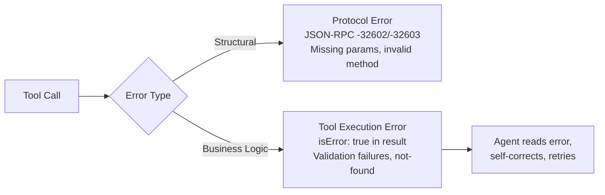

# MCP Server Design: A Server Author's Checklist

> A well-designed MCP server makes the right tool call obvious. A poorly designed one burns tokens on retries, confuses routing, and forces agents into blind debugging.

## First Decision: Tool, Resource, or Prompt?

Choosing the wrong primitive creates friction before naming or schema design matters.

| Primitive | Controlled By | Use When | Example |
|-----------|--------------|----------|---------|
| **Tool** | Model (agent invokes) | The agent needs to take an action or fetch dynamic data | `create_issue`, `search_logs` |
| **Resource** | Application (client attaches) | Read-only context the agent should see but not invoke | Project config, schema definitions, environment info |
| **Prompt** | User (slash command) | Reusable multi-step workflows triggered by the user | `/summarize-pr`, `/deploy-staging` |

Resources support `audience` and `priority` annotations for client-side filtering. Tools return `resource_link` references instead of embedding full content.

## Tool Naming

The MCP spec allows 1--128 characters using `A-Z a-z 0-9 _ - .` with no spaces.

**Conventions that work:**

- **snake_case** -- used by >90% of public MCP servers ([zazencodes analysis](https://zazencodes.com/blog/mcp-server-naming-conventions))
- **verb_noun pattern** -- `search_customer_orders` not `query_db_orders`; `create_jira_issue` not `jira_create`
- **32 characters or fewer** -- short enough for tool search matching, long enough to be descriptive
- **No version numbers or abbreviations** -- `search_products` not `prod_lookup_v2`

Tool search matches names and descriptions -- `query_db_orders` causes routing failures; `search_customer_orders` tells the agent exactly what it gets ([Anthropic](https://www.anthropic.com/engineering/advanced-tool-use)).

## Schema Design

`inputSchema` must be a valid JSON Schema object (use `{"type":"object","additionalProperties":false}` for parameterless tools).

### Schemas Cannot Express Everything

JSON Schema defines types and constraints, not format conventions or domain-specific usage. Supplement with examples.

Providing 1--5 realistic examples improved accuracy from 72% to 90% in Anthropic tests ([Advanced Tool Use](https://www.anthropic.com/engineering/advanced-tool-use)).

### What Good Schema Design Looks Like

```json
{
  "name": "search_logs",
  "description": "Search application logs by time range and severity. Returns max 100 entries. Use list_services first to get valid service names. Do NOT use for metrics -- use query_metrics instead.",
  "inputSchema": {
    "type": "object",
    "properties": {
      "service": {
        "type": "string",
        "description": "Service name from list_services (e.g., 'auth-api', 'payment-worker')"
      },
      "severity": {
        "type": "string",
        "enum": ["debug", "info", "warn", "error", "fatal"],
        "default": "error"
      },
      "since": {
        "type": "string",
        "description": "ISO 8601 timestamp. Must be within last 30 days. Example: '2026-03-01T00:00:00Z'"
      }
    },
    "required": ["service", "severity"],
    "additionalProperties": false
  }
}
```

Key moves: enums reduce guesswork, defaults handle common cases, descriptions state constraints with examples, negative guidance says when *not* to use the tool.

### Output Schema and Annotations

`outputSchema` enables structured content validation. Return both `structuredContent` (validated) and serialized JSON in `content` for backwards compatibility.

Tool annotations (`readOnlyHint`, `destructiveHint`, `idempotentHint`, `openWorldHint`) describe behavior for clients. Treat them as metadata -- clients must not trust them from untrusted servers. Set `idempotentHint: true` for tools that follow the [idempotent operations pattern](../agent-design/idempotent-agent-operations.md) -- same inputs produce the same end state on repeated calls.

## Error Handling

MCP has two error channels:



**Protocol errors** (JSON-RPC codes) signal structural problems -- wrong method, missing parameters. These are for the client, not the agent.

**Tool execution errors** (`isError: true` in the result) are for the agent. The spec states these should contain "actionable feedback that language models can use to self-correct and retry."

### Actionable Error Pattern

| Error Style | Agent Can Self-Correct? |
|-------------|------------------------|
| `"Error"` | No |
| `"Invalid date format"` | Maybe |
| `"Invalid departure date: must be in the future. Current date is 2026-03-13."` | Yes |

Include: what was wrong, what the constraint is, and enough context to fix it. This is the poka-yoke principle applied to error messages -- eliminate guesswork that leads to retry loops ([Anthropic](https://www.anthropic.com/engineering/building-effective-agents)).

## Token Efficiency

Tool definitions consume 50,000+ tokens before an agent processes a single request -- a server design problem, not just a client problem.

### The Scale of the Problem

| Approach | Tokens | Success Rate |
|----------|--------|-------------|
| All tools loaded upfront (2,500 endpoints) | ~1,170,000 | Variable |
| Tool search (top-k matching) | ~8,700 | Comparable |
| Code Mode (typed SDK + 2 tools) | ~1,000 | Not reported |
| Dynamic Toolsets (search/describe/execute) | 96% reduction | 100% reported |

Sources: [Anthropic](https://www.anthropic.com/engineering/advanced-tool-use), [Cloudflare](https://blog.cloudflare.com/code-mode-mcp/), [Speakeasy](https://www.speakeasy.com/blog/how-we-reduced-token-usage-by-100x-dynamic-toolsets-v2).

### Server-Side Mitigations

- **Keep tool lists small.** Single responsibility per server; curate minimal, non-overlapping toolsets.
- **Design for lazy discovery.** Agents discover tools contextually, not upfront ([Bui 2025](https://arxiv.org/abs/2603.05344)). Write clear server instructions so tool search finds your tools.
- **Make responses clearable.** Return only what the agent needs next. Tool result clearing is "one of the safest lightest touch forms of compaction" ([Anthropic](https://www.anthropic.com/engineering/effective-context-engineering-for-ai-agents)).
- **Input schemas dominate per-tool token cost.** Trim optional fields that agents rarely use. Consider `$ref` deduplication for shared types.

## Server Design Checklist

```
[ ] Each tool follows verb_noun snake_case naming
[ ] Every parameter has a description with constraints and examples
[ ] Enums and defaults are used wherever possible
[ ] Tool descriptions state when NOT to use the tool
[ ] Errors include the constraint, the violation, and recovery context
[ ] Read-only context is exposed as resources, not tools
[ ] Tool list is under 15 tools per server
[ ] Responses return only what the agent needs for its next decision
[ ] Server has clear instructions for tool search discoverability
```

## Related

- [MCP Client/Server Architecture](mcp-client-server-architecture.md)
- [MCP Client Design](mcp-client-design.md)
- [Agent-Computer Interface](agent-computer-interface.md)
- [Token-Efficient Tool Design](token-efficient-tool-design.md)
- [Tool Description Quality](tool-description-quality.md)
- [Poka-Yoke Agent Tools](poka-yoke-agent-tools.md)
- [Advanced Tool Use](advanced-tool-use.md)
- [Consolidate Agent Tools](consolidate-agent-tools.md)
- [Tool Descriptions as Onboarding](tool-descriptions-as-onboarding.md)
- [Tool Engineering](tool-engineering.md)
- [Dynamic Tool Fetching Breaks KV Cache](../anti-patterns/dynamic-tool-fetching-cache-break.md)
- [Machine-Readable Error Responses (RFC 9457)](rfc9457-machine-readable-errors.md)
- [Typed Schemas at Agent Boundaries](typed-schemas-at-agent-boundaries.md)
- [Semantic Tool Output](semantic-tool-output.md)
- [Tool Minimalism](tool-minimalism.md)
- [Self-Healing Tool Routing](self-healing-tool-routing.md)
- [MCP Result Persistence Annotation](mcp-result-persistence-annotation.md)
