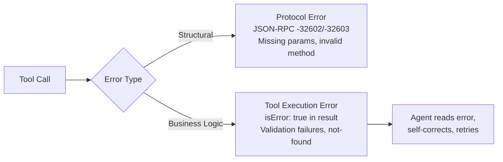

# MCP Server Design: A Server Author's Checklist

> A well-designed MCP server makes the right tool call obvious. A poorly designed one burns tokens on retries, confuses routing, and forces agents into blind debugging.

## First Decision: Tool, Resource, or Prompt?

Picking the wrong primitive creates friction before naming or schema design matters.

| Primitive | Controlled By | Use When | Example |
|-----------|--------------|----------|---------|
| **Tool** | Model (agent invokes) | Agent takes action or fetches dynamic data | `create_issue`, `search_logs` |
| **Resource** | Application (client attaches) | Read-only context the agent sees but cannot invoke | Project config, schema, env info |
| **Prompt** | User (slash command) | Reusable multi-step workflows | `/summarize-pr`, `/deploy-staging` |

Resources support `audience` and `priority` annotations for client-side filtering; tools can return `resource_link` references instead of embedding full content.

## Tool Naming

The spec allows 1--128 characters using `A-Z a-z 0-9 _ - .` with no spaces. Conventions that work:

- **snake_case** -- used by >90% of public MCP servers ([zazencodes analysis](https://zazencodes.com/blog/mcp-server-naming-conventions))
- **verb_noun pattern** -- `search_customer_orders` not `query_db_orders`
- **32 characters or fewer** -- descriptive but still matches tool search
- **No version numbers or abbreviations** -- `search_products` not `prod_lookup_v2`

Tool search matches names and descriptions; opaque names cause routing failures ([Anthropic](https://www.anthropic.com/engineering/advanced-tool-use)).

## Schema Design

`inputSchema` must be a valid JSON Schema object (use `{"type":"object","additionalProperties":false}` for parameterless tools). Schemas define types and constraints but not format conventions or domain usage -- supplement with examples. In Anthropic tests, 1--5 realistic examples raised accuracy from 72% to 90% ([Advanced Tool Use](https://www.anthropic.com/engineering/advanced-tool-use)).

### What Good Schema Design Looks Like

```json
{
  "name": "search_logs",
  "description": "Search application logs by time range and severity. Returns max 100 entries. Use list_services first to get valid service names. Do NOT use for metrics -- use query_metrics instead.",
  "inputSchema": {
    "type": "object",
    "properties": {
      "service": {
        "type": "string",
        "description": "Service name from list_services (e.g., 'auth-api', 'payment-worker')"
      },
      "severity": {
        "type": "string",
        "enum": ["debug", "info", "warn", "error", "fatal"],
        "default": "error"
      },
      "since": {
        "type": "string",
        "description": "ISO 8601 timestamp. Must be within last 30 days. Example: '2026-03-01T00:00:00Z'"
      }
    },
    "required": ["service", "severity"],
    "additionalProperties": false
  }
}
```

Enums reduce guesswork, defaults handle common cases, descriptions pair constraints with examples, and negative guidance tells the agent when *not* to call.

### Output Schema and Annotations

`outputSchema` enables structured content validation. Return both `structuredContent` (validated) and serialized JSON in `content` for backwards compatibility. Tool annotations (`readOnlyHint`, `destructiveHint`, `idempotentHint`, `openWorldHint`) are metadata only, not trustable from untrusted servers. Set `idempotentHint: true` for tools following the [idempotent operations pattern](../agent-design/idempotent-agent-operations.md).

## Error Handling

MCP has two error channels:



**Protocol errors** (JSON-RPC codes) are for the client. **Tool execution errors** (`isError: true`) are for the agent; the spec states these should contain "actionable feedback that language models can use to self-correct and retry."

### Actionable Error Pattern

| Error Style | Agent Can Self-Correct? |
|-------------|------------------------|
| `"Error"` | No |
| `"Invalid date format"` | Maybe |
| `"Invalid departure date: must be in the future. Current date is 2026-03-13."` | Yes |

Include what was wrong, the constraint, and context to fix it -- the poka-yoke principle applied to errors, eliminating guesswork that drives retry loops ([Anthropic](https://www.anthropic.com/engineering/building-effective-agents)).

## Token Efficiency

Large tool catalogs can consume tens of thousands of tokens before the agent processes a request -- a server problem, not just a client problem.

### The Scale of the Problem

| Approach | Tokens | Success Rate |
|----------|--------|-------------|
| All tools loaded upfront (2,500 endpoints) | ~1,170,000 | Variable |
| Tool search (top-k matching) | ~8,700 | Comparable |
| Code Mode (typed SDK + 2 tools) | ~1,000 | Not reported |
| Dynamic Toolsets (search/describe/execute) | 96% reduction | 100% reported |

Sources: [Anthropic](https://www.anthropic.com/engineering/advanced-tool-use), [Cloudflare](https://blog.cloudflare.com/code-mode-mcp/), [Speakeasy](https://www.speakeasy.com/blog/how-we-reduced-token-usage-by-100x-dynamic-toolsets-v2).

### Server-Side Mitigations

- **Keep tool lists small.** Single responsibility per server; non-overlapping toolsets.
- **Design for lazy discovery.** Agents discover tools contextually, not upfront ([Bui 2026](https://arxiv.org/abs/2603.05344)). Write clear server instructions so tool search finds yours.
- **Make responses clearable.** Return only what the agent needs next. Tool result clearing is "one of the safest lightest touch forms of compaction" ([Anthropic](https://www.anthropic.com/engineering/effective-context-engineering-for-ai-agents)).
- **Schemas dominate per-tool token cost.** Trim optional fields; consider `$ref` deduplication for shared types.

## When This Backfires

The checklist assumes a stable, internally-owned API. Conditions that invert that:

- **Enums vs. evolving upstream APIs.** Enumerated values encode a snapshot; when the upstream adds one, agents hit validation failures until redeploy. Thin string types trade strict validation for durability.
- **Schemas do not cover input sanitization.** The STDIO execution model in Anthropic's official MCP SDKs runs commands even when the local process fails to start, exposing servers to command injection unless the author sanitizes inputs ([OX Security](https://www.ox.security/blog/mcp-supply-chain-advisory-rce-vulnerabilities-across-the-ai-ecosystem), [SecurityWeek](https://www.securityweek.com/by-design-flaw-in-mcp-could-enable-widespread-ai-supply-chain-attacks/)). Argument sanitization is the mitigation, not richer schemas.
- **Description drift.** Hand-written descriptions are an artifact to keep in sync. Auto-generated wrappers lose prose quality but cannot drift.
- **Over-consolidation hurts routing.** One polymorphic tool pushes disambiguation into the schema; the right ceiling depends on description distinctness, not count.

## Server Design Checklist

```
[ ] Each tool follows verb_noun snake_case naming
[ ] Every parameter has a description with constraints and examples
[ ] Enums and defaults are used wherever possible
[ ] Tool descriptions state when NOT to use the tool
[ ] Errors include the constraint, the violation, and recovery context
[ ] Read-only context is exposed as resources, not tools
[ ] Tool list is under 15 tools per server
[ ] Responses return only what the agent needs for its next decision
[ ] Server has clear instructions for tool search discoverability
```

## Related

- [MCP Client/Server Architecture](mcp-client-server-architecture.md)
- [MCP Client Design](mcp-client-design.md)
- [MCP Elicitation](mcp-elicitation.md)
- [MCP LLM Sampling](mcp-llm-sampling.md)
- [Copilot Extensions to MCP Migration](copilot-extensions-to-mcp-migration.md)
- [Agent-Computer Interface](agent-computer-interface.md)
- [Token-Efficient Tool Design](token-efficient-tool-design.md)
- [Tool Description Quality](tool-description-quality.md)
- [Poka-Yoke Agent Tools](poka-yoke-agent-tools.md)
- [Advanced Tool Use](advanced-tool-use.md)
- [Consolidate Agent Tools](consolidate-agent-tools.md)
- [Tool Descriptions as Onboarding](tool-descriptions-as-onboarding.md)
- [Tool Engineering](tool-engineering.md)
- [Dynamic Tool Fetching Breaks KV Cache](../anti-patterns/dynamic-tool-fetching-cache-break.md)
- [Machine-Readable Error Responses (RFC 9457)](rfc9457-machine-readable-errors.md)
- [Typed Schemas at Agent Boundaries](typed-schemas-at-agent-boundaries.md)
- [Semantic Tool Output](semantic-tool-output.md)
- [Tool Minimalism](tool-minimalism.md)
- [Self-Healing Tool Routing](self-healing-tool-routing.md)
- [MCP Result Persistence Annotation](mcp-result-persistence-annotation.md)
