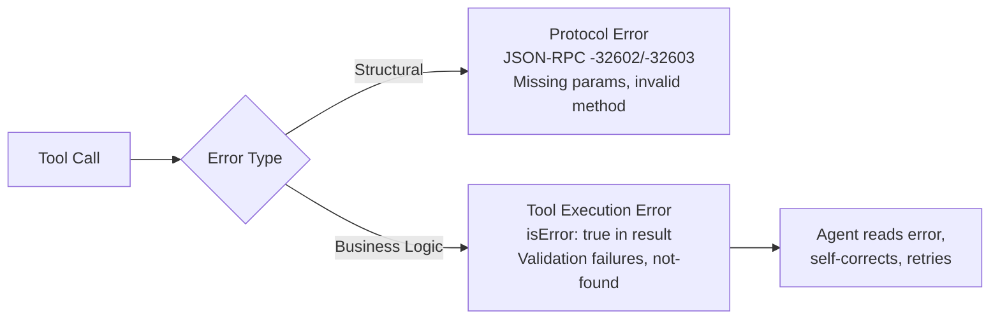

# MCP Server Design: Building Agent-Friendly Servers

> A well-designed MCP server makes the right tool call obvious. A poorly designed one burns tokens on retries, confuses routing, and forces blind debugging.

Learn it hands-on: [What a Server Exposes](https://learn.agentpatterns.ai/mcp-server-design/what-a-server-exposes/) — guided lesson with quizzes.

## First decision: tool, resource, or prompt

Picking the wrong primitive creates friction before naming or schema design matters.

| Primitive | Controlled by | Use when | Example |
|-----------|--------------|----------|---------|
| Tool | Model (agent invokes) | Agent takes action or fetches dynamic data | `create_issue`, `search_logs` |
| Resource | Application (client attaches) | Read-only context the agent sees but cannot invoke | Project config, schema, env info |
| Prompt | User (slash command) | Reusable multi-step workflows | `/summarize-pr`, `/deploy-staging` |

Resources support `audience` and `priority` annotations for client-side filtering. Tools can return `resource_link` references instead of embedding full content.

## Tool naming

The spec allows 1--128 characters using `A-Z a-z 0-9 _ - .` with no spaces. Conventions that work:

- snake_case -- used by more than 90% of public MCP servers ([zazencodes analysis](https://zazencodes.com/blog/mcp-server-naming-conventions))
- verb_noun pattern -- `search_customer_orders` not `query_db_orders`
- 32 characters or fewer -- descriptive but still matches tool search
- No version numbers or abbreviations -- `search_products` not `prod_lookup_v2`

Tool search matches names and descriptions. Opaque names cause routing failures ([Anthropic](https://www.anthropic.com/engineering/advanced-tool-use)).

## Schema design

`inputSchema` must be a valid JSON Schema object (use `{"type":"object","additionalProperties":false}` for parameterless tools). Schemas define types and constraints but not format conventions or domain usage -- supplement with examples. In Anthropic tests, 1--5 realistic examples raised accuracy from 72% to 90% ([Advanced Tool Use](https://www.anthropic.com/engineering/advanced-tool-use)).

### What good schema design looks like

```json
{
  "name": "search_logs",
  "description": "Search application logs by time range and severity. Returns max 100 entries. Use list_services first to get valid service names. Do NOT use for metrics -- use query_metrics instead.",
  "inputSchema": {
    "type": "object",
    "properties": {
      "service": {
        "type": "string",
        "description": "Service name from list_services (e.g., 'auth-api', 'payment-worker')"
      },
      "severity": {
        "type": "string",
        "enum": ["debug", "info", "warn", "error", "fatal"],
        "default": "error"
      },
      "since": {
        "type": "string",
        "description": "ISO 8601 timestamp. Must be within last 30 days. Example: '2026-03-01T00:00:00Z'"
      }
    },
    "required": ["service", "severity"],
    "additionalProperties": false
  }
}
```

Enums reduce guesswork, defaults handle common cases, descriptions pair constraints with examples, and negative guidance tells the agent when not to call.

### Output schema and annotations

`outputSchema` enables structured content validation. Return both `structuredContent` (validated) and serialized JSON in `content` for backwards compatibility. Tool annotations (`readOnlyHint`, `destructiveHint`, `idempotentHint`, `openWorldHint`) are metadata only, not trustable from untrusted servers. Set `idempotentHint: true` for tools following the [idempotent operations pattern](../patterns/agent-design/idempotent-agent-operations.md).

## Error handling

MCP has two error channels:


```mermaid
flowchart LR
    A[Tool Call] --> B{Error Type}
    B -->|Structural| C["Protocol Error<br/>JSON-RPC -32602/-32603<br/>Missing params, invalid method"]
    B -->|Business Logic| D["Tool Execution Error<br/>isError: true in result<br/>Validation failures, not-found"]
    D --> E["Agent reads error,<br/>self-corrects, retries"]
```

Protocol errors (JSON-RPC codes) are for the client. Tool execution errors (`isError: true`) are for the agent. The spec states these should contain "actionable feedback that language models can use to self-correct and retry."

### Actionable error pattern

| Error style | Agent can self-correct |
|-------------|------------------------|
| `"Error"` | No |
| `"Invalid date format"` | Maybe |
| `"Invalid departure date: must be in the future. Current date is 2026-03-13."` | Yes |

Include what was wrong, the constraint, and context to fix it -- the poka-yoke principle applied to errors, eliminating guesswork that causes retry loops ([Anthropic](https://www.anthropic.com/engineering/building-effective-agents)).

## Token efficiency

Large tool catalogs can consume tens of thousands of tokens before the agent processes a request -- a server problem, not just a client problem.

### The scale of the problem

| Approach | Tokens | Success rate |
|----------|--------|-------------|
| All tools loaded upfront (2,500 endpoints) | ~1,170,000 | Variable |
| Tool search (top-k matching) | ~8,700 | Comparable |
| Code Mode (typed SDK + 2 tools) | ~1,000 | Not reported |
| Dynamic Toolsets (search/describe/execute) | 96% reduction | 100% reported |

Sources: [Anthropic](https://www.anthropic.com/engineering/advanced-tool-use), [Cloudflare](https://blog.cloudflare.com/code-mode-mcp/), [Speakeasy](https://www.speakeasy.com/blog/how-we-reduced-token-usage-by-100x-dynamic-toolsets-v2).

### Server-side mitigations

- Keep tool lists small. Give each server a single responsibility and non-overlapping toolsets.
- Design for lazy discovery. Agents discover tools contextually, not upfront ([Bui 2026](https://arxiv.org/abs/2603.05344)). Write clear server instructions so tool search finds yours.
- Make responses clearable. Return only what the agent needs next. Tool result clearing is "one of the safest lightest touch forms of compaction" ([Anthropic](https://www.anthropic.com/engineering/effective-context-engineering-for-ai-agents)).
- Schemas dominate per-tool token cost. Trim optional fields and consider `$ref` deduplication for shared types.

## When this backfires

The checklist assumes a stable, internally-owned API. Conditions that invert that:

- Enums versus evolving upstream APIs. Enumerated values (`enum`) encode a snapshot. When the upstream adds one, agents hit validation failures until redeploy. Thin string types trade strict validation for durability.
- Schemas do not cover input sanitization. The STDIO execution model in Anthropic's official MCP SDKs runs commands even when the local process fails to start, exposing servers to command injection unless the author sanitizes inputs ([OX Security](https://www.ox.security/blog/mcp-supply-chain-advisory-rce-vulnerabilities-across-the-ai-ecosystem), [SecurityWeek](https://www.securityweek.com/by-design-flaw-in-mcp-could-enable-widespread-ai-supply-chain-attacks/)). Argument sanitization is the mitigation, not richer schemas.
- Description drift. Hand-written descriptions are an artifact to keep in sync. Auto-generated wrappers lose prose quality but cannot drift.
- [Over-consolidation](consolidate-agent-tools.md) hurts routing. One polymorphic tool pushes disambiguation into the schema. The right ceiling depends on description distinctness, not count.

## Server design checklist

```
[ ] Each tool follows verb_noun snake_case naming
[ ] Every parameter has a description with constraints and examples
[ ] Enums and defaults are used wherever possible
[ ] Tool descriptions state when NOT to use the tool
[ ] Errors include the constraint, the violation, and recovery context
[ ] Read-only context is exposed as resources, not tools
[ ] Tool list is under 15 tools per server
[ ] Responses return only what the agent needs for its next decision
[ ] Server has clear instructions for tool search discoverability
```

## FAQ

**What is the difference between MCP's two error channels?**

Protocol errors use JSON-RPC codes such as -32602 and -32603 and are aimed at the client — missing parameters, an invalid method. Tool execution errors set `isError: true` in the result and are aimed at the agent, covering validation failures and not-found cases. The spec expects the latter to carry actionable feedback that language models can use to self-correct and retry.

**When do enums become a liability?**

When the upstream API is not yours to control. Enumerated values encode a snapshot, so the moment upstream adds one, agents hit validation failures until you redeploy. A thin string type trades strict validation for durability. The design checklist assumes a stable, internally-owned API, and where that assumption does not hold the looser type is the safer choice.

**Do schemas and annotations make a server safe?**

No. Tool annotations such as `readOnlyHint` and `destructiveHint` are metadata only and are not trustable coming from an untrusted server. Schemas also do not cover input sanitization: the STDIO execution model in Anthropic's official MCP SDKs runs commands even when the local process fails to start, so argument sanitization is the mitigation rather than richer schemas.

## Key Takeaways

- Pick the right primitive first: tools for agent-invoked actions, resources for read-only context, prompts for user-triggered workflows.
- Use `verb_noun` snake_case names under 32 characters; include 1–5 realistic examples in descriptions to push accuracy from 72% to 90%.
- Put self-correction into error messages: include the constraint, the violation, and recovery context so agents can retry without a human.
- Keep tool catalogs small — large lists burn thousands of tokens before the agent processes a single request; design for lazy discovery.
- Enums and `additionalProperties: false` reduce guesswork; negative guidance ("do NOT use for metrics") prevents misrouting.

## Related

- [MCP Client/Server Architecture](mcp-client-server-architecture.md)
- [MCP Client Design](mcp-client-design.md)
- [Tool Description Quality](tool-description-quality.md)
- [Token-Efficient Tool Design](../token-engineering/token-efficient-tool-design.md)
- [Poka-Yoke Agent Tools](poka-yoke-agent-tools.md)
- [Advanced Tool Use](advanced-tool-use.md)
- [Machine-Readable Error Responses (RFC 9457)](rfc9457-machine-readable-errors.md)
- [Tool Minimalism](tool-minimalism.md)
