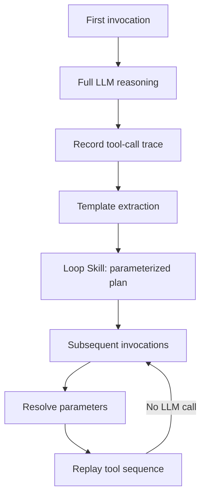

# One-Shot Record and Deterministic Replay for Periodic Agent Tasks

> Record a periodic agent task's tool-call sequence once, parameterize what varies, and replay deterministically without the LLM — cutting per-run reasoning cost to zero.

## The problem with reasoning on every cron tick

Periodic agent workloads — hourly monitoring, daily reports, scheduled triage — run the same task against shifting inputs. The token bill scales with the schedule. Stochastic reasoning also re-introduces failures the prior run already solved. Wang et al. reported a 99% token reduction by replacing repeated reasoning with deterministic replay of a single recorded plan ([Good to Go: The LOOP Skill Engine, 2026](https://arxiv.org/abs/2605.14237)). The general record, summarize, and replay paradigm began as a check-function-guarded framework ([AgentRR, 2025](https://arxiv.org/abs/2505.17716)). The periodic-task specialization swaps the check function for parameterized templates.

## The mechanism

The first invocation runs as a normal agent loop while the engine intercepts each tool call. On success, a template extraction pass converts the trace into a Loop Skill — a deterministic plan that captures the tool DAG and parameterizes time-dependent and result-dependent variables. Wang et al. use a greedy length-descending extraction algorithm and prove the step sequence is invariant across validated replays ([Good to Go: The LOOP Skill Engine, 2026](https://arxiv.org/abs/2605.14237)). Later invocations bypass the LLM. They resolve variables against real-time values, then execute the recorded sequence.



Reported results: 93.3%-99.98% monthly token reduction and 8.7x lower execution latency on periodic tasks at 5-minute to 24-hour intervals ([Good to Go: The LOOP Skill Engine, 2026](https://arxiv.org/abs/2605.14237)).

## Why it works on periodic tasks specifically

The mechanism is memoization with parameter extraction at the tool-call level. It applies when the tool DAG is invariant across runs and only specific arguments vary. Periodic tasks have that shape: the schedule fixes structure, and variability lives in timestamps, result fields, and identifiers. The LLM discovers the DAG on the first run. Once discovered, it adds no information. Removing it cuts cost (a reported 99% token reduction) and removes the entropy source behind non-determinism.

The falsifier: when invocations face materially different inputs — open-ended research, novel debugging — the template does not generalize. The tested envelope (5-min to 24-hour intervals) is the operating range, not a general claim.

## Preconditions

Three properties of the workload must hold. One violation produces silent, expensive failure.

| Precondition | Why it matters |
|---|---|
| Genuine periodicity | The tool DAG must be stable across invocations within the tested 5-minute to 24-hour envelope. Tasks whose plan branches on input content cannot be replayed from one recording. |
| Idempotent or transactional tools | Replays may execute against partial state from a prior failed run. Non-idempotent writes (POST without idempotency key, file append, message send) corrupt state on retry. See [Idempotent Agent Operations](../agent-design/idempotent-agent-operations.md). |
| Stable upstream APIs and schemas | A deterministic replay executes a now-invalid sequence when an upstream API, target HTML, or schema changes. The engine has no oracle to detect drift before failure compounds. |

The LOOP write-safety theorem covers concurrent access to persistent configuration via reentrant locks and atomic file replacement, not retry semantics on partially-applied tool effects ([Good to Go: The LOOP Skill Engine, 2026](https://arxiv.org/abs/2605.14237)).

## Distinction from adjacent patterns

| Pattern | Replay path | Failure mode |
|---|---|---|
| One-shot record + deterministic replay (this page) | Tool sequence, no LLM | Brittle on context drift; wrong plan replayed silently |
| AgentRR with check function ([2505.17716](https://arxiv.org/abs/2505.17716)) | Guarded replay; LLM resumes on check failure | Higher cost; check function is the hot-path bottleneck |
| Simulation replay for testing ([page](../workflows/simulation-replay-testing.md)) | New agent run vs. golden diff | Tests past conditions only; novel task types unrepresented |

LOOP accepts the periodic-task envelope and drops the AgentRR check-function overhead — trading replay safety for speed, at the cost of brittleness when upstream drifts.

## When the pattern backfires

- Stochastic branch points. The template freezes whichever branch the first run took. Inputs needing the other branch fail silently. Stress-test with adversarial input distributions before promoting (see [Simulation and Replay Testing](../workflows/simulation-replay-testing.md)).
- Drifting external dependencies. Without a trust anchor, replay has no oracle for upstream schema changes. Pair replay with a sentinel API call to fail fast on drift.
- Non-idempotent writes mid-sequence. A partially-failed replay re-executes completed writes. Require idempotency keys on every write tool (see [Idempotent Agent Operations](../agent-design/idempotent-agent-operations.md)), or wrap replay in a transaction with rollback.
- Short or one-shot tasks. Amortization needs enough invocations to recoup recording and extraction cost. For a handful of runs, hand-scripting is cheaper.

## Example

A daily Slack digest agent fetches open GitHub issues, filters by label, and posts a formatted summary. The first run is a normal LLM-driven agent execution:

```python
# First run — engine records tool calls
engine = LoopSkillEngine(agent=DigestAgent())
result = engine.run(task="post daily digest", date="2026-05-17")
# Engine records: search_issues(labels=["bug"], since={date}),
#                 format_summary(issues={results}),
#                 post_slack(channel="#eng", text={summary})
skill = engine.extract_skill()  # saves parameterized plan
```

Subsequent runs skip the LLM entirely:

```python
# Subsequent runs — replay only
engine = LoopSkillEngine.load_skill("daily-digest")
engine.replay(date="2026-05-18")  # resolves {date}, executes tool sequence
```

If the GitHub API schema changes or the Slack channel is renamed, the replay fails on the affected tool call. Add a sentinel precondition check to catch drift before the full sequence runs:

```python
engine.add_precondition(lambda: github_api_reachable() and slack_channel_exists("#eng"))
```

## Key Takeaways

- One-shot record and deterministic replay collapses periodic agent token cost by removing the LLM from the replay path; reported reductions reach 99% on cron-style workloads ([Good to Go: The LOOP Skill Engine, 2026](https://arxiv.org/abs/2605.14237)).
- The pattern is a specialization of general LLM record-and-replay ([AgentRR, 2025](https://arxiv.org/abs/2505.17716)), narrowed to periodic tasks so the check-function guard can be replaced by template parameterization.
- Three preconditions: stable tool DAG across runs, idempotent or transactional tools, stable upstream APIs. All three must hold; one violation produces silent replay failure.

## Related

- [Simulation and Replay Testing for Agent Verification](../workflows/simulation-replay-testing.md) — the testing-mode sibling; same recording substrate, different replay semantics.
- [Cost-Aware Tracing for Skill Distillation](../observability/cost-aware-tracing-skill-distillation.md) — cross-task patch extraction with cost attribution; complementary to within-task replay.
- [Idempotent Agent Operations](../agent-design/idempotent-agent-operations.md) — the per-tool precondition that makes safe replay possible.
- [Skill Library Evolution](skill-library-evolution.md) — Loop Skills are a skill-library entry with a distinct lifecycle: record, validate, promote, retire on drift.
- [Cost-Aware Agent Design](../token-engineering/cost-aware-agent-design.md) — the broader cost framing; LOOP is one mechanism for the cron-workload slice.
- [Memory Synthesis from Execution Logs](../agent-design/memory-synthesis-execution-logs.md) — synthesis without the deterministic-replay guarantee; the unbounded sibling.
