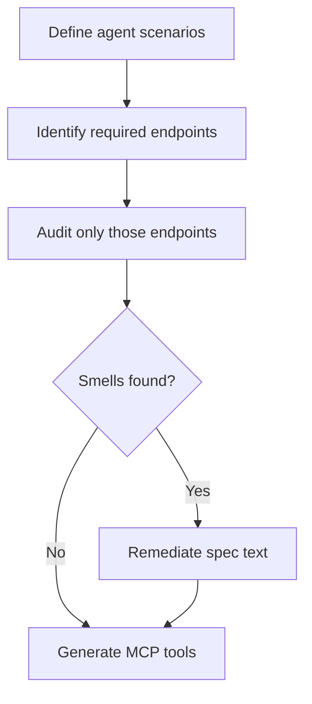

# OpenAPI Documentation Smells for Agent-Ready APIs

> A structurally valid OpenAPI spec is not an agent-ready API. Enriching the spec text alone moved agent task success from roughly 70% to 90%.

## The semantic-readiness gap

An OpenAPI document that passes `openapi-validator` can still fail an agent. Lima, Pinheiro, and Menezes audited 16 production APIs (~600 endpoints) being prepared for [Model Context Protocol](../standards/mcp-protocol.md) exposure and found that "[structural validity within microservice environments does not guarantee semantic readiness for agent-based consumption](https://arxiv.org/abs/2605.14312)"; enriching descriptions alone moved [task success from ~70% to ~90%](https://arxiv.org/abs/2605.14312).

Adjacent work agrees. [AutoMCP reached 99.9% tool-call success only after averaging 19 lines of spec edits per API, up from a 76.5% baseline](https://arxiv.org/abs/2507.16044). [Stainless documents Notion requiring an undeclared `Notion-Version` header, and APIs declaring auth on 5 of 24 endpoints when all 24 need it](https://www.stainless.com/blog/lessons-from-openapi-to-mcp-server-conversion).

## The smell taxonomy

Four [documentation smells](https://arxiv.org/abs/2605.14312) describe how the prose around an endpoint fails an agent:

| Smell | What it looks like |
|-------|--------------------|
| LAZY | Short summaries, vague descriptions, undocumented parameters, generic response messages |
| BLOATED | Verbose prose that adds tokens without adding decision-relevant information |
| TANGLED | Business logic, security, and error handling mixed into the same description fragment |
| FRAGMENTED | Essential information dispersed across disconnected sections with no linkage |

Five [REST smells](https://arxiv.org/abs/2605.14312) describe how the endpoint design itself misleads an agent:

| Smell | What it looks like |
|-------|--------------------|
| PATH | Action-oriented URIs (`/doTransfer`) that hide the underlying resource |
| METHOD | `POST` used for reads, `GET` used for state changes, mismatched semantics |
| INPUT | Weakly specified parameters, missing format constraints, no semantic clarification |
| RESPONSE | Inconsistent schemas, undocumented status codes, missing error shapes |
| SECURITY | Missing or unclear authentication and authorization definitions |

Prevalence in the Hermes corpus skewed heavily: [100% of endpoints had RESPONSE smells, 90% LAZY, 88% INPUT, 68% SECURITY, 53% PATH or METHOD](https://arxiv.org/abs/2605.14312). This is the default state of human-targeted documentation when an agent is the reader.

## Why each category matters

OpenAPI was written for developers with implicit context — codebase, Slack, ticket history — that agents do not see. Each smell names a specific gap between human-implicit and machine-explicit information.

- LAZY descriptions force the agent to pick endpoints by `operationId` alone — [the same failure mode practitioners cite when generating MCP tools from undocumented OpenAPI](https://blog.christianposta.com/semantics-matter-exposing-openapi-as-mcp-tools/).
- INPUT and RESPONSE smells map to the [parameter and schema fields that translate into agent tool definitions](../standards/openapi-agent-tool-spec.md) — gaps become hallucinated arguments and unhandled error states.
- TANGLED descriptions break [the description-quality discipline](tool-description-quality.md) of one concern per field.
- PATH and METHOD smells survive automatic [MCP server generation](mcp-server-design.md) and propagate into the tool catalog.

## Scenario-first triage

A 2,450-finding report is unactionable. The Hermes study itself pivoted to selective adaptation: [estimated effort dropped from 385 to 42 engineering hours — an 89% reduction — by fixing only endpoints needed for defined automation scenarios](https://arxiv.org/abs/2605.14312).

MCP practice agrees. [GitHub Copilot and Block cut tool counts by 60-93% before agents became reliable](https://dev.to/aws-heroes/mcp-tool-design-why-your-ai-agent-is-failing-and-how-to-fix-it-40fc); [Speakeasy's guidance is to "autogenerate the groundwork from OpenAPI, then curate"](https://www.speakeasy.com/mcp/tool-design/generate-mcp-tools-from-openapi).



Audit only the endpoints your scenarios need; the rest can wait.

## Mechanizing the audit

Hermes dispatches nine specialized smell-detector agents from one orchestrator, each analyzing the same endpoint from one category's perspective — a textbook [orchestrator-worker fan-out](../patterns/multi-agent/orchestrator-worker.md). Model selection matters less than expected: [`gpt-oss:120b` reached 0.85 Jaccard similarity with expert annotations](https://arxiv.org/abs/2605.14312). Frontier pricing is not required.

Static linters ([Spectral](https://stoplight.io/open-source/spectral), [Redocly CLI](https://redocly.com/docs/cli)) catch PATH, METHOD, and structural INPUT/RESPONSE issues at design time. Reach for LLM-based detection on the prose-shaped smells — LAZY, BLOATED, TANGLED, FRAGMENTED — where static rules cannot judge information density.

## When this backfires

Description enrichment is not always where the effort pays off. The taxonomy under-delivers when:

- The surface is too large to expose verbatim. [Block's Linear integration collapsed 30+ tools down to 2 by moving orchestration server-side](https://dev.to/aws-heroes/mcp-tool-design-why-your-ai-agent-is-failing-and-how-to-fix-it-40fc). Polishing endpoints that should never have been exposed is wasted work.
- Auto-wrapping leaks backend shape. Tool names like `get_customer_by_internal_id` [reflect implementation, not user intent](https://dev.to/aws-heroes/mcp-tool-design-why-your-ai-agent-is-failing-and-how-to-fix-it-40fc) — no description fixes a catalog whose verbs are wrong.
- JSON Schema dialects disagree. MCP clients interpret schema constraints inconsistently across models and runtimes, so even a clean spec can produce inconsistent tool behavior.

Audit the prose when the endpoint set is already scoped and the resource model is sound. When the API design itself is the problem, fix the design first.

## Example

A `LAZY` and `INPUT` smell pair, taken from the kind of spec the Hermes study evaluated:

Before — agent-hostile:

```yaml
/users/{id}/transfer:
  post:
    summary: Transfer
    operationId: doTransfer
    parameters:
      - name: id
        in: path
        schema:
          type: string
    requestBody:
      content:
        application/json:
          schema:
            type: object
            properties:
              amount:
                type: number
              to:
                type: string
    responses:
      '200':
        description: OK
```

After — agent-ready:

```yaml
/accounts/{accountId}/transfers:
  post:
    summary: Create a transfer from one account to another
    description: |
      Use when the caller has the source account ID and wants to move funds to a
      destination account in the same currency. Returns the created transfer
      including its server-assigned ID and settlement timestamp. Returns 409 if
      a transfer with the same Idempotency-Key already exists.
    operationId: createTransfer
    parameters:
      - name: accountId
        in: path
        description: UUID v4 of the source account.
        required: true
        schema:
          type: string
          format: uuid
    requestBody:
      content:
        application/json:
          schema:
            type: object
            required: [amount, destinationAccountId]
            properties:
              amount:
                type: integer
                description: Amount in minor units (e.g. cents). Must be > 0.
                minimum: 1
              destinationAccountId:
                type: string
                format: uuid
                description: UUID v4 of the destination account.
    responses:
      '200':
        description: Transfer created.
        content:
          application/json:
            schema:
              $ref: '#/components/schemas/Transfer'
      '409':
        description: Duplicate Idempotency-Key.
```

The PATH smell (`/users/{id}/transfer` with `doTransfer`) collapsed into a resource-shaped URI with `createTransfer`. The LAZY summary expanded into a description that names when to call, what comes back, and what the failure case looks like. INPUT gained format constraints and required-field declarations. RESPONSE gained a documented 409.

## Key Takeaways

- An OpenAPI spec that validates structurally can still fail agents — every one of 600 audited endpoints had at least one smell.
- The nine-category taxonomy (four documentation, five REST) gives a concrete checklist that maps to specific agent failure modes.
- Audit only the endpoints your defined agent scenarios need. Blanket audits produce reports nobody acts on; selective audits cut remediation effort by an order of magnitude (385 to 42 engineering hours in the Hermes study).
- Use static linters for structural smells and LLM-based detection for prose-shaped smells. Open-weight models reach expert-level Jaccard on this task — frontier pricing is not required.

## Related

- [OpenAPI as the Source of Truth for Agent Tool Definitions](../standards/openapi-agent-tool-spec.md)
- [MCP Server Design](mcp-server-design.md)
- [Tool Description Quality](tool-description-quality.md)
- [Write Tool Descriptions Like Onboarding Docs](tool-descriptions-as-onboarding.md)
- [Orchestrator-Worker Pattern](../patterns/multi-agent/orchestrator-worker.md)
