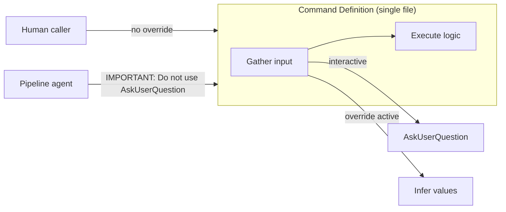

# Override Pattern: Reusing Interactive Commands in Automated Pipelines

> Suppress interactive prompts with a one-line instruction override so the same command definition serves both human-in-the-loop and fully automated execution.

## The Problem

Commands designed for human use include interactive decision points -- confirmation dialogs, picker menus, review steps -- via tools like `AskUserQuestion`. Pipeline agents running those same commands unattended hit these prompts and stall. The obvious fix -- duplicating each command into "interactive" and "batch" variants -- creates maintenance burden and drift.

The override pattern keeps a single command definition and toggles interaction behavior at invocation time.

## How It Works

A pipeline agent invokes the Skill tool with an instruction override prepended to the command's normal arguments:

```
IMPORTANT: Do not use AskUserQuestion. Process this issue directly.
```

The model's instruction-following suppresses the interactive tool call. The agent infers the values that would have come from user input and continues execution without pausing.



## Structural Alternatives

The prompt-level override is one of several mechanisms for non-interactive operation. Each trades off differently:

| Mechanism | Scope | Configuration | When to use |
|-----------|-------|---------------|-------------|
| **Prompt override** | Single invocation | None -- one line in the spawn prompt | Pipeline stages reusing interactive commands |
| **Background subagent** | Subagent lifetime | `run_in_background: true` | Fire-and-forget tasks where `AskUserQuestion` failures are acceptable |
| **`disallowedTools`** | Subagent definition | Frontmatter field | Permanently non-interactive subagents |
| **`permissionMode: dontAsk`** | Subagent definition | Frontmatter field | Suppressing permission prompts (not `AskUserQuestion`) |
| [**Headless mode** (`claude -p`)](../workflows/headless-claude-ci.md) | Entire session | CLI flag | CI/CD, cron jobs, no user session at all |

The prompt override is the lightest-weight option: no configuration changes, no separate command file, no architectural commitment. It works because the command already separates input-gathering from execution logic.

## Design Implication: Separate Gather from Execute

The override pattern only works cleanly when commands separate "gather input" from "execute logic." If user interaction is interleaved with execution -- confirm after each step, pick mid-workflow -- the override suppresses prompts but leaves the agent guessing at partially-specified state.

**Fragile structure** -- interaction woven into execution:

```markdown
1. List open issues
2. Ask user to pick one            ← interactive
3. Read the issue body
4. Ask user for output format      ← interactive
5. Generate the draft
6. Ask user to confirm             ← interactive
7. Commit and push
```

**Clean structure** -- input gathered upfront, execution runs uninterrupted:

```markdown
1. List open issues
2. Ask user to pick one            ← interactive (or infer)
3. Ask user for output format      ← interactive (or infer)
4. Read the issue body
5. Generate the draft
6. Commit and push
```

With the clean structure, the override suppresses steps 2-3 and the rest runs identically in both modes.

## Example

This repository's `pipeline.md` orchestrator reuses two interactive commands -- `save-idea.md` and `draft-content.md` -- in fully automated stages. Each command was written for human use with `AskUserQuestion` at decision points.

**Interactive invocation** (human user):

```
/save-idea
```

The command presents a draft issue for user review and confirmation before creating it.

**Pipeline invocation** (orchestrator agent):

```
You are a draft agent. Follow the instructions in
.github/commands/draft-content.md exactly.

Issue: 1313

IMPORTANT: Do not use AskUserQuestion. Process this issue directly.
```

The override instruction tells the agent to infer all values and skip confirmation. The command file is unchanged -- the same steps execute, but the agent fills in decisions that the human would have made interactively.

## Reliability Considerations

Prompt-level suppression is not guaranteed. The model may still occasionally attempt the suppressed tool call, especially:

- In long contexts where the override instruction competes with other directives
- With weaker models that have lower instruction-following compliance
- When the command text explicitly names the tool ("Use AskUserQuestion to confirm")

For higher reliability, combine the prompt override with `disallowedTools: [AskUserQuestion]` in subagent frontmatter. The prompt override handles graceful degradation (the agent infers values instead of prompting); the tool restriction provides a hard block if the model attempts the call anyway.

## Key Takeaways

- One command definition serves both interactive and automated callers -- the override is a one-line instruction addition, not a code change
- The pattern requires commands that separate input-gathering from execution logic
- Prompt-level overrides are the lightest-weight option; combine with `disallowedTools` for hard guarantees
- Background subagents get this behavior for free (interactive tool calls fail automatically) but lack the explicit "infer values" instruction

## Related

- [Skill Authoring Patterns](skill-authoring-patterns.md)
- [Skill Tool as Enforcement: Loading Command Prompts at Runtime](skill-tool-runtime-enforcement.md)
- [Sub-Agents for Fan-Out Research and Context Isolation](../multi-agent/sub-agents-fan-out.md)
- [Narrow Task Instructions](../security/task-scope-security-boundary.md)
- [Instruction Polarity](../instructions/instruction-polarity.md)
- [Agent Composition Patterns](../agent-design/agent-composition-patterns.md)
- [Orchestrator-Worker Pattern](../multi-agent/orchestrator-worker.md)
