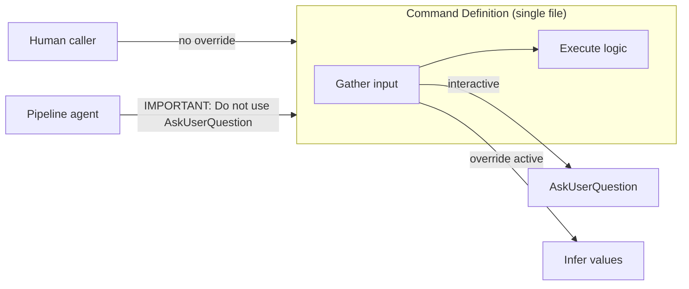

# Override Pattern: Reusing Interactive Commands in Automated Pipelines

> Suppress interactive prompts with a one-line instruction override so the same command definition serves both human-in-the-loop and fully automated execution.

## The problem

Commands built for people include interactive decision points: confirmation dialogs, picker menus, review steps. They reach those points through tools like `AskUserQuestion`. Pipeline agents run those same commands unattended, hit the prompts, and stall. The obvious fix is to duplicate each command into "interactive" and "batch" variants. That creates maintenance burden and drift.

The override pattern keeps a single command definition and toggles interaction behavior at invocation time.

## How it works

A pipeline agent invokes the Skill tool with an instruction override prepended to the command's normal arguments:

```
IMPORTANT: Do not use AskUserQuestion. Process this issue directly.
```

The model follows the instruction and suppresses the interactive tool call. The agent infers the values that would have come from user input, then continues without pausing. Background subagents suppress `AskUserQuestion` automatically — the tool call fails silently — but they lack the explicit "infer values" framing this override provides. See the [Claude Code subagent docs](https://docs.anthropic.com/en/docs/claude-code/sub-agents) for the difference between foreground and background subagent behavior, and [anthropics/claude-code#18721](https://github.com/anthropics/claude-code/issues/18721) documenting that `AskUserQuestion` calls from subagents spawned via the Task tool are unavailable without explicit fallback guidance.


```mermaid
flowchart LR
    subgraph Command["Command Definition (single file)"]
        A[Gather input] --> B[Execute logic]
    end

    H[Human caller] -->|no override| Command
    P[Pipeline agent] -->|"IMPORTANT: Do not use AskUserQuestion"| Command

    A -->|interactive| Q[AskUserQuestion]
    A -->|override active| I[Infer values]
```

## Structural alternatives

The prompt-level override is one of several ways to run without interaction. Each makes a different trade-off:

| Mechanism | Scope | Configuration | When to use |
|-----------|-------|---------------|-------------|
| Prompt override | Single invocation | None -- one line in the spawn prompt | Pipeline stages reusing interactive commands |
| Background subagent | Subagent lifetime | `run_in_background: true` | Fire-and-forget tasks where `AskUserQuestion` failures are acceptable |
| `disallowedTools` | Subagent definition | Frontmatter field | Permanently non-interactive subagents |
| `permissionMode: dontAsk` | Subagent definition | Frontmatter field | Suppressing permission prompts (not `AskUserQuestion`) |
| [Headless mode (`claude -p`)](../workflows/headless-claude-ci.md) | Entire session | CLI flag | CI/CD, cron jobs, no user session at all |

The prompt override is the lightest option: no configuration changes, no separate command file, no architectural commitment. It works because the command already separates input-gathering from execution logic.

## Design implication: separate gather from execute

The override pattern only works cleanly when commands separate "gather input" from "execute logic". When interaction is interleaved with execution — confirm after each step, pick mid-workflow — the override suppresses the prompts but leaves the agent guessing at partially-specified state.

Fragile structure, with interaction woven into execution:

```markdown
1. List open issues
2. Ask user to pick one            ← interactive
3. Read the issue body
4. Ask user for output format      ← interactive
5. Generate the draft
6. Ask user to confirm             ← interactive
7. Commit and push
```

Clean structure, with input gathered upfront so execution runs uninterrupted:

```markdown
1. List open issues
2. Ask user to pick one            ← interactive (or infer)
3. Ask user for output format      ← interactive (or infer)
4. Read the issue body
5. Generate the draft
6. Commit and push
```

With the clean structure, the override suppresses steps 2-3 and the rest runs identically in both modes.

## Example

This repository's `pipeline.md` orchestrator reuses two interactive commands — `save-idea.md` and `draft-content.md` — in fully automated stages. Each command was written for people, with `AskUserQuestion` at decision points.

Interactive invocation (human user):

```
/save-idea
```

The command presents a draft issue for user review and confirmation before creating it.

Pipeline invocation (orchestrator agent):

```
You are a draft agent. Follow the instructions in
.github/commands/draft-content.md exactly.

Issue: 1313

IMPORTANT: Do not use AskUserQuestion. Process this issue directly.
```

The override instruction tells the agent to infer all values and skip confirmation. The command file is unchanged. The same steps run, but the agent fills in the decisions a person would have made interactively.

## Reliability considerations

Prompt-level suppression is not guaranteed. The model can still attempt the suppressed tool call now and then, especially:

- In long contexts where the override instruction competes with other directives
- With weaker models that have lower instruction-following compliance
- When the command text explicitly names the tool ("Use AskUserQuestion to confirm")

For higher reliability, combine the prompt override with `disallowedTools: [AskUserQuestion]` in subagent frontmatter. The prompt override handles graceful degradation, where the agent infers values instead of prompting. The tool restriction adds a hard block if the model attempts the call anyway.

## When this backfires

The prompt-level override trades reliability for simplicity. Avoid it when a wrong inference is costly:

- Critical or irreversible operations: if the agent guesses wrong, such as the wrong deployment target or the wrong file to delete, a stalled prompt would have caught the error. The override lets it proceed silently.
- Commands with many decision points: each suppressed `AskUserQuestion` prompt is a value the agent must infer. Inference errors compound. A command that asks three questions in sequence has three chances to diverge from intent.
- Shared command definitions used across multiple callers: an override tuned for one pipeline may behave unexpectedly when another pipeline invokes the same command with different implicit assumptions.

For these cases, prefer [`disallowedTools`](https://docs.anthropic.com/en/docs/claude-code/sub-agents#subagent-configuration) at the subagent level (which makes the restriction explicit and auditable) or [headless mode](../workflows/headless-claude-ci.md) (which removes the interactive layer entirely rather than suppressing it).

## Key Takeaways

- One command definition serves both interactive and automated callers -- the override is a one-line instruction addition, not a code change
- The pattern requires commands that separate input-gathering from execution logic
- Prompt-level overrides are the lightest-weight option; combine with `disallowedTools` for hard guarantees
- Background subagents get this behavior for free (interactive tool calls fail automatically) but lack the explicit "infer values" instruction

## Related

- [Skill Authoring Patterns](skill-authoring-patterns.md)
- [Skill Tool as Enforcement: Loading Command Prompts at Runtime](skill-tool-runtime-enforcement.md)
- [CLI-First Skill Design](cli-first-skill-design.md)
- [MCP Elicitation](mcp-elicitation.md)
- [Sub-Agents for Fan-Out Research and Context Isolation](../multi-agent/sub-agents-fan-out.md)
- [Instruction Polarity](../instructions/instruction-polarity.md)
- [Agent Composition Patterns](../agent-design/agent-composition-patterns.md)
- [Orchestrator-Worker Pattern](../multi-agent/orchestrator-worker.md)
