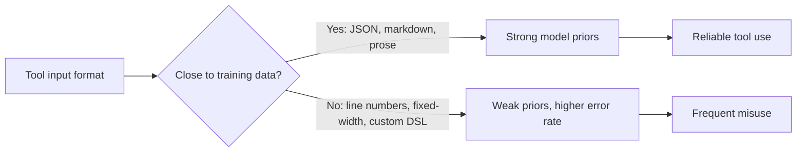

# Poka-Yoke for Agent Tools

> Redesign tool interfaces so the wrong call cannot compile — prevention over documentation.

!!! info "Also known as"
    Mistake-Proofing, Error-Proof Tool Design, Structural Constraints

## From Manufacturing to Tool Design

Poka-yoke (mistake-proofing) originated in Toyota's production system: redesign the process so the defective outcome is structurally impossible. Anthropic applies it directly to agent tools — "Change the arguments so that it is harder to make mistakes" ([Building Effective Agents](https://www.anthropic.com/engineering/building-effective-agents)) — and reports spending more time optimizing tools than the overall prompt ([SWE-bench Sonnet](https://www.anthropic.com/engineering/swe-bench-sonnet)).

## The Core Shift

Documentation tells the agent how to use a tool correctly. Poka-yoke makes incorrect use fail fast or become impossible.

| Approach | Mechanism | Failure mode |
|----------|-----------|--------------|
| Documentation | Describes correct usage | Agent ignores or misreads instructions |
| Validation | Rejects bad input at runtime | Agent wastes a turn, retries blindly |
| Poka-yoke | Eliminates the bad input from the interface | Error cannot occur |

Manufacturing taxonomy mapped:

| Manufacturing function | Tool design equivalent | Example |
|------------------------|------------------------|---------|
| **Contact method** — shape prevents misuse | Parameter type prevents invalid calls | Enum `["python", "typescript", "all"]` vs free-text |
| **Fixed-value method** — counters enforce limits | Bounds and defaults prevent out-of-range values | `max_results` clamped 1–100, default 20 |
| **Motion-step method** — enforced sequence | Prerequisite gates block out-of-order operations | Read-before-write: Edit rejects if file not yet read |

## Production Patterns

### Absolute Paths Over Relative

Relative filepaths failed after directory changes. Making absolute paths mandatory eliminated the failure mode:

> "Sometimes models could mess up relative file paths after the agent had moved out of the root directory. To prevent this, we simply made the tool always require an absolute path."
> — [SWE-bench Sonnet](https://www.anthropic.com/engineering/swe-bench-sonnet)

### Uniqueness Constraints on Edits

String replacement (`old_str`/`new_str`) fails if `old_str` matches zero or multiple locations — the uniqueness constraint is itself a poka-yoke. Zero matches means stale context; multiple means insufficient context. Both force the agent to add specificity.

### Read-Before-Write Gates

Claude Code's Edit and Write tools reject calls if the file has not been read in the current session — a structural prerequisite, not just an instruction.

### Output Truncation Boundaries

Read-tool line caps and [Bash-tool command timeouts](https://platform.claude.com/docs/en/agents-and-tools/tool-use/bash-tool) prevent unbounded context consumption even when the agent asks for everything.

### Training-Aligned Formats

Tool formats should be close to "naturally-occurring internet text" to leverage model training priors. Formats requiring line counting, string escaping, or unusual reasoning increase error rates ([Building Effective Agents](https://www.anthropic.com/engineering/building-effective-agents)).

### Tool Use Examples in Definitions

Concrete sample calls in tool definitions improved accuracy from 72% to 90% on complex parameter handling in Anthropic's testing ([Advanced Tool Use](https://www.anthropic.com/engineering/advanced-tool-use)).

## Beyond Tool Parameters

| Technique | What it prevents | Source |
|-----------|-----------------|--------|
| Credential scoping — test/staging with budget caps (e.g., $5 limit) | Costly mistakes in production | [Willison](https://simonwillison.net/2025/Sep/30/designing-agentic-loops/) |
| [Pre-completion checklists](../verification/pre-completion-checklists.md) — middleware forces verification before agent exit | Incomplete or incorrect final outputs | [LangChain](https://blog.langchain.com/improving-deep-agents-with-harness-engineering/) |
| [Loop detection](../observability/loop-detection.md) middleware — intervenes after N iterations | Infinite retry loops | [LangChain](https://blog.langchain.com/improving-deep-agents-with-harness-engineering/) |
| Minimal non-overlapping toolsets — reduce ambiguity in tool selection | Wrong-tool selection | [Context Engineering](https://www.anthropic.com/engineering/effective-context-engineering-for-ai-agents) |

## When This Backfires

Over-constraining tool interfaces introduces its own failure modes:

- **Enum exhaustion** — a fixed enum valid at design time excludes production edge cases; update or the agent cannot proceed.
- **Prerequisite deadlock** — read-before-write gates block optimistic-write patterns and content-from-scratch pipelines.
- **Designer blind spots** — constraints encode the designer's model of valid usage; legitimate emergent reasoning strategies get rejected.
- **Over-normalized toolsets** — too-narrow toolsets push agents toward multi-step workarounds with higher cumulative error probability.

Apply poka-yoke where failure modes are well-understood and the constraint space is stable. Prefer validation over elimination when use cases are still evolving.

## Designing Your Own Poka-Yoke

1. **Can any parameter accept values that are never valid?** Constrain to an enum or validated range.
2. **Does the tool depend on prior state?** Add a prerequisite gate (read-before-write, auth-before-access).
3. **Can the output overwhelm the context window?** Add truncation with recovery hints.
4. **Does the format require precise mechanical reasoning?** Switch to a format with strong training priors.
5. **Can the tool silently apply the wrong change?** Add a uniqueness or [idempotency](../agent-design/idempotent-agent-operations.md) constraint.
6. **Test like a junior developer API** — pass many inputs and observe where the model fails. Fix the interface, not the prompt.

## Related

- [Agent-Computer Interface (ACI)](agent-computer-interface.md) — the discipline that frames poka-yoke as one of four core ACI design principles
- [Tool Engineering](tool-engineering.md) — broader tool design principles including poka-yoke
- [Write Tool Descriptions Like Onboarding Docs](tool-descriptions-as-onboarding.md) — complementary: documentation quality alongside structural constraints
- [Tool Description Quality](tool-description-quality.md) — selection signals and description iteration
- [Deterministic Guardrails](../verification/deterministic-guardrails.md) — defense-layer perspective on structural constraints
- [Hooks for Enforcement vs Prompts for Guidance](../verification/hooks-vs-prompts.md) — enforcement through hooks rather than instructions
- [Typed Schemas at Agent Boundaries](typed-schemas-at-agent-boundaries.md) — formal schemas as structural contracts preventing invalid agent-to-agent calls
- [Tool Minimalism](tool-minimalism.md) — fewer, non-overlapping tools reduce selection ambiguity
- [Consolidate Agent Tools](consolidate-agent-tools.md) — higher-level tools that match agent reasoning over many narrow endpoints
- [Context Engineering: The Discipline of Designing Agent Context](../context-engineering/context-engineering.md) — signal density principles underlying tool output constraints
