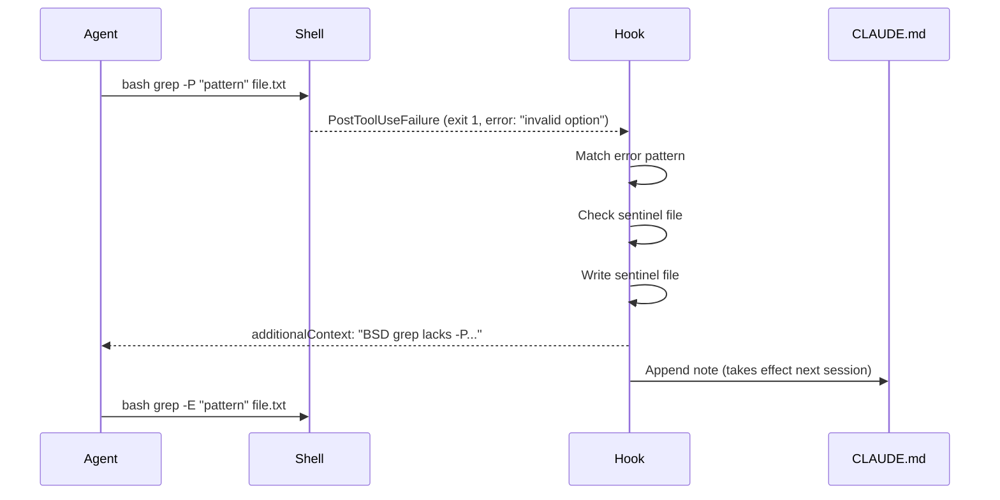

# PostToolUse Hook for BSD/GNU Tool Miss Detection

> A `PostToolUse` or `PostToolUseFailure` hook can catch "command not found" and BSD/GNU incompatibility errors the moment they occur, feed the fix back to the agent via `additionalContext`, and optionally update CLAUDE.md for the next session.

## The Problem

macOS ships with BSD versions of core utilities. GNU and BSD implementations diverge in ways that silently break agent-generated shell commands:

| Tool | BSD (macOS) | GNU (Linux) |
|------|-------------|-------------|
| `grep` | No `-P` (PCRE) flag | `-P` supported |
| `sed` | `-i ''` requires empty-string argument | `-i` takes no argument |
| `date` | `-d` not supported | `-d` parses date strings |
| `xargs` | No `-r` (no-run-if-empty) | `-r` supported |

The agent doesn't know which variant is present. Instructions in CLAUDE.md can help but must be written before the problem is observed. A runtime hook catches the failure and corrects it in the same session, without requiring pre-configuration.

## Hook Events

Two events are relevant:

| Event | When it fires | Has `tool_response` |
|-------|--------------|---------------------|
| `PostToolUse` | After a successful Bash call | Yes — full stdout/stderr |
| `PostToolUseFailure` | After a non-zero exit | No — only `error` string |

`PostToolUseFailure` is the right event for "command not found" (exit 127) and most BSD/GNU errors (non-zero exits). `PostToolUse` can catch cases where the command succeeds but produces an error-like message on stderr.

Both `PostToolUse` and `PostToolUseFailure` hooks can return `additionalContext` in their JSON output to inject information into the agent's context without blocking the tool call.

## Implementation

### 1. Detect and Return additionalContext

```bash
#!/bin/bash
# .claude/hooks/detect-cli-compat.sh

INPUT=$(cat)
ERROR=$(echo "$INPUT" | jq -r '.error // empty')
COMMAND=$(echo "$INPUT" | jq -r '.tool_input.command // empty')

# Check for command not found
if echo "$ERROR" | grep -q "command not found"; then
  MISSING=$(echo "$ERROR" | grep -oE '[^:]+: command not found' | awk '{print $1}')
  jq -n --arg msg "Command not found: $MISSING. Check if it needs to be installed (e.g. brew install $MISSING) or use an available alternative." \
    '{additionalContext: $msg}'
  exit 0
fi

# Check for known BSD/GNU incompatibilities
if echo "$ERROR" | grep -qE "invalid option|illegal option|unrecognized option"; then
  # BSD grep -P failure
  if echo "$COMMAND" | grep -q "grep.*-P"; then
    jq -n '{additionalContext: "BSD grep does not support -P (PCRE). Use grep -E for extended regex, or install GNU grep via `brew install grep` and use `ggrep -P`."}'
    exit 0
  fi
  # BSD sed -i without argument
  if echo "$COMMAND" | grep -qE "sed.*-i[^' ]"; then
    jq -n '{additionalContext: "BSD sed requires an extension argument with -i. Use `sed -i '\'''\'' ...` on macOS, or `sed -i ...` on Linux."}'
    exit 0
  fi
fi

exit 0
```

Register in `.claude/settings.json`:

```json
{
  "hooks": {
    "PostToolUseFailure": [
      {
        "matcher": "Bash",
        "hooks": [
          {
            "type": "command",
            "command": "\"$CLAUDE_PROJECT_DIR\"/.claude/hooks/detect-cli-compat.sh"
          }
        ]
      }
    ]
  }
}
```

### 2. Once-Per-Session Enforcement

To avoid repeating the same advice every invocation, gate the response on a sentinel file keyed to `session_id`. The `session_id` field is present in every hook input:

```bash
#!/bin/bash
# .claude/hooks/detect-cli-compat.sh

INPUT=$(cat)
SESSION_ID=$(echo "$INPUT" | jq -r '.session_id // empty')
ERROR=$(echo "$INPUT" | jq -r '.error // empty')
COMMAND=$(echo "$INPUT" | jq -r '.tool_input.command // empty')

SENTINEL_DIR="$HOME/.claude/sessions"
SENTINEL="$SENTINEL_DIR/${SESSION_ID}.compat-notified"

# Determine if we have a match
MESSAGE=""

if echo "$ERROR" | grep -q "command not found"; then
  MISSING=$(echo "$ERROR" | grep -oE '\S+: command not found' | awk '{print $1}' | tr -d ':')
  MESSAGE="Command not found: $MISSING. Install via \`brew install $MISSING\` or use a built-in alternative."
elif echo "$COMMAND" | grep -q "grep.*-P" && echo "$ERROR" | grep -q "invalid option"; then
  MESSAGE="BSD grep lacks -P. Use grep -E or install GNU grep: \`brew install grep\` then use \`ggrep -P\`."
elif echo "$COMMAND" | grep -qE "sed.*-i[^' ]" && echo "$ERROR" | grep -q "option"; then
  MESSAGE="BSD sed -i requires an empty-string arg on macOS: \`sed -i '' ...\`."
fi

[ -z "$MESSAGE" ] && exit 0

# Once-per-session: skip if already notified
mkdir -p "$SENTINEL_DIR"
[ -f "$SENTINEL" ] && exit 0
touch "$SENTINEL"

jq -n --arg msg "$MESSAGE" '{additionalContext: $msg}'
```

`once: true` is only available for skills, not command hooks — the sentinel file is the correct pattern for session-scoped state.

### 3. Persist to CLAUDE.md

After notifying the agent, optionally write the fix to CLAUDE.md for future sessions:

```bash
# Append to project CLAUDE.md (only if not already present)
NOTE="- macOS: BSD grep lacks -P; use grep -E or ggrep. BSD sed -i requires empty arg: sed -i '' ..."
if ! grep -qF "BSD grep" "$CLAUDE_PROJECT_DIR/CLAUDE.md" 2>/dev/null; then
  echo "" >> "$CLAUDE_PROJECT_DIR/CLAUDE.md"
  echo "$NOTE" >> "$CLAUDE_PROJECT_DIR/CLAUDE.md"
fi
```

**Important constraint:** CLAUDE.md is loaded at session start, not on every turn. Writing to it mid-session does not affect the current session. The `additionalContext` response is the mechanism for immediate in-session feedback; CLAUDE.md is the mechanism for cross-session persistence. Both serve different purposes and should both be used.

## Flow



## Auto-Remediation via Homebrew

The hook can run `brew install` as a side-effect:

```bash
if echo "$ERROR" | grep -q "command not found"; then
  MISSING=$(echo "$ERROR" | grep -oE '\S+: command not found' | awk '{print $1}' | tr -d ':')
  if command -v brew &>/dev/null && [ -n "$MISSING" ]; then
    brew install "$MISSING" &>/dev/null &
    MESSAGE="$MISSING not found — installing via Homebrew in background. Retry in a moment."
  fi
fi
```

This is technically viable — hooks run in the same shell context as Claude Code and can spawn subprocesses. Use it only if you explicitly want hooks to install system packages. It is a non-trivial side-effect that bypasses normal package management review.

## Relationship to PreToolUse Prevention

The official [bash_command_validator example](https://github.com/anthropics/claude-code/blob/main/examples/hooks/bash_command_validator_example.py) uses a `PreToolUse` hook to rewrite commands before they run — e.g., redirecting `grep` to `ripgrep`. BSD/GNU divergence is a documented portability concern ([GNU sed manual](https://www.gnu.org/software/sed/manual/sed.html#The-_0022s_0022-Command), [GNU grep manual](https://www.gnu.org/software/grep/manual/grep.html)). These two approaches are complementary:

| Approach | Event | Mechanism | Use when |
|----------|-------|-----------|----------|
| PreToolUse rewrite | `PreToolUse` | Block + redirect | Known incompatibility, safe substitute exists |
| PostToolUse detection | `PostToolUseFailure` | additionalContext | Unknown missing tool, discovered at runtime |

Static allowlisting catches known patterns. Runtime detection handles the cases that weren't anticipated.

## When This Backfires

Runtime hook detection adds overhead to every failing Bash call. Three conditions make this pattern worse than the alternative:

- **Overly broad pattern matching produces false positives.** If the regex matches "invalid option" in output unrelated to BSD/GNU divergence, the agent receives misleading advice and may spend turns chasing the wrong fix. Test detection patterns against real failure output before deploying.
- **Sentinel files break in ephemeral environments.** Containerised CI runners, sandboxed shells, or environments where `$HOME` is not persistent will fail to find or create the sentinel file, causing the hook to emit the context message on every invocation rather than once per session. Use an in-process variable or skip once-per-session gating when `$HOME` is not guaranteed.
- **The hook can mask the original error.** When `additionalContext` fires alongside a non-zero exit, the agent sees both the error and the advisory message. If the advisory message is confident ("use grep -E instead"), the agent may act on it even when the actual error has a different root cause, bypassing diagnostic steps. Keep advisory text conditional and hedged.

## Key Takeaways

- `PostToolUseFailure` receives the `error` string but not `tool_response`; match against both `.error` and `.tool_input.command`
- `once: true` is not available for command hooks — implement once-per-session logic with a sentinel file keyed to `session_id`
- Use `additionalContext` for immediate in-session feedback; write to CLAUDE.md for cross-session persistence — they are not interchangeable
- CLAUDE.md writes take effect at the next session start, not in the current session
- Auto-remediation via `brew install` is technically viable but installs system packages silently — opt into this deliberately

## Related

- [Hook Catalog: Guardrails, Sandboxing, and CLI Enforcement](hook-catalog.md)
- [Hooks and Lifecycle Events: Intercepting Agent Behavior](hooks-lifecycle-events.md)
- [PostToolUse Hooks: Automatic Formatting and Linting After Every File Edit](../workflows/posttooluse-auto-formatting.md)
- [On-Demand Skill Hooks: Session-Scoped Hook Guardrails](on-demand-skill-hooks.md)
- [CLI Scripts as Agent Tools: Return Only What Matters](cli-scripts-as-agent-tools.md)
- [Unix CLI as the Native Tool Interface for AI Agents](unix-cli-native-tool-interface.md)
