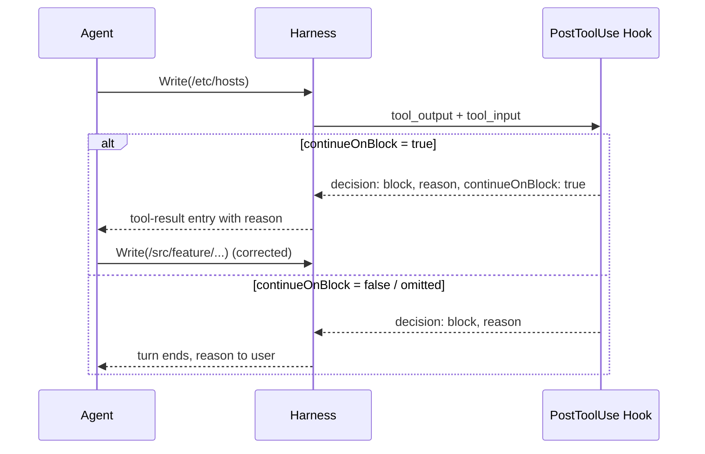

# PostToolUse continueOnBlock: Refusal With a Load-Bearing Reason

> `continueOnBlock` feeds a `PostToolUse` hook's rejection reason back as a continuation signal instead of ending the turn, guiding the agent to correct routable policy.

## What changed

Claude Code v2.1.139 (2026-05-11) added a `continueOnBlock` config for `PostToolUse` hooks: when `true`, a hook returning `decision: "block"` with a `reason` no longer halts the turn — the reason arrives as a tool-result-style entry and the agent keeps working ([Claude Code changelog](https://code.claude.com/docs/en/changelog)).

Before the option, a blocking `PostToolUse` hook ended the turn, training operators to read hook blocks as user denials rather than quality gates. `continueOnBlock` makes the block shape-identical to a tool error.

## Decision modes

`PostToolUse` exposes five signal shapes ([hooks reference](https://code.claude.com/docs/en/hooks)):

| Mode | Returned | What the agent sees |
|------|----------|---------------------|
| Observe | (no JSON) | Original `tool_output` |
| Augment | `additionalContext` | Tool output + appended note |
| Replace | `updatedToolOutput` | Hook's string only |
| Refuse | `decision: "block"` + `reason` + `continueOnBlock: true` | Rejection text as a tool result; turn continues |
| Halt | `decision: "block"` + `reason` | Turn ends; reason shown to user |

The first three are covered in [PostToolUse Output Replacement](posttooluse-output-replacement.md). This page is the refuse mode.

## When to use it

Use it when the agent could plausibly succeed by understanding the rule:

- Path scope — writes outside an allowed prefix; the refusal names the prefix and the agent reroutes
- Size or volume — generated artifact exceeds a cap; agent splits or trims
- Command shape — Bash matches a discouraged pattern (`rm -rf`, `git push --force`); refusal names a safer alternative
- Schema violations — malformed JSON or YAML; refusal cites the validator error
- Style/lint blocks — `PostToolUse` ruff/eslint runner returns failures; reason lists fixes

The rejection text is the corrective payload. Agents trained with tool-use RLHF route on tool-result text, so a refusal-with-reason reads as an environment error.

## When not to use it

Two categories warrant a silent block — `decision: "block"` without `continueOnBlock`, or a `PreToolUse` hook that exits 2:

- Hard security boundaries. Egress to unverified hosts, credential reads, destructive ops on shared state. Every rejection reason gives a prompt-injection turn something to iterate against — forcing blind iteration is the point.
- High-volume matchers. A `continueOnBlock` hook on every Bash call spams refusal text into the turn budget. Tighten the matcher or move to `PreToolUse`.

## Hook shape

`PostToolUse` uses the top-level `decision`/`reason` pattern (not `hookSpecificOutput`) for blocks ([hooks reference](https://code.claude.com/docs/en/hooks)):

```json
{
  "decision": "block",
  "reason": "Write outside allowed scope. Permitted prefixes: /src, /tests. Path attempted: /etc/hosts. Reroute to /src/<feature>/ and retry.",
  "continueOnBlock": true
}
```

`decision` triggers the block, `reason` carries the corrective text, `continueOnBlock` flips halt-vs-continue. Omit it (or set `false`) and the turn ends with the reason shown to the user.

## Refusal-text discipline

The reason is load-bearing — it is the only signal the agent uses to choose the next action. Three properties separate refusals that train good behavior from refusals that train cosmetic retries:

- Specific. Name the rule, the violated value, and the corrective path. "Policy violation" teaches nothing. "Path `/etc/hosts` outside allowed prefix `/src`; reroute to `/src/`" teaches one fact.
- Non-negotiable in tone. Sycophantic phrasing ("I'm sorry, but…") primes the model to negotiate. State the rule and the fix.
- One rule per refusal. A reason bundling five checks lets the agent fix one and retry. Each hook handles one rule; multiple [PostToolUse hooks](hooks-lifecycle-events.md) compose. Same principle as [Confirmation Gates §What to Surface at Confirmation](../security/human-in-the-loop-confirmation-gates.md) — exact action data, no summaries.

A noisy refusal trains retry-with-cosmetic-edit. The retry then counts as a fix in the transcript while the violation pattern persists across sessions.

## Example

A `PostToolUse` hook on `Write|Edit` rejects writes outside the `src/` and `tests/` prefixes with a corrective refusal:

`.claude/hooks/path-scope.sh`:

```bash
#!/usr/bin/env bash
set -euo pipefail

INPUT=$(cat)
FILE=$(echo "$INPUT" | jq -r '.tool_input.file_path // empty')

case "$FILE" in
  */src/*|*/tests/*)
    exit 0  # Allowed, no output
    ;;
esac

jq -n --arg path "$FILE" '{
  decision: "block",
  reason: ("Write outside allowed scope. Permitted prefixes: src/, tests/. Path attempted: " + $path + ". Reroute under src/<feature>/ or tests/ and retry."),
  continueOnBlock: true
}'
```

`.claude/settings.json`:

```json
{
  "hooks": {
    "PostToolUse": [
      {
        "matcher": "Write|Edit",
        "hooks": [
          { "type": "command", "command": "\"$CLAUDE_PROJECT_DIR\"/.claude/hooks/path-scope.sh" }
        ]
      }
    ]
  }
}
```

`PostToolUse` fires after execution, so the artifact already wrote — the refusal corrects the next call. For true prevention, use a `PreToolUse` hook on the same matcher; pair the two when both the action and the learning signal matter.

## Decision loop



## When this backfires

- Reason text leaks rule shape. A prompt-injection turn iterates payloads against the reason. For adversary-facing policy, prefer a silent `PreToolUse` block.
- Vague reasons train evasion. "Command rejected" teaches "vary the command and retry." Specific reasons teach the rule.
- Latency on hot paths. Each block adds a retry round-trip. `PreToolUse` blocks once without the retry, which is cheaper when the matcher fires often.
- Block-with-feedback is not undo. The tool already ran. The refusal corrects the next call, not the current artifact.
- Multiple hooks on one matcher race. Merge order is not deterministic ([PostToolUse Output Replacement §When This Backfires](posttooluse-output-replacement.md)). Register at most one refusing hook per matcher.

## Key Takeaways

- `continueOnBlock: true` (Claude Code v2.1.139, 2026-05-11) makes a `PostToolUse` block feed the rejection reason back as a continuation signal instead of ending the turn
- Use it for policy the agent can plausibly route around — path scope, file size, command shape, schema and lint blocks
- Do not use it for hard security boundaries — every rejection reason is leverage for prompt-injection iteration
- Refusal text is load-bearing: specific, non-negotiable, one rule per refusal
- `PostToolUse` is a *next-call* corrective, not an undo — pair with `PreToolUse` when prevention matters

## Related

- [PostToolUse Output Replacement: Hooks That Rewrite Tool Results](posttooluse-output-replacement.md)
- [Hooks and Lifecycle Events: Intercepting Agent Behavior](hooks-lifecycle-events.md)
- [Hooks Invoking MCP Tools: Closing the Loop Between Policy and Tool Execution](hooks-invoking-mcp-tools.md)
- [PreCompact Hook: Vetoing Compaction at Lifecycle Boundaries](precompact-hook-compaction-veto.md)
- [Claude Code Hooks: Deterministic Lifecycle Automation](../tools/claude/hooks-lifecycle.md)
- [Hook Catalog: Guardrails, Sandboxing, and CLI Enforcement](hook-catalog.md)
