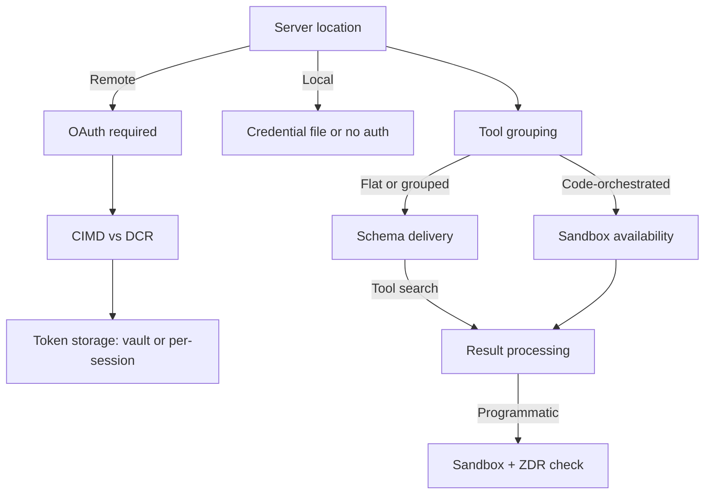

# Production MCP Agent Stack

> Moving an MCP agent from prototype to production means sequencing six orthogonal decisions that constrain each other. The individual patterns are well-documented; the sequence and the cross-pattern gotchas are where real deployments go wrong.

Anthropic's [production MCP guidance](https://claude.com/blog/building-agents-that-reach-production-systems-with-mcp) (April 2026) frames MCP as "the critical layer" for cloud-resident agents — SDK downloads crossed 300M/month, up from 100M at the start of the year. What that post does not spell out in one place is the compositional order: which decision forecloses which, and which combinations silently break.

## The Six-Axis Decision Space

| Axis | Option A | Option B | Option C |
|------|----------|----------|----------|
| **Server location** | Local / stdio | Remote (HTTP/SSE) | — |
| **Tool grouping** | Flat 1:1 with API | Intent-grouped | Code-orchestrated (search + execute) |
| **Schema delivery** | Eager (all tools loaded) | Deferred via tool search (`defer_loading: true`) | — |
| **Result processing** | Raw-to-context | Programmatic tool calling (sandboxed) | — |
| **OAuth client registration** | Static / pre-registered | Dynamic Client Registration (DCR) | Client ID Metadata Documents (CIMD) |
| **Token storage** | Per-session credentials | Vault with refresh | — |

Each axis has a defensible answer in isolation. The production question is which combinations compose cleanly.

## Decision Sequencing

Resolve the decisions in this order — each locks in the option space for the next.

1. **Server location** is the root choice. Remote-first is the only configuration that reaches web, mobile, and cloud-hosted agents ([Anthropic, April 2026](https://claude.com/blog/building-agents-that-reach-production-systems-with-mcp)). Remote forces OAuth; local can use filesystem credentials.
2. **OAuth flow** follows. The [2025-11-25 MCP spec](https://modelcontextprotocol.io/specification/2025-11-25/basic/authorization#client-id-metadata-documents) adds CIMD as the recommended registration mechanism — faster first-time flow and fewer surprise re-auth prompts than DCR.
3. **Token storage** follows from OAuth. For multi-user cloud agents, [Claude Managed Agents vaults](https://platform.claude.com/docs/en/managed-agents/vaults#mcp-oauth-credential) register tokens once, inject them at session creation, and refresh automatically — no secret store to build.
4. **Tool grouping** runs in parallel with the auth track. Flat 1:1 API mirrors degrade at scale: [LongFuncEval (2025)](https://arxiv.org/abs/2505.10570) reports 7–85% selection-accuracy drops as catalogs grow. Intent-grouping ([toolset agentization](toolset-agentization.md)) shrinks the 1-of-N problem; code-orchestration is the extreme form — Cloudflare exposes ~2,500 endpoints through two tools in roughly 1K tokens ([cloudflare/mcp](https://github.com/cloudflare/mcp)).
5. **Schema delivery** constrains and is constrained by grouping. [Tool search with `defer_loading: true`](advanced-tool-use.md) cuts tool-definition tokens by 85%+ but retrieves from whatever catalog you ship.
6. **Result processing** is last. [Programmatic tool calling](advanced-tool-use.md#programmatic-tool-calling-code-based-orchestration) reduces tokens by ~37% on multi-step workflows but requires a sandboxed code-execution environment and is not [Zero Data Retention](https://platform.claude.com/docs/en/agents-and-tools/tool-use/programmatic-tool-calling#data-retention) eligible.

## Cross-Pattern Gotchas

Failure modes that matter in production only appear when patterns combine.

**Dynamic fetching nukes the prompt cache — unless it's tool search.** Rebuilding the tool list per step invalidates the entire cache prefix: tool definitions sit at the top of the hierarchy (`tools` → `system` → `messages`). See the [dynamic tool fetching anti-pattern](../anti-patterns/dynamic-tool-fetching-cache-break.md). Tool search with `defer_loading: true` sidesteps this — deferred tools are excluded from the cacheable prefix ([Anthropic advanced tool use](https://www.anthropic.com/engineering/advanced-tool-use)).

**Tool search and `input_examples` are mutually exclusive per catalog.** The server-side tool search tool cannot surface tools that carry `input_examples` ([tool search error handling](https://platform.claude.com/docs/en/agents-and-tools/tool-use/tool-search-tool#error-handling)). Catalogs that rely on examples need standard calling or a custom client-side search.

**Retrieval quality is the binding constraint at very large catalogs.** Independent testing across 4,027 tools reports 56% (regex) and 64% (BM25) retrieval accuracy on straightforward queries ([Arcade.dev, December 2025](https://www.arcade.dev/blog/anthropic-tool-search-4000-tools-test/)) — well below Anthropic's internal benchmarks. Plan for custom client-side retrieval past a few thousand tools.

**Programmatic calling needs a sandbox the host trusts and is not ZDR-eligible** ([data retention](https://platform.claude.com/docs/en/agents-and-tools/tool-use/programmatic-tool-calling#data-retention)). Workflows that need model reasoning over intermediate state also lose it — only `stdout` returns.

**Intent-grouping benefits from trajectory data.** Regroup based on real co-invocation traces once traffic lands ([toolset agentization](toolset-agentization.md)).

## Example: Cloudflare's Two-Tool MCP Server

Cloudflare's [MCP server](https://github.com/cloudflare/mcp) is the reference extreme of intent-grouping + code-orchestration. The API surface covers ~2,500 endpoints across Workers, DNS, Zero Trust, and the dashboard. A flat mirror would consume tens of thousands of tokens in tool definitions alone.

The design exposes **two** tools — `search` (find relevant API operations) and `execute` (run a chosen operation) — in roughly 1K tokens total ([Anthropic, April 2026](https://claude.com/blog/building-agents-that-reach-production-systems-with-mcp)). Programmatic tool calling compounds the win: for "find all zones with DNSSEC disabled and enable it," the agent writes a short script that loops over results in a sandbox and returns only the changed zones, instead of pulling thousands of zone records into context.

The composition works because every layer lines up: remote-first server → intent grouping pushed to its extreme → deferred schemas not needed (two tools fit eagerly) → programmatic calling handles large result sets → OAuth + vault on the auth side.

## When Not to Deploy the Full Stack

The stack earns its complexity at cloud-hosted multi-user scale. It is overkill when:

- **Under ~20 stable tools, single agent, single tenant.** Intent-grouping and tool search add round-trips with no token benefit; direct API or a CLI is simpler.
- **Air-gapped or on-prem deployments with no sandbox.** Programmatic tool calling is inert without a trusted code-execution environment.
- **Retrieval accuracy floor above ~80% on very large catalogs.** Independent benchmarks show server-side tool search dropping below 65% at 4,000+ tools ([Arcade.dev](https://www.arcade.dev/blog/anthropic-tool-search-4000-tools-test/)) — plan custom retrieval, or split the catalog.
- **Catalogs that depend on `input_examples` for parameter correctness.** Tool search is mutually exclusive with examples; pick one per catalog.

## Key Takeaways

- Six decisions — server location, tool grouping, schema delivery, result processing, OAuth, token storage — constrain each other; sequence matters more than any individual choice.
- Remote-first server forces OAuth, which forces the CIMD-vs-DCR decision, which shapes whether you need a vault.
- Tool search with `defer_loading: true` is the one form of dynamic tool loading that does not break the prompt cache; naive dynamic fetching does.
- Programmatic calling and `input_examples` + tool search are the two composition traps — verify sandbox availability and example-vs-search per catalog before committing.
- Cloudflare's two-tool server over ~2,500 endpoints is the reference case for how far intent-grouping and code-orchestration scale when every layer lines up.

## Related

- [MCP Server Design](mcp-server-design.md) — remote-first, primitive choice, schema design on the server side.
- [MCP Client Design](mcp-client-design.md) — host-side lifecycle, caching, and multi-server routing.
- [Toolset Agentization](toolset-agentization.md) — intent-grouping as a sub-agent pattern with trajectory-based adaptation.
- [Advanced Tool Use](advanced-tool-use.md) — tool search (`defer_loading`), programmatic calling, and input examples in depth.
- [Dynamic Tool Fetching Breaks KV Cache](../anti-patterns/dynamic-tool-fetching-cache-break.md) — the load-bearing gotcha that tool search sidesteps.
- [MCP Protocol](../standards/mcp-protocol.md) — the open standard these patterns build on.
