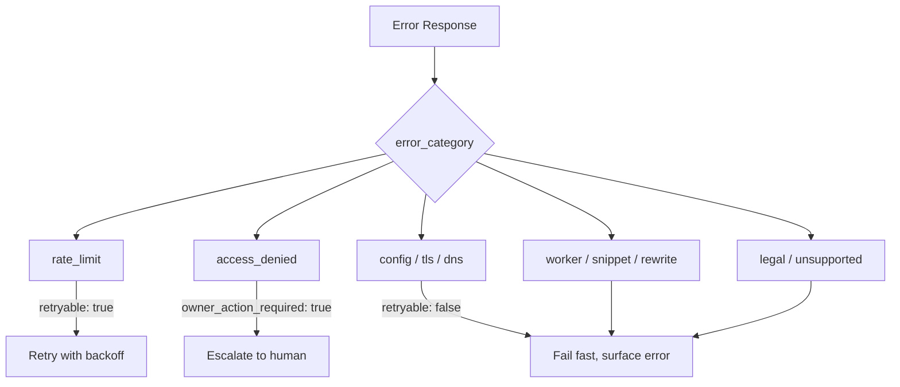

# Machine-Readable Error Responses for AI Agents (RFC 9457)

> Request structured errors from HTTP APIs using `Accept` headers — and emit them from your own agent-facing services — to replace brittle HTML parsing with deterministic control flow.

## The Problem: Errors Designed for Humans

When an agent calls an HTTP API and receives an error, it typically gets an HTML page designed for a browser. A Cloudflare 1015 rate-limit page is ~14,252 tokens as HTML. The agent must pattern-match through markup to extract the status, then guess at retry behaviour from heuristics. At scale, this burns context budget and produces unreliable recovery logic.

The same information as Markdown is 221 tokens (~64.5x reduction). As RFC 9457 JSON: 256 tokens (~55.7x).

## RFC 9457: The Standard

[RFC 9457](https://www.rfc-editor.org/rfc/rfc9457) defines `application/problem+json` — a standard structure for HTTP error details:

```json
{
  "type": "https://errors.example.com/rate-limit",
  "status": 429,
  "title": "Rate Limit Exceeded",
  "detail": "You have exceeded the 100 req/min limit for this endpoint.",
  "instance": "/api/v1/completions/req-abc123"
}
```

Five base fields: `type`, `status`, `title`, `detail`, `instance`. Servers may add extension fields for operational metadata.

## Operational Extension Fields (Cloudflare Pattern)

[Cloudflare's agent-facing error implementation](https://blog.cloudflare.com/rfc-9457-agent-error-pages/) adds extension fields that map directly to agent control-flow branches:

| Field | Type | Purpose |
|-------|------|---------|
| `retryable` | boolean | Whether retrying the same request can succeed |
| `retry_after` | integer (seconds) | Minimum wait before retrying |
| `owner_action_required` | boolean | Whether a human must intervene |
| `error_code` | string | Machine-readable code (e.g., `1015`) |
| `error_category` | string | Broad category for routing logic |

### Error Category Taxonomy

Five error category groups map to three agent actions:



The agent branches on explicit signals rather than inferring intent from status codes or HTML content.

## Requesting Structured Errors

Set the `Accept` header on outbound API calls:

```http
Accept: application/problem+json
```

For a token-efficient prose format with YAML frontmatter (no `Content-Type` negotiation overhead):

```http
Accept: text/markdown
```

The `text/markdown` response embeds operational fields in YAML frontmatter, costs the same as a standard request, and is already supported by Cloudflare's edge.

Example Markdown response for a rate-limit error:

```markdown
---
retryable: true
retry_after: 60
error_code: "1015"
error_category: rate_limit
owner_action_required: false
---

# Rate Limited

You have been rate limited. Wait 60 seconds before retrying.
```

## Integration with Claude Tool Results

Claude's tool-use API forwards structured error content to the model via `is_error: true` in `tool_result` blocks:

```json
{
  "type": "tool_result",
  "tool_use_id": "toolu_abc123",
  "is_error": true,
  "content": [
    {
      "type": "text",
      "text": "{\"retryable\": true, \"retry_after\": 60, \"error_category\": \"rate_limit\", \"title\": \"Rate Limit Exceeded\"}"
    }
  ]
}
```

Claude receives the structured fields and can branch deterministically: if `retryable` is true and `retry_after` is set, wait and retry; if `owner_action_required` is true, surface to the user; otherwise fail fast.

## Emitting RFC 9457 Errors from Agent-Facing Services

When building services that agents will call, emit RFC 9457 responses rather than generic HTTP errors:

```python
from flask import jsonify

def rate_limit_error(retry_after: int):
    return jsonify({
        "type": "https://api.example.com/errors/rate-limit",
        "status": 429,
        "title": "Rate Limit Exceeded",
        "detail": f"Retry after {retry_after} seconds.",
        "retryable": True,
        "retry_after": retry_after,
        "error_category": "rate_limit",
        "owner_action_required": False,
    }), 429, {"Content-Type": "application/problem+json"}
```

This pattern connects three cost and reliability concerns under a single design decision: token spend, retry waste, and escalation routing.

## Unverified Claims

- The issue body cites "58x smaller" — the Cloudflare source documents 64.5x (Markdown) and 55.7x (JSON) for the 1015 error type specifically. A cross-error-type average is not confirmed in the source material.

## Related

- [Semantic Tool Output](semantic-tool-output.md)
- [Context-Injected Error Recovery](../context-engineering/context-injected-error-recovery.md)
- [Error Preservation in Context](../context-engineering/error-preservation-in-context.md)
- [Self-Healing Tool Routing](self-healing-tool-routing.md)
- [Scoped Credentials Proxy](../security/scoped-credentials-proxy.md)
- [Token-Efficient Tool Design](token-efficient-tool-design.md)
