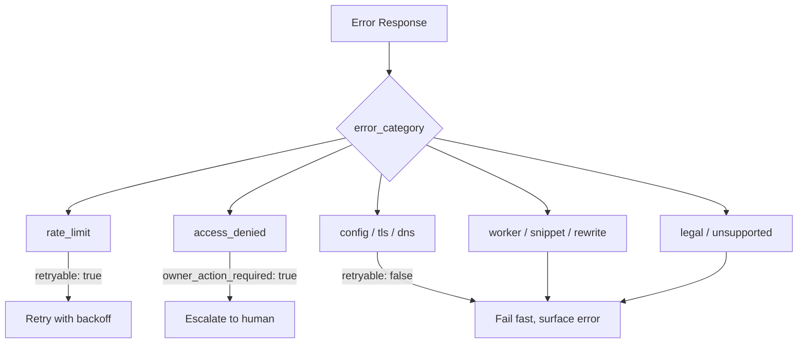

# Machine-Readable Error Responses for AI Agents (RFC 9457)

> Request structured errors from HTTP APIs using `Accept` headers — and emit them from your own agent-facing services — to replace brittle HTML parsing with deterministic control flow.

Learn it hands-on with the [Errors as a Teaching Signal guided lesson](https://learn.agentpatterns.ai/tool-engineering/errors-as-teaching-signal/), which includes quizzes.

## The problem: errors designed for humans

When an agent calls an HTTP API and hits an error, it usually gets back an HTML page built for a browser. A Cloudflare 1015 rate-limit page costs about 14,252 tokens as HTML. The agent has to pattern-match through markup to find the status, then guess at retry behavior from heuristics. At scale, this burns context budget and produces unreliable recovery logic.

The same information as Markdown costs 221 tokens, a reduction of about 64.5 times. As RFC 9457 JSON it costs 256 tokens, about 55.7 times less.

## RFC 9457: the standard

[RFC 9457](https://www.rfc-editor.org/rfc/rfc9457) defines `application/problem+json` — a standard structure for HTTP error details:

```json
{
  "type": "https://errors.example.com/rate-limit",
  "status": 429,
  "title": "Rate Limit Exceeded",
  "detail": "You have exceeded the 100 req/min limit for this endpoint.",
  "instance": "/api/v1/completions/req-abc123"
}
```

RFC 9457 defines five base fields: `type`, `status`, `title`, `detail`, and `instance`. Servers can add extension fields for operational metadata.

## Operational extension fields (Cloudflare pattern)

[Cloudflare's agent-facing error implementation](https://blog.cloudflare.com/rfc-9457-agent-error-pages/) adds extension fields that map directly to agent control-flow branches:

| Field | Type | Purpose |
|-------|------|---------|
| `retryable` | boolean | Whether retrying the same request can succeed |
| `retry_after` | integer (seconds) | Minimum wait before retrying |
| `owner_action_required` | boolean | Whether a human must intervene |
| `error_code` | string | Machine-readable code (for example `1015`) |
| `error_category` | string | Broad category for routing logic |

### Error category taxonomy

Five error category groups map to three agent actions:


```mermaid
graph TD
    E[Error Response] --> cat{error_category}
    cat --> RL[rate_limit]
    cat --> AD[access_denied]
    cat --> C[config / tls / dns]
    cat --> W[worker / snippet / rewrite]
    cat --> L[legal / unsupported]

    RL -->|retryable: true| R[Retry with backoff]
    AD -->|owner_action_required: true| H[Escalate to human]
    C -->|retryable: false| F[Fail fast, surface error]
    W --> F
    L --> F
```

The agent branches on explicit signals rather than inferring intent from status codes or HTML content.

## Requesting structured errors

Set the `Accept` header on outbound API calls:

```http
Accept: application/problem+json
```

For a token-efficient prose format with YAML frontmatter (no `Content-Type` negotiation overhead):

```http
Accept: text/markdown
```

The `text/markdown` response embeds operational fields in YAML frontmatter, costs the same as a standard request, and is already supported by Cloudflare's edge.

Example Markdown response for a rate-limit error:

```markdown
---
retryable: true
retry_after: 60
error_code: "1015"
error_category: rate_limit
owner_action_required: false
---

# Rate Limited

You have been rate limited. Wait 60 seconds before retrying.
```

## Integration with Claude tool results

Claude's tool-use API forwards structured error content to the model via `is_error: true` in `tool_result` blocks:

```json
{
  "type": "tool_result",
  "tool_use_id": "toolu_abc123",
  "is_error": true,
  "content": [
    {
      "type": "text",
      "text": "{\"retryable\": true, \"retry_after\": 60, \"error_category\": \"rate_limit\", \"title\": \"Rate Limit Exceeded\"}"
    }
  ]
}
```

Claude receives the structured fields and can branch deterministically: if `retryable` is true and `retry_after` is set, wait and retry; if `owner_action_required` is true, surface to the user; otherwise fail fast.

## Emitting RFC 9457 errors from agent-facing services

When you build services that agents will call, emit RFC 9457 responses rather than generic HTTP errors:

```python
from flask import jsonify

def rate_limit_error(retry_after: int):
    return jsonify({
        "type": "https://api.example.com/errors/rate-limit",
        "status": 429,
        "title": "Rate Limit Exceeded",
        "detail": f"Retry after {retry_after} seconds.",
        "retryable": True,
        "retry_after": retry_after,
        "error_category": "rate_limit",
        "owner_action_required": False,
    }), 429, {"Content-Type": "application/problem+json"}
```

This pattern connects three cost and reliability concerns under a single design decision: token spend, retry waste, and escalation routing.

## When this backfires

RFC 9457 adoption is uneven. Most third-party APIs do not support `application/problem+json` and silently ignore the `Accept` header, returning HTML regardless. Three conditions make this pattern unreliable:

1. Third-party APIs without RFC 9457 support still hand the agent an HTML error body. Parse defensively: always try structured extraction first, then fall back to plain-text error extraction.
2. Middleware that rewrites Accept headers can break the pattern. Some proxies, API gateways, or WAFs strip or replace `Accept` before the request reaches the origin. Check that the `Accept` header survives the full request path.
3. First-party services that have not adopted the format need active implementation work. The pattern pays off once agents make enough API calls to justify the engineering cost; for low-volume integrations, generic error handling may be enough.

## Key Takeaways

- Request structured errors by setting `Accept: application/problem+json` or `Accept: text/markdown` on outbound API calls.
- RFC 9457 defines five base fields — `type`, `status`, `title`, `detail`, `instance` — that any compliant server returns.
- Cloudflare's extension fields (`retryable`, `retry_after`, `owner_action_required`, `error_code`, `error_category`) map errors directly to agent control-flow branches.
- Emit RFC 9457 responses from first-party agent-facing services so agents can replace HTML-parsing heuristics with explicit field checks.
- Parse defensively: many third-party APIs ignore the `Accept` header, and middleware can strip it before the request reaches the origin.

## Related

- [Semantic Tool Output](semantic-tool-output.md)
- [Context-Injected Error Recovery](../context-engineering/context-injected-error-recovery.md)
- [Error Preservation in Context](../context-engineering/error-preservation-in-context.md)
- [Self-Healing Tool Routing](self-healing-tool-routing.md)
- [Scoped Credentials Proxy](../security/scoped-credentials-proxy.md)
- [Token-Efficient Tool Design](../token-engineering/token-efficient-tool-design.md)
