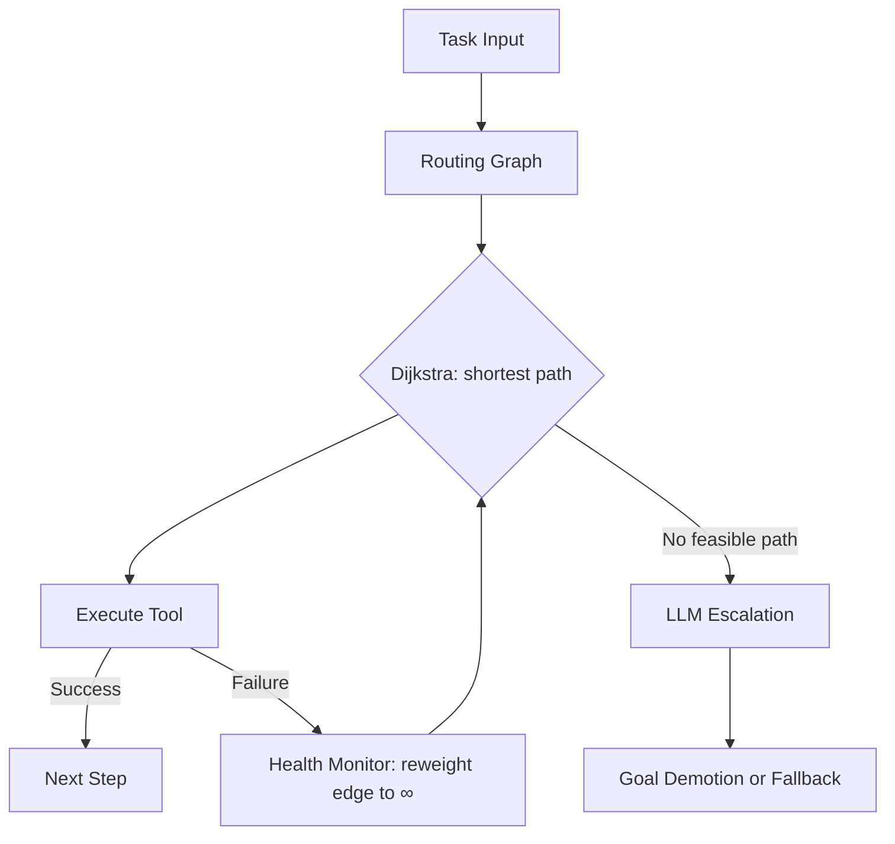

# Self-Healing Tool Routing

> Route agent tool-call decisions through a cost-weighted graph with parallel health monitors; recompute paths deterministically on failure and escalate to the LLM only when no feasible path exists.

## The Problem With LLM-Driven Control Flow

In a ReAct-style loop, the LLM decides which tool to call on every step — including retries and fallbacks. Most retry and fallback decisions follow deterministic rules: "this tool failed, use the next available one." Routing them through the LLM wastes inference budget and introduces latency for decisions that require no reasoning.

Static workflow baselines avoid this cost but produce silent failures: when a tool is unavailable, the workflow halts or skips silently. Neither failure mode is acceptable for production agents.

## The Pattern

Model each tool as a node in a directed graph. Each edge carries two weights: cost (inference latency, API tokens, or monetary cost) and availability (derived from live health monitors). Compute the lowest-cost path through available tools using Dijkstra's algorithm at each routing step — no LLM call is involved in the routing decision itself.



### Graph Construction

Each node represents a tool invocation. Edges represent valid sequencing relationships. Edge weights encode the cost of traversing that transition: an HTTP tool with a 200ms P99 gets a low weight; an LLM-backed synthesizer gets a high one. Weights are tunable at deploy time.

### Parallel Health Monitors

Dedicated monitors run alongside execution, continuously probing tool availability. When a tool fails, its health monitor resets its outgoing edge weights to infinity. Dijkstra recomputes the path in-process — the next routing decision reflects the current health state without any LLM involvement.

### LLM Escalation on Infeasibility

The LLM is invoked only when no feasible path exists in the current graph — meaning every candidate tool is unavailable or every route leads to an infinity-weighted dead end. At that point, the harness passes the routing failure to the LLM for goal demotion or explicit escalation to the user. This preserves the LLM's reasoning budget for decisions that genuinely require it.

## Results

Testing across 19 scenarios and three graph topologies (linear pipeline, dependency DAG, parallel fan-out), the Self-Healing Router achieves a [93% reduction in LLM control-plane calls](https://arxiv.org/abs/2603.01548) compared to a ReAct baseline — 9 aggregate LLM calls versus 123 — with equivalent task correctness.

Every failure is either a logged reroute or an explicit escalation — the silent-failure mode of static workflows is eliminated without paying the inference cost of LLM-directed recovery.

## Why It Works

The 93% reduction in LLM control-plane calls follows from a structural property: the routing decisions eliminated are those that carry no ambiguity. A ReAct agent consults the LLM at every step, including steps where the only valid action is "retry with the next available tool." Because the LLM must re-read context, re-evaluate tool options, and generate a decision token sequence, each such call costs fixed inference overhead regardless of decision difficulty. Dijkstra routing moves those decisions into an in-process graph traversal — constant-time per edge, no token sampling — and reserves LLM inference for states where graph traversal returns no feasible path. The result is a step-function cost reduction proportional to the fraction of steps that are unambiguously deterministic, which in practice is the majority of steps in failure-recovery scenarios.

## Positioning on the Workflow/Agent Spectrum

[Anthropic's agent design guidance](https://www.anthropic.com/engineering/building-effective-agents) distinguishes fixed workflows (predefined code paths) from full agents (LLM-directed). Self-Healing Tool Routing occupies the space between them: paths adapt at runtime based on live health state, but adaptation is deterministic — the LLM is not involved until adaptation is impossible. This is a third mode: deterministic adaptive routing.

Complementary to, not in competition with:

- **Workload-specialized model routing** ([arXiv:2603.05344](https://arxiv.org/abs/2603.05344)): routes at the model-selection level, not the tool-call level
- **Lazy tool discovery**: reduces context window cost by deferring tool schema loading until a tool is actually needed; orthogonal to control-plane call reduction
- **Harness-level loop detection** ([LangChain](https://blog.langchain.com/improving-deep-agents-with-harness-engineering/)): catches failure at the middleware level through hooks, not through graph reweighting

## When This Backfires

Graph construction and edge reweighting add overhead that simple alternatives don't pay. Avoid this pattern when:

- **Tool set is small and stable** (fewer than ~5 tools): a static priority list with a retry counter has lower setup cost and comparable fault tolerance.
- **Failure rates are near-zero** in production: the health monitor infrastructure carries ongoing overhead for a failure path that rarely executes; a harness-level exception handler is simpler.
- **Tool dependencies are dynamic**: when sequencing rules change per-request (e.g., multi-tenant agents with per-user tool grants), rebuilding the graph on each request can exceed the latency savings from avoiding LLM routing calls.

## Implementation Notes

Four components are required:

1. **Tool graph**: directed graph with per-edge cost and availability weights
2. **Health monitors**: per-tool probes running in parallel; update edge weights on failure events
3. **Router**: Dijkstra (or A* with admissible heuristic) run at each step against the current graph state
4. **Escalation handler**: invoked when the router returns no feasible path; passes failure context to the LLM

The paper ([arXiv:2603.01548](https://arxiv.org/abs/2603.01548)) documents the routing algorithm and benchmark results; specific health monitor API contracts and integration code are implementation choices left to the adopter.

## Example

The following implements the core routing graph and Dijkstra-based path selection. Health monitors update edge weights when a tool fails; the LLM is only called when no feasible path exists.

```python
import heapq
import math

# Tool graph: adjacency list with (neighbor, cost) pairs
# Edge cost reflects latency/token cost; math.inf = tool unavailable
TOOL_GRAPH = {
    "web_search": [("summarizer", 1), ("llm_synthesizer", 10)],
    "summarizer": [("output", 1)],
    "llm_synthesizer": [("output", 5)],
    "output": [],
}

# Health monitor: set edge to inf on failure
def mark_unavailable(graph: dict, tool: str) -> None:
    for src, edges in graph.items():
        graph[src] = [
            (dst, math.inf if dst == tool else cost)
            for dst, cost in edges
        ]

def dijkstra(graph: dict, start: str, end: str) -> list[str] | None:
    heap = [(0, start, [start])]
    visited = set()
    while heap:
        cost, node, path = heapq.heappop(heap)
        if node in visited:
            continue
        visited.add(node)
        if node == end:
            return path
        for neighbor, edge_cost in graph.get(node, []):
            if neighbor not in visited and edge_cost < math.inf:
                heapq.heappush(heap, (cost + edge_cost, neighbor, path + [neighbor]))
    return None  # No feasible path — escalate to LLM

# Simulate a tool failure: summarizer is down
mark_unavailable(TOOL_GRAPH, "summarizer")

path = dijkstra(TOOL_GRAPH, "web_search", "output")
if path:
    print("Routing path:", " -> ".join(path))
    # Routing path: web_search -> llm_synthesizer -> output
else:
    print("No feasible path — escalating to LLM for goal demotion")
```

When `summarizer` is healthy, the router selects the lower-cost path `web_search → summarizer → output`. After the health monitor marks `summarizer` unavailable, Dijkstra recomputes to `web_search → llm_synthesizer → output` — no LLM call involved in the reroute decision itself.

## Key Takeaways

- Most tool-selection decisions in agent loops are routing, not reasoning — treat them as such and remove them from the LLM's critical path.
- Parallel health monitors that reweight graph edges provide live fault detection without polling overhead or harness-level retries.
- Reserving LLM calls for the no-feasible-path case is the key inversion versus ReAct — it converts a constant per-step cost into an occasional escalation cost.

## Related

- [Cost-Aware Agent Design](../agent-design/cost-aware-agent-design.md)
- [Circuit Breakers](../observability/circuit-breakers.md)
- [Loop Detection](../observability/loop-detection.md)
- [MCP Client Design](mcp-client-design.md)
- [Tool Engineering](tool-engineering.md)
- [RFC 9457 Machine-Readable Errors](rfc9457-machine-readable-errors.md)
- [Token-Efficient Tool Design](token-efficient-tool-design.md)
