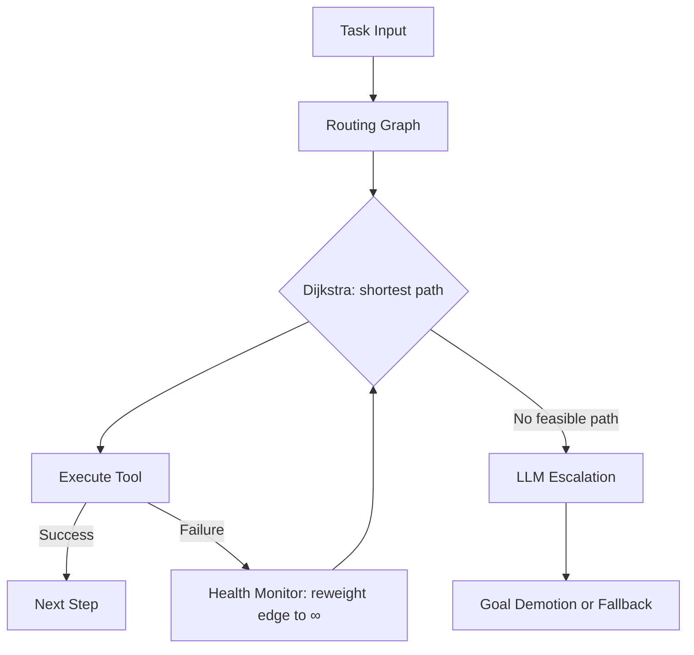

# Self-Healing Tool Routing

> Route tool calls through a cost-weighted graph; recompute paths on failure and invoke the LLM only when no feasible path exists.

## The problem with LLM-driven control flow

In a ReAct-style loop, the LLM decides which tool to call on every step, including retries and fallbacks. Most follow deterministic rules: this tool failed, use the next available one. Routing them through the LLM wastes inference budget and adds latency for decisions that need no reasoning — the cost [token-efficient tool design](../token-engineering/token-efficient-tool-design.md) targets.

Static workflow baselines avoid this cost but produce silent failures: when a tool is unavailable, the workflow halts or skips. Neither failure mode is acceptable for production agents.

## The pattern

Model each tool as a node in a directed graph. Each edge carries two weights: cost (latency, tokens, or money) and availability (from live health monitors). At each step, compute the lowest-cost path through available tools with Dijkstra's algorithm — the routing decision makes no LLM call, the [cost-aware](../token-engineering/cost-aware-agent-design.md) inversion at the pattern's center.


```mermaid
graph TD
    A[Task Input] --> B[Routing Graph]
    B --> C{Dijkstra: shortest path}
    C --> D[Execute Tool]
    D -->|Success| E[Next Step]
    D -->|Failure| F[Health Monitor: reweight edge to ∞]
    F --> C
    C -->|No feasible path| G[LLM Escalation]
    G --> H[Goal Demotion or Fallback]
```

### Graph construction

Each node is a tool invocation, and edges encode valid sequencing. Edge weights reflect transition cost: an HTTP tool with 200ms P99 gets a low weight, and an LLM-backed synthesizer gets a high one. Tune the weights at deploy time.

### Parallel health monitors

Dedicated monitors probe tool availability alongside execution. When a tool fails, its monitor resets outgoing edge weights to infinity, the same health-state tripping that [circuit breakers](../observability/circuit-breakers.md) apply at the call boundary. Dijkstra recomputes in-process, so the next routing decision reflects current health without the LLM.

### LLM escalation on infeasibility

The LLM runs only when no feasible path exists: every candidate tool unavailable, or every route infinity-weighted. The harness passes the failure to the LLM for goal demotion or explicit user escalation, preserving reasoning budget for decisions that genuinely need it.

## Results

Testing across 19 scenarios and three graph topologies (linear pipeline, dependency DAG, parallel fan-out), the Self-Healing Router achieves a [93% reduction in LLM control-plane calls](https://arxiv.org/abs/2603.01548v1) compared to a ReAct baseline — 9 aggregate LLM calls versus 123 — with equivalent task correctness.

Every failure is either a logged reroute or an explicit escalation — the silent-failure mode of static workflows is eliminated without paying the inference cost of LLM-directed recovery.

## Why it works

The 93% reduction follows from one structural property: eliminated routing decisions carry no ambiguity. A ReAct agent consults the LLM even when the only valid action is to retry with the next available tool. Dijkstra routing moves those decisions into in-process graph traversal with no token sampling, reserving LLM inference for states where no feasible path exists. Savings scale with the fraction of steps that are deterministic, which dominates failure-recovery workloads.

## Positioning on the workflow and agent spectrum

[Anthropic's agent design guidance](https://www.anthropic.com/engineering/building-effective-agents) distinguishes fixed workflows from LLM-directed agents. Self-Healing Tool Routing sits between them: paths adapt to live health state, but adaptation is deterministic. The LLM stays out until adaptation is impossible.

This pattern complements three others rather than competing:

- [Workload-specialized model routing](https://arxiv.org/abs/2603.05344) routes at the model-selection level, not the tool-call level
- Lazy tool discovery defers tool schema loading until needed, separate from control-plane call reduction
- [Harness-level loop detection](https://blog.langchain.com/improving-deep-agents-with-harness-engineering/) catches failures through middleware hooks, not graph reweighting

## When this backfires

Graph construction and edge reweighting add overhead that simpler alternatives do not pay. Avoid this pattern when:

- The tool set is small and stable (fewer than about 5 tools): a static priority list with a retry counter has lower setup cost and comparable fault tolerance
- Failure rates are near-zero in production: the health monitor infrastructure carries ongoing overhead for a failure path that rarely runs, so a harness-level exception handler is simpler
- Tool dependencies are dynamic: when sequencing rules change per request (for example, multi-tenant agents with per-user tool grants), rebuilding the graph on each request can exceed the latency saved by avoiding LLM routing calls

## Implementation notes

Four components:

1. Tool graph: a directed graph with per-edge cost and availability weights.
2. Health monitors: per-tool probes that run in parallel, updating edge weights on failure events.
3. Router: Dijkstra (or A* with an admissible heuristic) run at each step against the current graph state.
4. Escalation handler: invoked when the router returns no feasible path, passing failure context to the LLM.

The paper ([arXiv:2603.01548](https://arxiv.org/abs/2603.01548)) documents the routing algorithm and benchmark results; health monitor API contracts and integration code are left to the adopter.

## Example

The following implements the core routing graph and Dijkstra-based path selection. Health monitors update edge weights when a tool fails; the LLM is only called when no feasible path exists.

```python
import heapq
import math

# Tool graph: adjacency list with (neighbor, cost) pairs
# Edge cost reflects latency/token cost; math.inf = tool unavailable
TOOL_GRAPH = {
    "web_search": [("summarizer", 1), ("llm_synthesizer", 10)],
    "summarizer": [("output", 1)],
    "llm_synthesizer": [("output", 5)],
    "output": [],
}

# Health monitor: set edge to inf on failure
def mark_unavailable(graph: dict, tool: str) -> None:
    for src, edges in graph.items():
        graph[src] = [
            (dst, math.inf if dst == tool else cost)
            for dst, cost in edges
        ]

def dijkstra(graph: dict, start: str, end: str) -> list[str] | None:
    heap = [(0, start, [start])]
    visited = set()
    while heap:
        cost, node, path = heapq.heappop(heap)
        if node in visited:
            continue
        visited.add(node)
        if node == end:
            return path
        for neighbor, edge_cost in graph.get(node, []):
            if neighbor not in visited and edge_cost < math.inf:
                heapq.heappush(heap, (cost + edge_cost, neighbor, path + [neighbor]))
    return None  # No feasible path — escalate to LLM

# Simulate a tool failure: summarizer is down
mark_unavailable(TOOL_GRAPH, "summarizer")

path = dijkstra(TOOL_GRAPH, "web_search", "output")
if path:
    print("Routing path:", " -> ".join(path))
    # Routing path: web_search -> llm_synthesizer -> output
else:
    print("No feasible path — escalating to LLM for goal demotion")
```

When `summarizer` is healthy, the router selects the lower-cost path `web_search → summarizer → output`. After the health monitor marks `summarizer` unavailable, Dijkstra recomputes to `web_search → llm_synthesizer → output` — no LLM call involved in the reroute decision itself.

## Key Takeaways

- Most tool-selection decisions in agent loops are routing, not reasoning — treat them as such and remove them from the LLM's critical path.
- Parallel health monitors that reweight graph edges provide live fault detection without polling overhead or harness-level retries.
- Reserving LLM calls for the no-feasible-path case is the key inversion versus ReAct — it converts a constant per-step cost into an occasional escalation cost.

## Related

- [Cost-Aware Agent Design](../token-engineering/cost-aware-agent-design.md)
- [Circuit Breakers](../observability/circuit-breakers.md)
- [Loop Detection](../observability/loop-detection.md)
- [MCP Client Design](mcp-client-design.md)
- [Tool Engineering](tool-engineering.md)
- [RFC 9457 Machine-Readable Errors](rfc9457-machine-readable-errors.md)
- [Token-Efficient Tool Design](../token-engineering/token-efficient-tool-design.md)
