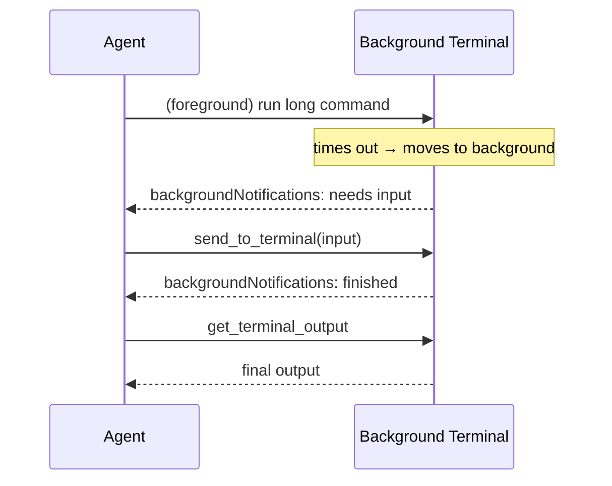

# Terminal Tools for Agents: send_to_terminal and Background Interaction

> VS Code 1.115 adds `send_to_terminal` and the `backgroundNotifications` setting, giving agents bidirectional control over background terminal processes — eliminating polling and enabling recovery from interactive stalls.

## The Problem

Agents running terminal commands face two gaps:

**Read-only background access.** Before VS Code 1.115, once a foreground terminal timed out and moved to the background, it became read-only. `get_terminal_output` could sample its output, but agents could not send input. An SSH session waiting at a password prompt, or a REPL waiting for a command, would stall indefinitely.

**Passive polling for completion.** Agents had no way to know when a background command finished or needed input. The only option was to call `get_terminal_output` repeatedly — wasting turns and introducing latency before the agent could react.

## Two New Primitives

[VS Code 1.115](https://code.visualstudio.com/updates/v1_115) (April 8, 2026) introduces two capabilities that address these gaps directly.

### `send_to_terminal`

The new `send_to_terminal` tool lets an agent write input to any background terminal — not just foreground ones. This restores interactivity to sessions that have timed out and moved to the background.

Concrete use cases:

- **SSH with password prompt** — the foreground terminal times out; the agent uses `send_to_terminal` to deliver the password without restarting the session
- **REPL interaction** — keep a long-running Python or Node REPL alive and issue commands as needed
- **Dev server with runtime prompts** — some servers prompt for confirmation on file changes; the agent can respond without manual intervention
- **Test watcher commands** — send filter commands or rerun triggers to a watching test runner

### `backgroundNotifications` (Experimental)

The `chat.tools.terminal.backgroundNotifications` setting eliminates polling. When enabled, the agent receives an automatic notification when a background terminal command finishes or requires input — including terminals that were foreground and timed out.

The agent can then act immediately: call `get_terminal_output` to review the result, or call `send_to_terminal` to provide the needed input.

**Enable in VS Code settings:**

```json
{
  "chat.tools.terminal.backgroundNotifications": true
}
```

## How the Primitives Compose

The three terminal tools form a complete async I/O loop for background processes:



Without `backgroundNotifications`, the agent must poll `get_terminal_output` in a loop, inferring completion from output changes rather than an explicit signal. Without `send_to_terminal`, the agent is blind-ended when a process waits for input.

## Comparison: VS Code vs. Claude Code

Both VS Code Copilot and Claude Code solve the "agent needs to react to async terminal events" problem, but through different mechanisms:

| Capability | VS Code Copilot | Claude Code |
|-----------|----------------|-------------|
| Write to terminal | `send_to_terminal` tool | `Bash` tool (new subprocess only) |
| React to background events | `backgroundNotifications` setting | `Monitor` tool (streams stdout) |
| Background read | `get_terminal_output` tool | `Bash` + polling [unverified] |

VS Code uses a setting to push events to the agent; Claude Code exposes `Monitor` as a dedicated streaming tool where each stdout line arrives as a notification. Both avoid the polling loop, but the integration point differs — a setting vs. a tool call.

## Example

An agent managing a development workflow starts a Next.js dev server in a terminal, continues work in other files, then needs to check if the server is ready:

**Without `backgroundNotifications`:**

```
Agent turn 1: [run terminal command: npm run dev]
Agent turn 2: get_terminal_output() → "Starting..."
Agent turn 3: get_terminal_output() → "Starting..."  ← polling
Agent turn 4: get_terminal_output() → "Ready on :3000"
```

**With `backgroundNotifications`:**

```
Agent turn 1: [run terminal command: npm run dev]
[agent works on other files]
Notification received: background terminal finished
Agent turn 2: get_terminal_output() → "Ready on :3000"
```

The agent recovers those polling turns and receives the signal with lower latency.

## Key Takeaways

- `send_to_terminal` gives agents write access to background terminals, enabling recovery from interactive stalls like SSH password prompts and REPL input waits
- `backgroundNotifications` (experimental, `chat.tools.terminal.backgroundNotifications`) pushes completion and input-needed events to the agent, eliminating `get_terminal_output` polling loops
- `get_terminal_output` (read) + `send_to_terminal` (write) + `backgroundNotifications` (event) form a complete async I/O model for background terminal process management
- Claude Code's `Monitor` tool fills the equivalent role in Claude-based agent workflows by streaming background process stdout as notifications

## Unverified Claims

- Claude Code `Bash` tool polling behavior for background processes: described as requiring repeated calls to approximate completion detection, but the exact mechanism is not confirmed against Claude Code documentation.

## Related

- [CLI Scripts as Agent Tools](cli-scripts-as-agent-tools.md)
- [Override Interactive Commands](override-interactive-commands.md)
- [Batch File Operations via Bash Scripts](batch-file-operations.md)
- [Hooks and Lifecycle Events](hooks-lifecycle-events.md)
- [Self-Healing Tool Routing](self-healing-tool-routing.md)
