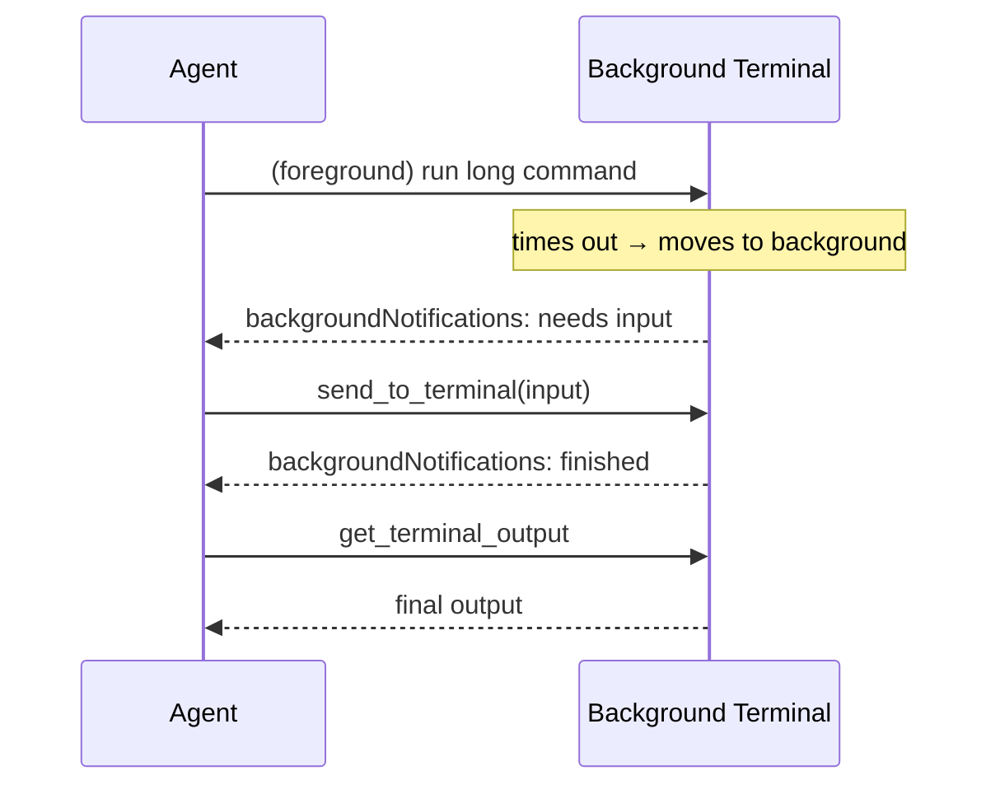

# Terminal Tools for Agents: send_to_terminal and Background Interaction

> VS Code 1.115 adds `send_to_terminal` and the `backgroundNotifications` setting, giving agents bidirectional control over background terminal processes — eliminating polling and enabling recovery from interactive stalls.

## The problem

Agents running terminal commands face two gaps.

Read-only background access. Before VS Code 1.115, once a foreground terminal timed out and moved to the background, it became read-only. `get_terminal_output` could sample its output, but agents could not send input. An SSH session waiting at a password prompt, or a REPL waiting for a command, would stall indefinitely.

Passive polling for completion. Agents had no way to know when a background command finished or needed input. The only option was to call `get_terminal_output` repeatedly. This wasted turns and added latency before the agent could react.

## Two new primitives

[VS Code 1.115](https://code.visualstudio.com/updates/v1_115) (April 8, 2026) introduces two capabilities that address these gaps directly. [VS Code 1.116](https://code.visualstudio.com/updates/v1_116) (April 15, 2026) generalized both to any visible terminal and turned the notification setting on by default.

### `send_to_terminal`

The `send_to_terminal` tool lets an agent write input to any terminal visible in the panel: background terminals that timed out, and, as of [VS Code 1.116](https://code.visualstudio.com/updates/v1_116), foreground terminals a human started too. Interactive sessions stop being one-way black boxes.

Use cases:

- SSH with a password prompt: the foreground terminal times out, and the agent uses `send_to_terminal` to deliver the password without restarting the session (see [keeping a captured secret out of the model's context](../security/sensitive-terminal-prompt-interception.md) when this path is in use)
- REPL interaction: keep a long-running Python or Node REPL alive and issue commands as needed
- Dev server with runtime prompts: some servers prompt for confirmation on file changes, and the agent can respond without manual help
- Test watcher commands: send filter commands or rerun triggers to a watching test runner

### `backgroundNotifications`

The `chat.tools.terminal.backgroundNotifications` setting removes polling. The agent gets an automatic notification when a background terminal command finishes or needs input, including terminals that were foreground and timed out. The setting shipped as experimental in VS Code 1.115 and is [enabled by default in VS Code 1.116+](https://code.visualstudio.com/updates/v1_116), so most users get this behavior without configuration.

The agent can then act right away: call `get_terminal_output` to review the result, or call `send_to_terminal` to provide the needed input.

To override the default, set this in VS Code settings:

```json
{
  "chat.tools.terminal.backgroundNotifications": false
}
```

Set it to `true` only on VS Code 1.115. On 1.116+ it is already on.

## How the primitives compose

The three terminal tools form a complete async I/O loop for background processes:


```mermaid
sequenceDiagram
    participant A as Agent
    participant T as Background Terminal
    A->>T: (foreground) run long command
    Note over T: times out → moves to background
    T-->>A: backgroundNotifications: needs input
    A->>T: send_to_terminal(input)
    T-->>A: backgroundNotifications: finished
    A->>T: get_terminal_output
    T-->>A: final output
```

Without `backgroundNotifications`, the agent must poll `get_terminal_output` in a loop and infer completion from output changes rather than an explicit signal. Without `send_to_terminal`, the agent has no way to respond when a process waits for input.

## Comparison: VS Code vs Claude Code

Both VS Code Copilot and Claude Code solve the same problem: the agent needs to react to async terminal events. They use different mechanisms.

| Capability | VS Code Copilot | Claude Code |
|-----------|----------------|-------------|
| Write to terminal | `send_to_terminal` tool | `Bash` tool (new subprocess only) |
| React to background events | `backgroundNotifications` setting | `Monitor` tool (streams stdout) |
| Background read | `get_terminal_output` tool | `Bash` + polling ([source](https://code.claude.com/docs/en/tools-reference)) |

VS Code uses a setting to push events to the agent; Claude Code exposes `Monitor` as a dedicated streaming tool where each stdout line arrives as a notification. Both avoid the polling loop, but the integration point differs: a setting rather than a tool call.

## Example

An agent managing a development workflow starts a Next.js dev server in a terminal, continues work in other files, then needs to check whether the server is ready.

Without `backgroundNotifications`:

```
Agent turn 1: [run terminal command: npm run dev]
Agent turn 2: get_terminal_output() → "Starting..."
Agent turn 3: get_terminal_output() → "Starting..."  ← polling
Agent turn 4: get_terminal_output() → "Ready on :3000"
```

With `backgroundNotifications`:

```
Agent turn 1: [run terminal command: npm run dev]
[agent works on other files]
Notification received: background terminal finished
Agent turn 2: get_terminal_output() → "Ready on :3000"
```

The agent recovers those polling turns and receives the signal with lower latency.

## Key Takeaways

- `send_to_terminal` gives agents write access to background terminals, enabling recovery from interactive stalls like SSH password prompts and REPL input waits
- `backgroundNotifications` (`chat.tools.terminal.backgroundNotifications`, default-on as of VS Code 1.116) pushes completion and input-needed events to the agent, eliminating `get_terminal_output` polling loops
- `get_terminal_output` (read) + `send_to_terminal` (write) + `backgroundNotifications` (event) form a complete async I/O model for background terminal process management
- Claude Code's `Monitor` tool fills the equivalent role in Claude-based agent workflows by streaming background process stdout as notifications

## When this backfires

Behavior change between minor releases. The setting shipped experimental in 1.115 and became on-by-default in 1.116 a week later. Workflows that branched on its presence — or that assumed the agent would poll because the setting was off — silently changed shape on upgrade. Treat the notification surface as a moving target across minor VS Code updates and retest the agent loop after each.

Version lock-in. `send_to_terminal` and `backgroundNotifications` are VS Code 1.115+ features, and the foreground-terminal extension to `send_to_terminal` requires 1.116+. Teams pinned to an older VS Code version, or using a different IDE entirely, cannot adopt this pattern. Falling back to `get_terminal_output` polling is still required in those environments.

Notification reliability. The `backgroundNotifications` event fires when the shell reports process exit or input-wait status. Processes that stall without exiting (hung network calls, deadlocked threads) produce no notification — the agent waits indefinitely unless a separate timeout is enforced. The polling loop the setting replaces can at least detect output staleness.

## Related

- [CLI Scripts as Agent Tools](cli-scripts-as-agent-tools.md)
- [Override Interactive Commands](override-interactive-commands.md)
- [Batch File Operations via Bash Scripts](batch-file-operations.md)
- [Hooks and Lifecycle Events](hooks-lifecycle-events.md)
- [Self-Healing Tool Routing](self-healing-tool-routing.md)
- [Terminal Tool Output Compression](terminal-output-compression.md) — sibling pattern for managing terminal output volume once `get_terminal_output` is wired up
- [Out-of-Band Hook Notifications via terminalSequence](terminal-sequence-hook-notifications.md) — alternative notification path when an agent needs to signal completion without relying on the chat surface
- [Future-Based Asynchronous Function Calling](future-based-async-function-calling.md) — broader async-tool-call pattern that `backgroundNotifications` implements for terminals
