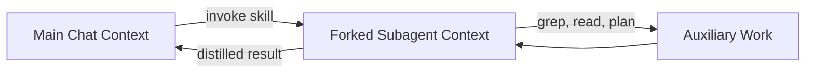

# Skill Context Isolation: Forking the Skill into a Subagent Window

> Run a skill in an isolated subagent context so its auxiliary tokens — search hits, intermediate plans, raw tool output — never enter the main chat. Only the skill's distilled result returns to the parent thread.

!!! note "Also known as"
    Dedicated context for skills, skill fork context. For the broader sub-agent isolation pattern, see [Sub-Agents for Fan-Out](../multi-agent/sub-agents-fan-out.md). For the SKILL.md syntax, see [Skill Frontmatter Reference](skill-frontmatter-reference.md).

Skill context isolation is a per-invocation context-engineering choice: the skill executes inside a forked subagent window, and only its final output crosses back. The selection unit is the skill call, not the task or the turn — same model, isolated context.

## What Forks and What Returns



The auxiliary work — file reads, search results, intermediate scratch, multi-step tool chains — stays inside the fork. The main thread sees a single skill call with a compact result, not the trace that produced it.

## Two Tools, One Mechanism

Both Claude Code and VS Code expose this as a frontmatter opt-in.

**Claude Code** sets `context: fork` plus an `agent:` type in the SKILL.md frontmatter. The skill body becomes the subagent's task prompt; the agent type supplies tools and permissions. Built-in agents include `Explore` (Haiku, read-only — fast codebase search), `Plan` (read-only — pre-planning research), and `general-purpose` (full tools) ([SKILL.md Frontmatter Reference](skill-frontmatter-reference.md)).

```yaml
---
name: deep-research
description: Research a topic thoroughly across the codebase
context: fork
agent: Explore
---
```

**VS Code 1.118** (2026-04-29) shipped "Dedicated Context for Skills" with the same `context: fork` opt-in. The release notes name the failure it solves: "When you use a skill that performs multi-step tool calls or pulls in large reference material, that auxiliary content can crowd your main chat context and degrade the quality of follow-up responses" ([VS Code 1.118 release notes](https://code.visualstudio.com/updates/v1_118)).

## When to Fork

Fork when all three conditions hold:

- The skill produces substantially more auxiliary tokens than its final result (search-heavy, planning, multi-step reasoning, long tool chains)
- The result is self-contained — the user does not typically follow up by referencing intermediate state
- The skill body contains explicit step-by-step instructions, not just reference content

If any condition fails, leaving the skill in the main context is the right default.

## When It Backfires

- **Reference-only skills** — `context: fork` plus a body that is taxonomy, template, or knowledge produces empty output. The subagent receives the body as its task; with no instructions, there is nothing to do ([Skill Frontmatter Reference](skill-frontmatter-reference.md)).
- **Follow-up sensitivity** — when the user routinely acts on intermediate findings ("now refactor the third caller"), forking discards exactly the state the next turn needs.
- **Small auxiliary footprint** — subagent framing overhead (system prompt, tool definitions, result wrapping) can exceed what the fork saves on short-output skills.
- **Determinism-required outputs** — security audits, diff review, and other workflows where the user must see the raw work cannot tolerate a summarised return.
- **Debug iteration** — while the skill itself is being authored, the inner trace needs to be visible. Fork after the skill is stable.

## Why It Works

Transformer attention is allocated across all tokens in context; auxiliary tokens compete with primary task tokens for both attention and absolute window capacity. Anthropic frames sub-agent isolation as a context management strategy: "the detailed search context remains isolated within sub-agents, while the lead agent focuses on synthesizing and analyzing the results," with sub-agents typically returning condensed summaries of 1,000–2,000 tokens ([Anthropic — Effective Context Engineering for AI Agents](https://www.anthropic.com/engineering/effective-context-engineering-for-ai-agents)). When the raw exploration substantially exceeds that summary size, the fork keeps the main context lean for follow-up turns.

## Distinct From Related Patterns

| Pattern | Selection unit | What is held constant |
|---------|---------------|----------------------|
| **Skill context isolation** | Per skill call | Same model, isolated context window |
| [Specialized SLM as agent tool](../agent-design/specialized-slm-as-agent-tool.md) | Per tool call | Different (smaller) model behind a tool boundary |
| [Sub-agents for fan-out](../multi-agent/sub-agents-fan-out.md) | Per parallel branch | Same model, isolated contexts, primary goal is parallelism |
| [Cost-aware tier routing](../agent-design/cost-aware-agent-design.md) | Per turn or role | Different model selected for cost |

The differentiator: skill context isolation is a context-window decision, not a model decision and not a parallelism decision.

## Example

A research-style skill with high auxiliary footprint and a self-contained result is the canonical fit. The body has explicit steps — a critical condition for `context: fork` to produce output.

```yaml
---
name: deep-research
description: Research a topic thoroughly across the codebase
context: fork
agent: Explore
---

Research $ARGUMENTS:

1. Find relevant files using Glob and Grep
2. Read and analyze the code
3. Summarize findings with specific file references
```

Without forking, the parent context absorbs every Glob hit, every file read, and every intermediate note before the final summary. With forking, only the summary (file references and findings) crosses back. The next turn can use the summary as input but cannot reference the dropped intermediates — which is the point.

## Key Takeaways

- The mechanism is context-window scoping per skill invocation, not model selection or parallelism — the same model runs the skill, just inside an isolated window
- VS Code 1.118 and Claude Code both use the same `context: fork` frontmatter opt-in; the failure mode they target is auxiliary skill content crowding the main chat
- Fork only when the skill is high-auxiliary-volume, has a self-contained result, and contains explicit step-by-step instructions; reference-only bodies produce empty output
- Counter-indications are real: follow-up sensitivity, small footprint, determinism requirements, and active skill debugging all favor leaving the skill in the main context

## Related

- [Skill Frontmatter Reference](skill-frontmatter-reference.md) — `context:` and `agent:` fields, built-in agent types, fork caveats
- [Skill Authoring Patterns](skill-authoring-patterns.md) — when a skill warrants the overhead of structured authoring
- [Sub-Agents for Fan-Out](../multi-agent/sub-agents-fan-out.md) — same isolation primitive applied to parallel research
- [Cross-Tool Subagent Comparison](../multi-agent/cross-tool-subagent-comparison.md) — how Claude Code, Gemini CLI, and Copilot CLI differ on subagent isolation
- [Specialized SLM as Agent Tool](../agent-design/specialized-slm-as-agent-tool.md) — model-level analogue: smaller model behind a tool boundary
- [Effective Context Engineering](../context-engineering/context-engineering.md) — the broader framing that makes isolation a context strategy
- [Progressive Disclosure for Agent Definitions](../agent-design/progressive-disclosure-agents.md) — the loading-side counterpart to context scoping
