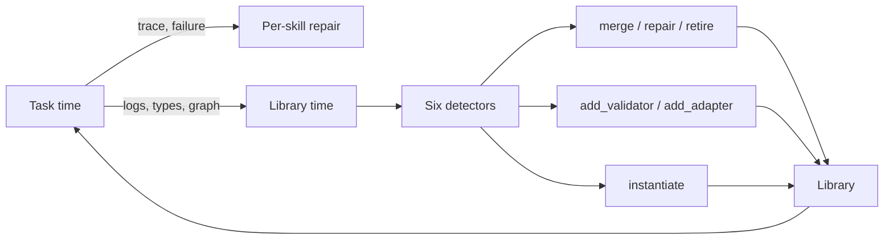

# Skill Library Technical Debt

> Skill libraries accumulate defects that no single-skill eval catches — redundant clones, stale dependencies, missing validators, type mismatches. Diagnose and repair them at library time, not at task time, with typed signals and named actions.

Per-skill evals catch defects that break one skill. They miss the failure mode that emerges when defects interact across the library: an agent retrieves the wrong skill because two descriptions overlap, composes skills whose artifact types do not match, or repeatedly invokes a stale skill that silently produces broken output. The SkillOps paper names this **skill technical debt** — library-level defects that may not break a single skill locally but degrade retrieval, composition, and execution at scale. [Source: [SkillOps: Managing LLM Agent Skill Libraries as Self-Maintaining Software Ecosystems](https://arxiv.org/abs/2605.13716)]

## Why Task-Time Repair Is Not Enough

Most skill-based agent frameworks repair at task time: when a skill fails, the next session reads the trace and picks another skill or rewrites the failing one. This works locally and leaves the library untouched. Defects that do not surface as task failures — two skills selectable for the same intent, an obsolete skill never invoked, a stale validator that always passes — persist across sessions until they cause a confidently wrong output. The signal is structural, not behavioural; only library-time inspection sees it. [Source: [SkillOps arxiv:2605.13716](https://arxiv.org/abs/2605.13716)]

## Typed Skill Contracts as the Inspection Surface

Mechanical detection requires typed signals. The SkillOps framework models each skill as a tuple `(P, O, A, V, F)`: a precondition for invocation, the executable operation, the typed artifact produced, a validator over that artifact, and the set of known failure modes. The library is organized as a hierarchical graph so cross-skill relationships — type compatibility, supersession, redundancy — are inspectable without running the agent. [Source: [SkillOps arxiv:2605.13716](https://arxiv.org/abs/2605.13716)]

Without typed contracts, the inspection surface collapses to body-hash deduplication and string-similarity over descriptions. Both signals catch only the most obvious defects.

## Six Debt Patterns and Their Signals

The SkillOps authors enumerate six concrete debt patterns and the observable signal each produces. The patterns generalize beyond their benchmark — each names a defect class that a real skill library can accrue. [Source: [SkillOps arxiv:2605.13716](https://arxiv.org/abs/2605.13716)]

| Debt pattern | Signal | Named action |
|---|---|---|
| Redundant clones (paraphrased names, identical bodies) | body-hash collision | `merge(s_i, s_j)` |
| Stale clones (deprecated dependencies) | failure-log pattern | `repair(s)` |
| Obsolete or consistently failing skills | utility log + failure rate | `retire(s)` |
| Missing validators | absent `V` reference | `add_validator(s)` |
| Wrong interface types (artifact ↛ precondition) | type mismatch | `add_adapter(s_i, s_j)` |
| Over-specialized skills with restrictive tags | unbindable arguments | `instantiate(s, arg)` |

Each row is a closed loop: a detector reads a signal from logs or the skill graph and emits a typed action that the library can apply without changing the agent harness.

## Four Diagnostic Dimensions

SkillOps groups detectors under four library-health dimensions: [Source: [SkillOps arxiv:2605.13716](https://arxiv.org/abs/2605.13716)]

- **Utility** — invocation counts, success rates, supersession evidence. Drives `retire`.
- **Compatibility** — type matches across the skill graph, adapter coverage. Drives `add_adapter` and `merge`.
- **Risk** — missing or weak validators, broken artifact references. Drives `add_validator`. The 26.1% vulnerability rate found across community-contributed skills shows risk is not hypothetical. [Source: [Agent Skills for LLMs (arxiv:2602.12430)](https://arxiv.org/abs/2602.12430)]
- **Validation** — failure modes against ground truth, repair candidates. Drives `repair` and `instantiate`.

Each dimension answers a different question; running only one leaves a coverage gap analogous to the one [Skill Library Refinement Loops](../workflows/skill-library-refinement-loops.md) describes for organisational feedback.

## Library-Time vs Task-Time



The rule-based variant of SkillOps runs the detectors with "nearly zero library-time LLM calls" — body-hash diffs, type-graph walks, log queries. The repair action is the only one that may invoke an LLM, and only on the failing skill, not the whole library. This decouples maintenance cost from task volume. [Source: [SkillOps arxiv:2605.13716](https://arxiv.org/abs/2605.13716)]

## Reported Results

On ALFWorld with 185 task instances across three seeds, SkillOps achieves 79.5% standalone task success, +8.8 percentage points over the strongest baseline. As a plug-in over retrieval baselines, it adds +0.68 to +2.90 percentage points. At a 2000-skill library it held 80.5% success rate while baselines degraded — the scaling claim the framework was built to support. [Source: [SkillOps arxiv:2605.13716](https://arxiv.org/abs/2605.13716)]

## When This Backfires

The framework adds machinery; the machinery is not free.

- **Small libraries (< ~20 skills)** — the lifecycle ceiling cited in [Skill Library Evolution](skill-library-evolution.md) applies here: rule-based debt detection costs more engineering than the defects it catches.
- **Prose-only skill files** — Anthropic-style `SKILL.md` skills carry semantic descriptions, not typed `(P, O, A, V, F)` contracts. Without typed signals, mechanical detection collapses to body-hash dedup — useful but partial. [Source: [Anthropic SKILL.md format](https://platform.claude.com/docs/en/agents-and-tools/agent-skills/best-practices)]
- **Highly dynamic dependency surface** — if upstream APIs and libraries churn faster than re-validation, every skill is "stale" and `retire` fires constantly without improving outcomes.
- **Single-user libraries** — without aggregate utility logs, the "low utility" signal is noise. The dashboard loop in [Skill Library Refinement Loops](../workflows/skill-library-refinement-loops.md) faces the same constraint.

The authors themselves note that their evaluation library is half-synthetic and based mainly on ALFWorld, and that rule-based detection misses semantic redundancy or complex conflicts that require deeper reasoning. [Source: [SkillOps arxiv:2605.13716](https://arxiv.org/abs/2605.13716)]

## Example

A library accumulates two skills authored months apart:

```yaml
# skills/fetch_paginated_results.yaml
name: fetch_paginated_results
description: Fetch all pages from a paginated REST endpoint
inputs: {url: str, params: dict}
output: list[dict]
validator: response_is_list

# skills/paginate_api.yaml
name: paginate_api
description: Iterate every page of a REST API
inputs: {endpoint: str, query: dict}
output: list[dict]
validator: null
```

The body-hash detector sees identical implementations. The validator detector sees `paginate_api` has none. The compatibility detector sees both produce `list[dict]` and are bound to similar preconditions. Three signals converge on one action:

```
merge(fetch_paginated_results, paginate_api)
  → keep fetch_paginated_results (has validator)
  → retire paginate_api, alias the name
```

No LLM call, no agent run — the defect is structural and the fix is structural.

## Key Takeaways

- Per-skill evals catch local defects; library-time inspection catches the interaction defects that degrade retrieval and composition
- Typed skill contracts `(P, O, A, V, F)` are the inspection surface — prose-only skills collapse the detection rules to body-hash dedup
- Six debt patterns map to six named actions: `merge`, `repair`, `retire`, `add_validator`, `add_adapter`, `instantiate`
- Four diagnostic dimensions — utility, compatibility, risk, validation — together cover the library-health surface; running only one leaves blind spots
- Skip the framework on small or prose-only libraries; the rule scaffolding costs more than the defects it catches at low scale

## Related

- [Skill Library Evolution](skill-library-evolution.md) — lifecycle stages, versioning, and pruning principles that frame the broader maintenance problem
- [Skill Library Refinement Loops](../workflows/skill-library-refinement-loops.md) — organisational feedback channels orthogonal to the typed-signal detectors here
- [Skill Evals](../verification/skill-evals.md) — per-skill output quality and trigger precision; the unit-level counterpart to library-level debt
- [Skill Authoring Patterns](skill-authoring-patterns.md) — practical patterns that prevent debt at authoring time
- [SKILL.md Frontmatter Reference](skill-frontmatter-reference.md) — fields a typed contract can extend
- [Enterprise Skill Marketplace](../workflows/enterprise-skill-marketplace.md) — distribution and OTel telemetry that feed the utility dimension at scale
- [Skill Supply Chain Poisoning](../security/skill-supply-chain-poisoning.md) — risk dimension at the boundary, complementing internal validator gaps
