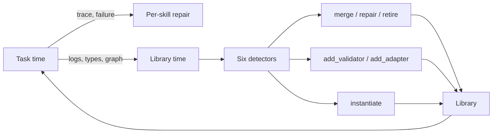

# Skill Library Technical Debt

> Skill libraries accumulate defects no single-skill eval catches: redundant clones, missing validators, type mismatches. Repair at library time with typed signals and named actions.

Per-skill evals catch defects that break one skill. They miss interaction defects: overlapping descriptions misroute retrieval, mismatched types break composition, stale skills produce broken output. The SkillOps paper names this skill technical debt: library-level defects that degrade retrieval, composition, and execution even when each skill passes its eval. [Source: [SkillOps: Managing LLM Agent Skill Libraries as Self-Maintaining Software Ecosystems](https://arxiv.org/abs/2605.13716)]

## Why task-time repair is not enough

Most frameworks repair at task time: a failing skill triggers the next session to pick another or rewrite it; the library stays untouched. Defects that never surface as failures — two skills selectable for one intent, an obsolete skill, a validator that always passes — persist until they produce a confidently wrong output. The signal is structural; only library-time inspection sees it. [Source: [SkillOps arxiv:2605.13716](https://arxiv.org/abs/2605.13716)]

## Typed skill contracts as the inspection surface

Mechanical detection requires typed signals. SkillOps models each skill as `(P, O, A, V, F)`: precondition, operation, artifact, validator, failure modes. Skills sit in a hierarchical graph, so cross-skill relationships — type compatibility, supersession, redundancy — are inspectable without running the agent. [Source: [SkillOps arxiv:2605.13716](https://arxiv.org/abs/2605.13716)]

## Six debt patterns and their signals

SkillOps enumerates six debt patterns and the signal each produces. They generalize beyond the benchmark — each names a defect class real libraries accrue. [Source: [SkillOps arxiv:2605.13716](https://arxiv.org/abs/2605.13716)]

| Debt pattern | Signal | Named action |
|---|---|---|
| Redundant clones (identical bodies) | body-hash collision | `merge(s_i, s_j)` |
| Stale clones (dead dependencies) | failure-log pattern | `repair(s)` |
| Obsolete or failing skills | utility log + failure rate | `retire(s)` |
| Missing validators | absent `V` reference | `add_validator(s)` |
| Wrong interface types (artifact ↛ precondition) | type mismatch | `add_adapter(s_i, s_j)` |
| Over-specialized skills | unbindable arguments | `instantiate(s, arg)` |

Each row is a closed loop: a detector reads a signal from logs or the skill graph and emits a typed action, applied without touching the agent harness.

## Four diagnostic dimensions

SkillOps groups detectors under four library-health dimensions: [Source: [SkillOps arxiv:2605.13716](https://arxiv.org/abs/2605.13716)]

- Utility — invocation counts, success rates, supersession. Drives `retire`.
- Compatibility — type matches across the graph, adapter coverage. Drives `add_adapter`, `merge`.
- Risk — missing or weak validators, broken artifact references. Drives `add_validator`. A 26.1% vulnerability rate across community-contributed skills shows risk is not hypothetical. [Source: [Agent Skills for LLMs (arxiv:2602.12430)](https://arxiv.org/abs/2602.12430)]
- Validation — failure modes against ground truth, repair candidates. Drives `repair`, `instantiate`.

Each dimension answers a different question; running only one leaves a coverage gap, like the one [Skill Library Refinement Loops](../workflows/skill-library-refinement-loops.md) describes for feedback.

## Library-time vs task-time



The rule-based variant runs detectors with "nearly zero library-time LLM calls" — body-hash diffs, type-graph walks, log queries. Only `repair` may invoke an LLM, on the failing skill, so maintenance cost decouples from task volume. [Source: [SkillOps arxiv:2605.13716](https://arxiv.org/abs/2605.13716)]

## Reported results

On ALFWorld (185 instances, three seeds), SkillOps reaches 79.5% standalone success, +8.8 points over the strongest baseline. As a plug-in it adds +0.68 to +2.90 points; at a 2000-skill library it held 80.5% while baselines degraded. [Source: [SkillOps arxiv:2605.13716](https://arxiv.org/abs/2605.13716)]

Those gains are method-conditional. The paper finds retrieval-only agents benefit most, LLM-planning agents stay flat, and self-repairing agents may conflict with external maintenance: when a honing loop like SkillWeaver would recover a degraded skill at execution, library-time maintenance may retire that candidate first, so the strategies fight. Library-time repair is not strictly superior — match the maintenance layer to how the agent recovers. [Source: [SkillOps arxiv:2605.13716](https://arxiv.org/abs/2605.13716)]

## When this backfires

- Small libraries (under about 20 skills) — the lifecycle ceiling in [Skill Library Evolution](skill-library-evolution.md) applies: detection costs more than the defects it catches.
- Prose-only skill files — Anthropic-style `SKILL.md` skills carry semantic descriptions, not typed `(P, O, A, V, F)` contracts, so detection collapses to body-hash dedup. [Source: [Anthropic SKILL.md format](https://platform.claude.com/docs/en/agents-and-tools/agent-skills/best-practices)]
- Highly dynamic dependencies — if upstream APIs churn faster than re-validation, every skill reads as "stale" and `retire` fires constantly without improving anything.
- Single-user libraries — without aggregate utility logs, "low utility" is noise, as the dashboard loop in [Skill Library Refinement Loops](../workflows/skill-library-refinement-loops.md) finds.

The authors note the evaluation is half-synthetic and ALFWorld-based, and that rule-based detection misses semantic redundancy or conflicts needing deeper reasoning. [Source: [SkillOps arxiv:2605.13716](https://arxiv.org/abs/2605.13716)]

## Example

A library accumulates two skills authored months apart:

```yaml
# skills/fetch_paginated_results.yaml
name: fetch_paginated_results
description: Fetch all pages from a paginated REST endpoint
inputs: {url: str, params: dict}
output: list[dict]
validator: response_is_list

# skills/paginate_api.yaml
name: paginate_api
description: Iterate every page of a REST API
inputs: {endpoint: str, query: dict}
output: list[dict]
validator: null
```

The body-hash detector sees identical implementations. The validator detector sees `paginate_api` has none. The compatibility detector sees both produce `list[dict]` and are bound to similar preconditions. Three signals converge on one action:

```
merge(fetch_paginated_results, paginate_api)
  → keep fetch_paginated_results (has validator)
  → retire paginate_api, alias the name
```

No LLM call, no agent run — the defect is structural and the fix is structural.

## Key Takeaways

- Per-skill evals catch local defects; library-time inspection catches the interaction defects that degrade retrieval and composition
- Typed skill contracts `(P, O, A, V, F)` are the inspection surface — prose-only skills collapse the detection rules to body-hash dedup
- Six debt patterns map to six named actions: `merge`, `repair`, `retire`, `add_validator`, `add_adapter`, `instantiate`
- Four diagnostic dimensions — utility, compatibility, risk, validation — together cover the library-health surface; running only one leaves blind spots
- Skip the framework on small or prose-only libraries; the rule scaffolding costs more than the defects it catches at low scale

## Related

- [Skill Library Evolution](skill-library-evolution.md) — lifecycle stages, versioning, and pruning principles that frame the broader maintenance problem
- [Skill Reuse as Vendored Forking](skill-reuse-as-vendored-forking.md) — the empirical reuse behavior (never-resynced near-verbatim copies) that seeds this library-level debt
- [Skill Library Refinement Loops](../workflows/skill-library-refinement-loops.md) — organizational feedback channels orthogonal to the typed-signal detectors here
- [Skill Evals](../verification/skill-evals.md) — per-skill output quality and trigger precision; the unit-level counterpart to library-level debt
- [Skill Authoring Patterns](skill-authoring-patterns.md) — practical patterns that prevent debt at authoring time
- [SKILL.md Frontmatter Reference](skill-frontmatter-reference.md) — fields a typed contract can extend
- [Enterprise Skill Marketplace](../workflows/enterprise-skill-marketplace.md) — distribution and OTel telemetry that feed the utility dimension at scale
- [Skill Supply Chain Poisoning](../security/skill-supply-chain-poisoning.md) — risk dimension at the boundary, complementing internal validator gaps
