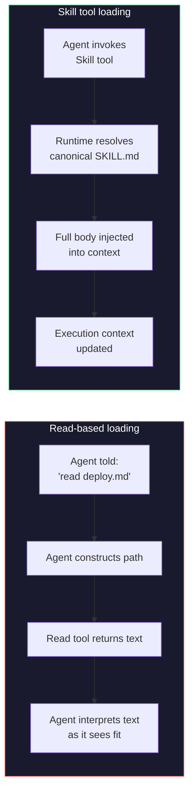

# Skill Tool as Enforcement: Loading Command Prompts at Runtime

> Use the Skill tool to load command prompts at invocation time rather than telling agents to "read the file" -- this eliminates stale instructions, truncation, and path drift by using the canonical invocation path.

!!! note "Also known as"
    **Runtime skill loading**, **canonical invocation path**. For the skill format itself, see [Agent Skills: Cross-Tool Task Knowledge Standard](../standards/agent-skills-standard.md). For authoring guidance, see [Skill Authoring Patterns](skill-authoring-patterns.md).

## The Problem: Three Failure Modes of "Read the File"

When you instruct an agent to "read `commands/deploy.md` for instructions," three things can go wrong:

| Failure mode | What happens | Why it happens |
|-------------|-------------|---------------|
| **Stale content** | Agent acts on an outdated version of the instructions | File read earlier in session; agent reuses cached content |
| **Truncation / paraphrase** | Agent follows a partial or reworded version | Long files get summarized; critical details dropped |
| **Path drift** | Agent reads the wrong file or fails to find it | Working directory changed, file moved, or wrong path constructed |

These failures are silent: the agent produces output that looks reasonable but diverges from the canonical instructions. In scaled pipelines, drift compounds undetected across every agent running the same command.

## How the Skill Tool Eliminates All Three

When an agent calls the Skill tool with a skill name, the runtime:

1. **Resolves the canonical SKILL.md** from the registered skill path -- no path construction by the agent
2. **Injects the full instruction body into context** via a controlled two-message pattern sent directly to the API ([Chung, 2025](https://leehanchung.github.io/blogs/2025/10/26/claude-skills-deep-dive/))
3. **Modifies the execution context** -- updates tool permissions and may switch the model

A Read tool call does none of these.



## Why This Works: The Canonical Invocation Path

The Skill tool uses the same mechanism as the human `/command` invocation -- if a command's definition changes, every agent automatically gets the updated version on its next call. No propagation step, no cache invalidation.

This is the [JIT context loading](https://www.anthropic.com/engineering/effective-context-engineering-for-ai-agents) principle from Anthropic's context engineering guide applied to agent instructions: load via tools at runtime rather than embedding in the static prompt.

## Progressive Disclosure Budget

Skill descriptions are capped at approximately 15,000 characters / 2% of the context window ([Chung, 2025](https://leehanchung.github.io/blogs/2025/10/26/claude-skills-deep-dive/)), creating a three-layer progressive disclosure stack:

| Layer | When loaded | Token cost |
|-------|------------|------------|
| Frontmatter `description` | Always in system prompt | ~100 tokens |
| Full SKILL.md body | On Skill tool invocation | <5000 tokens recommended |
| Referenced files | On demand within skill execution | Variable |

This layering prevents the [Mega-Prompt anti-pattern](../instructions/instruction-compliance-ceiling.md) -- instructions stay out of the system prompt until needed, not loaded immediately at session start.

## Dynamic Context with Shell Interpolation

Skills support `` !`command` `` syntax: the output replaces the placeholder before the skill content reaches the agent, injecting live data on every invocation:

```markdown
## Current deployment targets
!`kubectl get deployments -o name`

## Active feature flags
!`cat config/flags.json | jq '.enabled[]'`
```

Shell interpolation extends enforcement beyond static instructions -- the agent receives *live system state* at invocation time rather than file contents at read time.

## When Read-Based Loading Is Appropriate

Use direct file reading when:

- **The file is data, not instructions** -- configs, schemas, codebases to analyze
- **The content is one-shot** -- read once at session start and won't change
- **No execution context change is needed** -- reference material, not a command

Use Read to *inform*; use Skill tool to *direct*.

## Example

A team has a `review-pr` command that agents execute as part of a CI pipeline. The command definition lives in `.claude/commands/review-pr.md`.

**Fragile approach** -- instruction in the agent's system prompt:

```
When asked to review a PR, read .claude/commands/review-pr.md and follow its instructions.
```

The agent must construct the path, read the file, and decide to treat the contents as instructions. If `review-pr.md` is updated, agents mid-session continue using the version they already read.

**Robust approach** -- Skill tool invocation:

```
When asked to review a PR, invoke the review-pr skill using the Skill tool.
```

The Skill tool resolves the canonical path, injects the current version into context, and updates execution permissions. The agent cannot use a stale version because it never caches the instructions -- each invocation loads fresh.

## Key Takeaways

- "Read the file" introduces silent failures: stale content, truncation, and path drift
- The Skill tool eliminates all three via a controlled injection path that bypasses agent-side file resolution
- Skills modify the execution context (tool permissions, model selection) -- Read cannot
- Progressive disclosure keeps instructions out of the system prompt until needed
- Shell interpolation (`` !`command` ``) injects live system state at invocation time
- Use Skill tool for directing agents; use Read for reference data

## Related

- [Skill as Knowledge Pattern](skill-as-knowledge.md)
- [Skill Authoring Patterns](skill-authoring-patterns.md)
- [SKILL.md Frontmatter Reference](skill-frontmatter-reference.md)
- [On-Demand Skill Hooks](on-demand-skill-hooks.md)
- [Skill Library Evolution](skill-library-evolution.md)
- [Progressive Disclosure for Agent Definitions](../agent-design/progressive-disclosure-agents.md)
- [Event-Driven System Reminders](../instructions/event-driven-system-reminders.md)
- [Agent Skills: Cross-Tool Task Knowledge Standard](../standards/agent-skills-standard.md)
- [Hooks for Enforcement vs Prompts for Guidance](../verification/hooks-vs-prompts.md)
- [Context Engineering: The Discipline of Designing Agent Context](../context-engineering/context-engineering.md) — token economics and lazy loading principles behind JIT context loading
