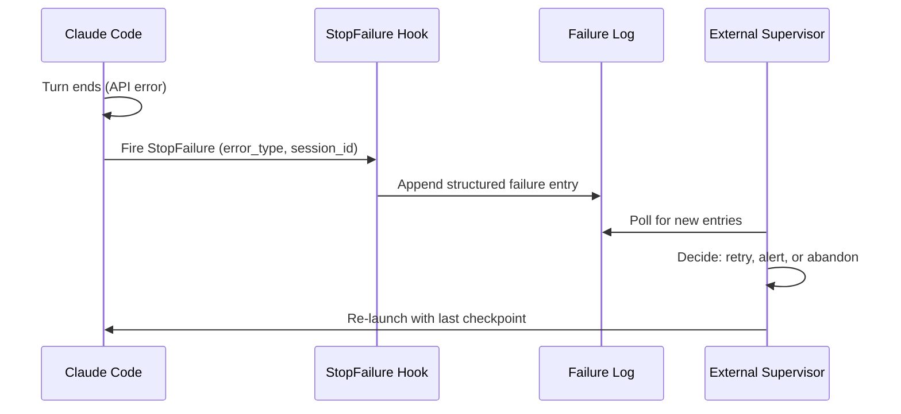

# StopFailure Hook: Observability for API Error Termination

> The `StopFailure` hook fires when a Claude Code turn ends due to an API error — rate limit, auth failure, billing error, or server error — providing a deterministic signal for logging, alerting, and external recovery coordination.

## What It Is (and What It Is Not)

Added in [Claude Code v2.1.78](https://code.claude.com/docs/en/changelog), `StopFailure` is an **observational hook** — not a control hook. The runtime ignores its exit code and output. It cannot block behavior, initiate a retry, or resume the session. It fires after the turn has already failed.

The hook's role is notification: log the error, push a metric, trigger an alert. Any retry or re-launch logic must live in an external process — a CI supervisor, a cron job, a shell wrapper — that reads the hook's output and decides what to do next.

Contrast with `Stop`, which fires on successful turn completion. Both are non-blocking; `StopFailure` is the error branch.

## Input Schema

Claude Code passes JSON on stdin when `StopFailure` fires:

```json
{
  "session_id": "abc123",
  "transcript_path": "/Users/.../.claude/projects/.../transcript.jsonl",
  "cwd": "/Users/...",
  "hook_event_name": "StopFailure",
  "error_type": "rate_limit",
  "error_message": "Rate limit exceeded: 100 requests per minute"
}
```

`error_type` carries one of seven values:

| Value | Cause |
|-------|-------|
| `rate_limit` | Request rate or quota exceeded |
| `authentication_failed` | Invalid or expired API credentials |
| `billing_error` | Account billing issue |
| `invalid_request` | Malformed API request |
| `server_error` | Provider-side error |
| `max_output_tokens` | Response exceeded token limit |
| `unknown` | Error type not classified |

## Matcher Scoping

Configure `StopFailure` hooks with an `error_type` matcher to fire only on specific failure classes:

```json
{
  "hooks": {
    "StopFailure": [
      {
        "matcher": "rate_limit",
        "hooks": [
          {
            "type": "command",
            "command": ".claude/hooks/log-rate-limit.sh"
          }
        ]
      },
      {
        "matcher": "authentication_failed|billing_error",
        "hooks": [
          {
            "type": "command",
            "command": ".claude/hooks/alert-operator.sh"
          }
        ]
      }
    ]
  }
}
```

A hook without a matcher fires for all `StopFailure` events regardless of error type.

## Use Cases

- **Structured failure logging** — write `error_type`, `session_id`, and timestamp to a file external recovery scripts can poll
- **Operator alerting** — push to Slack, PagerDuty, or a webhook when `authentication_failed` or `billing_error` fires, since these require human action
- **Metrics collection** — increment failure counters by error type for dashboards and SLO tracking
- **Audit trails** — append to a session audit log alongside the `transcript_path` for post-mortem analysis

## Wiring into an External Recovery Loop

`StopFailure` fits into a recovery architecture as the notification layer. The retry/re-launch decision lives outside Claude Code:



The hook writes the signal; the supervisor acts on it. This separation keeps the hook simple and the retry logic testable outside Claude Code.

## Example

A long-running overnight refactor agent uses `StopFailure` to log failures and alert on credential issues.

**`.claude/hooks/on-stop-failure.sh`**:

```bash
#!/usr/bin/env bash
set -euo pipefail

INPUT=$(cat)
ERROR_TYPE=$(echo "$INPUT" | jq -r '.error_type')
SESSION_ID=$(echo "$INPUT" | jq -r '.session_id')
TRANSCRIPT=$(echo "$INPUT" | jq -r '.transcript_path')
TIMESTAMP=$(date -u +"%Y-%m-%dT%H:%M:%SZ")

# Always log
echo "{\"timestamp\":\"$TIMESTAMP\",\"error_type\":\"$ERROR_TYPE\",\"session_id\":\"$SESSION_ID\",\"transcript\":\"$TRANSCRIPT\"}" \
  >> ~/agent-failures.jsonl

# Alert on credential/billing errors — these require human action
if [[ "$ERROR_TYPE" == "authentication_failed" || "$ERROR_TYPE" == "billing_error" ]]; then
  curl -s -X POST "$SLACK_WEBHOOK_URL" \
    -H "Content-Type: application/json" \
    -d "{\"text\":\"Agent stopped: $ERROR_TYPE — session $SESSION_ID\"}" \
    || true  # never block on webhook failure
fi
```

**`.claude/settings.json`**:

```json
{
  "hooks": {
    "StopFailure": [
      {
        "hooks": [
          {
            "type": "command",
            "command": ".claude/hooks/on-stop-failure.sh"
          }
        ]
      }
    ]
  }
}
```

An external cron job polls `~/agent-failures.jsonl`. When it finds a `rate_limit` entry, it waits and re-launches the agent from the last git checkpoint. The hook writes the signal; the cron job acts on it.

## Key Takeaways

- `StopFailure` fires when a Claude Code turn ends due to an API error — exit codes and output are ignored
- It is an observability hook, not a control hook: use it for logging, alerting, and metrics
- `error_type` matchers scope the hook to specific failure classes
- Retry and re-launch logic must live in an external process; the hook provides the signal, not the recovery

## Related

- [Hooks and Lifecycle Events](hooks-lifecycle-events.md)
- [Hook Catalog: Guardrails, Sandboxing, and CLI Enforcement](hook-catalog.md)
- [Exception Handling and Recovery Patterns](../agent-design/exception-handling-recovery-patterns.md)
- [Circuit Breakers for Agent Loops](../observability/circuit-breakers.md)
- [Trajectory Logging via Progress Files and Git History](../observability/trajectory-logging-progress-files.md)
