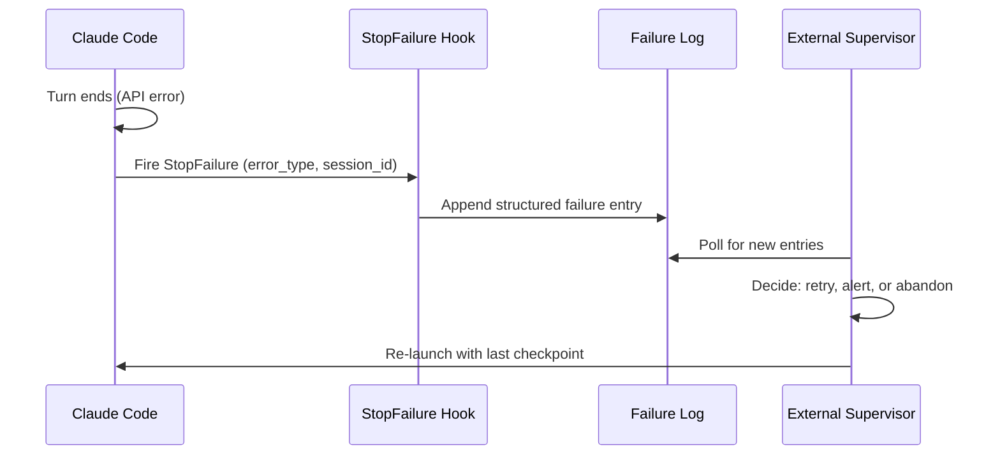

# StopFailure Hook: Observability for API Error Termination

> `StopFailure` fires when a Claude Code turn ends due to an API error, providing a deterministic signal for logging, alerting, and recovery coordination.

## What it is and what it is not

`StopFailure` is an observational hook, not a control hook. The runtime ignores its exit code and output. `StopFailure` cannot block, retry, or resume the session. It fires after the turn has already failed.

The hook's job is notification: log, push a metric, trigger an alert. Retry or re-launch logic must live in an external process such as a CI supervisor, cron job, or shell wrapper. That process reads the hook's output and decides what to do next.

`Stop` is the counterpart that fires on successful completion. Both are non-blocking. `StopFailure` is the error branch.

## Input schema

Claude Code passes JSON on stdin when `StopFailure` fires:

```json
{
  "session_id": "abc123",
  "transcript_path": "/Users/.../.claude/projects/.../transcript.jsonl",
  "cwd": "/Users/...",
  "permission_mode": "default",
  "hook_event_name": "StopFailure",
  "error_type": "rate_limit",
  "error": "429",
  "error_message": "Rate limit exceeded: 100 requests per minute"
}
```

`StopFailure` adds `error_type` (matcher key), `error` (short error code), and `error_message` to the [common hook input fields](https://code.claude.com/docs/en/hooks). `error_type` carries one of nine values:

| Value | Cause |
|-------|-------|
| `rate_limit` | Request rate or quota exceeded |
| `overloaded` | API capacity temporarily exhausted |
| `authentication_failed` | Invalid or expired API credentials |
| `oauth_org_not_allowed` | OAuth identity not permitted for the organization |
| `billing_error` | Account billing issue |
| `invalid_request` | Malformed API request |
| `model_not_found` | Requested model unavailable |
| `server_error` | Provider-side error |
| `max_output_tokens` | Response exceeded token limit |
| `unknown` | Error type not classified |

## Matcher scoping

Give a `StopFailure` hook an `error_type` matcher so it fires only on specific failure classes:

```json
{
  "hooks": {
    "StopFailure": [
      {
        "matcher": "rate_limit",
        "hooks": [
          {
            "type": "command",
            "command": ".claude/hooks/log-rate-limit.sh"
          }
        ]
      },
      {
        "matcher": "authentication_failed|billing_error",
        "hooks": [
          {
            "type": "command",
            "command": ".claude/hooks/alert-operator.sh"
          }
        ]
      }
    ]
  }
}
```

A hook without a matcher fires for every `StopFailure` event, whatever the error type.

## Use cases

- Structured failure logging: write `error_type`, `session_id`, and a timestamp to a file recovery scripts can poll
- Operator alerting: push to Slack or PagerDuty when `authentication_failed` or `billing_error` fires, since these need human action
- Metrics: increment failure counters by error type for dashboards and SLOs
- Audit trails: append to a session log alongside `transcript_path` for post-mortems

## Wiring into an external recovery loop

`StopFailure` is the notification layer in a recovery design. The retry or re-launch decision lives outside Claude Code:


```mermaid
sequenceDiagram
    participant Agent as Claude Code
    participant Hook as StopFailure Hook
    participant Log as Failure Log
    participant Supervisor as External Supervisor

    Agent->>Agent: Turn ends (API error)
    Agent->>Hook: Fire StopFailure (error_type, session_id)
    Hook->>Log: Append structured failure entry
    Supervisor->>Log: Poll for new entries
    Supervisor->>Supervisor: Decide: retry, alert, or abandon
    Supervisor->>Agent: Re-launch with last checkpoint
```

The hook writes the signal; the supervisor acts on it. This split keeps the hook simple and lets you test the retry logic outside Claude Code.

## Example

An overnight refactor agent uses `StopFailure` to log failures and alert on credential issues.

`.claude/hooks/on-stop-failure.sh`:

```bash
#!/usr/bin/env bash
set -euo pipefail

INPUT=$(cat)
ERROR_TYPE=$(echo "$INPUT" | jq -r '.error_type')
SESSION_ID=$(echo "$INPUT" | jq -r '.session_id')
TRANSCRIPT=$(echo "$INPUT" | jq -r '.transcript_path')
TIMESTAMP=$(date -u +"%Y-%m-%dT%H:%M:%SZ")

# Always log
echo "{\"timestamp\":\"$TIMESTAMP\",\"error_type\":\"$ERROR_TYPE\",\"session_id\":\"$SESSION_ID\",\"transcript\":\"$TRANSCRIPT\"}" \
  >> ~/agent-failures.jsonl

# Alert on credential/billing errors — these require human action
if [[ "$ERROR_TYPE" == "authentication_failed" || "$ERROR_TYPE" == "billing_error" ]]; then
  curl -s -X POST "$SLACK_WEBHOOK_URL" \
    -H "Content-Type: application/json" \
    -d "{\"text\":\"Agent stopped: $ERROR_TYPE — session $SESSION_ID\"}" \
    || true  # never block on webhook failure
fi
```

`.claude/settings.json`:

```json
{
  "hooks": {
    "StopFailure": [
      {
        "hooks": [
          {
            "type": "command",
            "command": ".claude/hooks/on-stop-failure.sh"
          }
        ]
      }
    ]
  }
}
```

An external cron job polls `~/agent-failures.jsonl`. When it finds a `rate_limit` entry, it waits and re-launches the agent from the last git checkpoint. The hook writes the signal; the cron job acts on it.

## Why it works

`StopFailure` is non-blocking because it fires after an unrecoverable error, when the turn has already ended. Claude Code splits pre-action hooks that can block (`PreToolUse`, `UserPromptSubmit`, `PermissionRequest`) from post-action hooks that cannot (`PostToolUse`, `StopFailure`). Once `StopFailure` fires, the API call has already failed, and no hook exit code can change that. The runtime runs the notification command, ignores its return, and terminates. See the [Claude Code hooks reference](https://code.claude.com/docs/en/hooks) for the full lifecycle and exit-code behavior table.

## When this backfires

- Interactive sessions rarely justify the overhead: for a developer running `claude` in a terminal, reading the CLI's [exit code](https://code.claude.com/docs/en/hooks#exit-code-output) directly is simpler than wiring a hook plus a supervisor. The hook pays off for long-running unattended agents (overnight refactors, CI, cron loops) where no human watches the exit code.
- Silent hook script failures: the exit code is ignored, so a broken hook (missing `jq`, bad path, unset `$SLACK_WEBHOOK_URL`) fails invisibly. No alert, no log line, yet the operator believes the supervisor is healthy. Test hooks in isolation and watch the log file for staleness.
- Supervisor polling lag defers recovery: the hook writes to a log, and the supervisor polls on an interval. Polling lag (30s, 1min) stacks on top of the API failure and extends mean time to recovery. Push-based signaling, where the hook calls the supervisor directly, trades hook latency for faster reaction.
- Slow hooks delay shutdown: `StopFailure` runs synchronously before the process exits. A hook that calls a slow webhook or metrics endpoint holds the process open. Add a `timeout` and use `|| true` on external calls.
- The `unknown` error type limits scoping: matchers cannot tell apart the root cause when `error_type` is `unknown`. A hook scoped to `rate_limit` silently skips genuine rate-limit failures the runtime could not classify. Keep a catch-all unscoped hook for audit logging alongside the type-scoped hooks.
- Log files fill on repeated crashes: a cron restart loop plus an append-only log hook writes one entry per crash indefinitely. Cap the log file size or use a rotating logger.

## Key Takeaways

- `StopFailure` fires when a Claude Code turn ends due to an API error — exit codes and output are ignored
- It is an observability hook, not a control hook: use it for logging, alerting, and metrics
- `error_type` matchers scope the hook to specific failure classes
- Retry and re-launch logic must live in an external process; the hook provides the signal, not the recovery

## Related

- [Hooks and Lifecycle Events](hooks-lifecycle-events.md)
- [Hook Catalog: Guardrails, Sandboxing, and CLI Enforcement](hook-catalog.md)
- [Conditional Hook Execution: Filter Hooks by Tool Pattern](conditional-hook-execution.md)
- [Reactive Environment Hooks: CwdChanged and FileChanged](reactive-environment-hooks.md)
- [Exception Handling and Recovery Patterns](../agent-design/exception-handling-recovery-patterns.md)
- [Circuit Breakers for Agent Loops](../observability/circuit-breakers.md)
- [Trajectory Logging via Progress Files and Git History](../observability/trajectory-logging-progress-files.md)
- [PreCompact Hook Compaction Veto](precompact-hook-compaction-veto.md)
