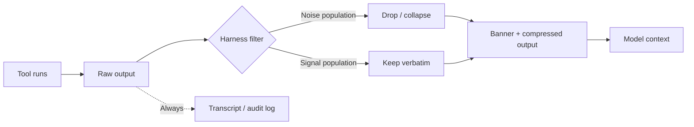

# Terminal Tool Output Compression: Filtering Predictable Noise at the Harness

> Strip predictable-shape noise from terminal output at the harness boundary so the model's context window holds the diff under review, not the lockfile churn next to it.

## The Pattern

Long shell output decomposes into two populations. Predictable noise — `npm install` progress, lockfile diffs, `ls -l` permission columns, unchanged hunks inside a `git diff` — has near-zero information value per token but consumes context budget at the same rate as signal. The failing test, the changed function, the deprecation advisory competes with it for attention and tokens.

Terminal output compression is a post-processing filter at the harness boundary. It drops the noise population, leaves the signal population intact, and prepends a banner that records which filters fired so the model can opt out per call.

## Reference Implementation: VS Code 1.120

VS Code 1.120 ships this as `chat.tools.compressOutput.enabled` for the agent chat tool (Preview), per the [May 2026 release notes](https://code.visualstudio.com/updates). The filter set:

| Tool output | Compression |
|-------------|-------------|
| `git diff` and similar | Large unchanged hunks collapsed |
| Lockfile and snapshot diffs | Dropped entirely |
| `ls -l` | Reduced to entry names |
| `npm install` | Progress bars, deprecation warnings, and audit summaries stripped |

The release notes specify the audit contract directly: "A short banner is prepended to any compressed output, so the model can see which filters fired and how to disable compression if it needs the raw text." The banner is non-optional — without it, the pattern degrades into silent error masking ([PostToolUse Output Replacement §When This Backfires](posttooluse-output-replacement.md)).

## Where the Lever Lives

Compression is a harness-layer concern. The same primitive exists across coding assistants under different names:

| Harness | Mechanism |
|---------|-----------|
| VS Code agent chat | `chat.tools.compressOutput.enabled` setting |
| Claude Code | `PostToolUse` hook returning `hookSpecificOutput.modifiedToolResponse` |
| MCP server-side | `_meta["anthropic/maxResultSizeChars"]` annotation (Claude Code compaction only) |

The shape is identical across implementations: the harness reads the raw `tool_output`, applies filters, returns the compressed string; the original remains in the transcript for incident review ([PostToolUse Output Replacement](posttooluse-output-replacement.md)).



## Noise-Dominated vs Signal-Dominated Output

The compression contract only works when the filter set is calibrated. Wrong calls are bidirectional — false positives drop the byte that mattered; false negatives leave the noise in.

**Noise-dominated** — safe to compress by default:

- Generated-file diffs: lockfiles (`package-lock.json`, `yarn.lock`, `Cargo.lock`), snapshot files, minified bundles
- Package manager progress: download bars, percent indicators, "added N packages" tallies
- Directory metadata when only names are needed: `ls -l` permission/owner/size columns, `find -ls` output
- Repeated structure: identical error lines across N files in a multi-file lint

**Signal-dominated** — never compress without explicit reason:

- Test runner output (the exact failing assertion is often a single line buried in a large block)
- Compiler diagnostics with column numbers and suggested fixes
- Error traces with file paths and line numbers
- `git diff` of source files the agent is reasoning about — collapse unchanged hunks only, never the changed ones
- Anything containing a URL, token, ID, or path the model may need to cite

## The Banner Contract

The banner is the auditability hinge. Without it, the model has no way to know compression happened or to request raw output — and the developer reading the transcript sees output the model never actually saw (the audit-vs-context divergence in [PostToolUse Output Replacement](posttooluse-output-replacement.md) §When This Backfires).

A minimum banner records which filters fired (`lockfile-dropped`, `unchanged-hunks-collapsed`, `npm-progress-stripped`), how to disable compression on the next call, and original vs compressed size. When the model needs the raw bytes — chasing a flaky test, reading a deprecation advisory ID — it issues a follow-up call with compression disabled.

## Relationship to Adjacent Patterns

Four levers solve adjacent problems at different layers and compose:

| Page | Layer | Trigger |
|------|-------|---------|
| Terminal output compression (this page) | Harness, per-call | Tool returns predictable noise — filter at write time |
| [Observation Masking](../context-engineering/observation-masking.md) | Context history, post-hoc | Tool result already used — drop from history |
| [Context Compression Strategies](../context-engineering/context-compression-strategies.md) | Context history, threshold-triggered | Context budget at 70/85/99% — offload then summarise |
| [Semantic Tool Output](semantic-tool-output.md) | Tool author, design-time | Tool emits less noise to begin with |

None substitutes for another. [Audit Tool Output Token Cost](../agent-readiness/audit-tool-output-token-cost.md) identifies the call sites where compression pays for itself.

## When This Backfires

- **Over-compression hides the failing byte.** Stripping `npm install` audit summaries also strips the specific advisory ID the model needs to file a fix issue. The banner names the filter that fired but does not surface the dropped content — the model has to know to disable compression and rerun.
- **False-positive pattern matches.** A test fixture file that starts with `+++` and `---` markers gets treated as a diff and collapsed. A `README.md` listing alongside source files may match the "lockfile-shape" heuristic if it is large and rarely changes.
- **Interactive debugging where every byte matters.** Iteratively narrowing down a flaky test, compression of "predictable progress output" can mask the timing variance that explains the flake. The opt-out exists but adds a round-trip per call.
- **Compression at the harness can mask agent learning.** An agent that always sees compressed `npm install` output never builds intuition for what the full output looks like, weakening its ability to recognise novel package-manager failure modes. This is the same failure mode as overly aggressive [observation masking](../context-engineering/observation-masking.md) — useful at scale, but a tax on the agent's read-through corpus.

The fix in every case is the banner plus the opt-out. Compression without those degrades into [silent error masking](posttooluse-output-replacement.md#when-this-backfires).

## Example

A Claude Code `PostToolUse` hook compresses `git diff` output by collapsing unchanged hunks, leaving changed hunks verbatim, and prepending a banner.

**`.claude/hooks/compress-git-diff.sh`**:

```bash
#!/usr/bin/env bash
set -euo pipefail

INPUT=$(cat)
TOOL=$(echo "$INPUT" | jq -r '.tool_name')
CMD=$(echo "$INPUT" | jq -r '.tool_input.command // empty')

# Only act on git diff invocations
if [ "$TOOL" != "Bash" ] || ! echo "$CMD" | grep -qE '^git diff'; then
  exit 0
fi

OUTPUT=$(echo "$INPUT" | jq -r '.tool_output // empty')
ORIG_SIZE=${#OUTPUT}

# Collapse unchanged hunks (lines starting with space) into a count summary;
# leave +/- lines and file headers intact.
COMPRESSED=$(echo "$OUTPUT" | awk '
  /^[+-]/ || /^@@/ || /^diff / || /^index / || /^--- / || /^\+\+\+ / { print; unchanged=0; next }
  /^ / { unchanged++; if (unchanged == 1) print "  [... unchanged context follows ...]"; next }
  { print }
')

NEW_SIZE=${#COMPRESSED}
if [ "$NEW_SIZE" -ge "$ORIG_SIZE" ]; then
  exit 0  # No win — pass through.
fi

BANNER=$(printf "[compress-git-diff: collapsed unchanged hunks, %d -> %d bytes. To disable: rerun with --no-compress in the command.]\n\n" "$ORIG_SIZE" "$NEW_SIZE")

jq -n --arg out "${BANNER}${COMPRESSED}" \
  '{hookSpecificOutput: {hookEventName: "PostToolUse", modifiedToolResponse: $out}}'
```

The model sees the banner first, knows compression fired, and can request raw output by adding `--no-compress` to a follow-up `git diff` call (which the hook is configured to detect and skip). The full diff remains in the transcript regardless.

## Key Takeaways

- Terminal output compression strips predictable noise (lockfile diffs, package-manager progress, `ls -l` metadata, unchanged diff hunks) at the harness boundary before the model sees it.
- The lever lives at the harness, not the tool — VS Code ships it as `chat.tools.compressOutput.enabled` in 1.120 (Preview); Claude Code implements the same shape via `PostToolUse` `modifiedToolResponse`.
- The banner is non-optional. Without a record of which filters fired and how to disable them, compression becomes silent error masking.
- Compress the noise-dominated set (lockfiles, progress bars, directory metadata, unchanged hunks). Never compress the signal-dominated set (test failures, error traces, changed code, anything carrying an ID the model may need to cite).
- Compression composes with — does not replace — semantic tool output, observation masking, and threshold-triggered context compression.

## Related

- [PostToolUse Output Replacement: Hooks That Rewrite Tool Results](posttooluse-output-replacement.md)
- [Semantic Tool Output](semantic-tool-output.md)
- [Token-Efficient Tool Design](token-efficient-tool-design.md)
- [Observation Masking: Filter Tool Outputs from Context](../context-engineering/observation-masking.md)
- [Context Compression Strategies: Offloading and Summarisation](../context-engineering/context-compression-strategies.md)
- [Audit Tool Output Token Cost](../agent-readiness/audit-tool-output-token-cost.md)
- [CLI Scripts as Agent Tools](cli-scripts-as-agent-tools.md)
