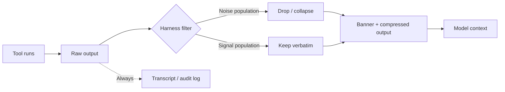

# Terminal Tool Output Compression: Filtering Predictable Noise at the Harness

> Strip predictable-shape noise from terminal output at the harness boundary so context holds signal, not lockfile churn.

## The pattern

Long shell output splits into two kinds. Predictable noise carries near-zero value per token: `npm install` progress, lockfile diffs, `ls -l` columns, and unchanged hunks inside `git diff`. It still spends context budget at the same rate as signal, so it crowds out the failing test or the changed function.

Terminal output compression is a post-processing filter at the harness boundary. It drops noise, leaves signal intact, and prepends a banner so the model can opt out per call.

## Reference implementation: VS Code 1.120

VS Code 1.120 ships this as `chat.tools.compressOutput.enabled` for the agent chat tool (Preview), per the [VS Code 1.120 release notes](https://code.visualstudio.com/updates/v1_120). The filter set:

| Tool output | Compression |
|-------------|-------------|
| `git diff` and similar | Large unchanged hunks collapsed |
| Lockfile and snapshot diffs | Dropped entirely |
| `ls -l` | Reduced to entry names |
| `npm install` | Progress bars, deprecation warnings, audit summaries stripped |

The release notes set out the audit contract directly: "A short banner is prepended to any compressed output, so the model can see which filters fired and how to disable compression if it needs the raw text." The banner is not optional. Without it, the pattern degrades into [silent error masking](posttooluse-output-replacement.md#when-this-backfires).

## Where the filter lives

Compression is a harness-layer job. The same primitive recurs across assistants under different names:

| Harness | Mechanism |
|---------|-----------|
| VS Code agent chat | `chat.tools.compressOutput.enabled` setting |
| Claude Code | `PostToolUse` hook returning [`hookSpecificOutput.updatedToolOutput`](https://code.claude.com/docs/en/hooks) |
| MCP server-side | `_meta["anthropic/maxResultSizeChars"]` ([Claude Code only](mcp-result-persistence-annotation.md)) |

The shape is identical. The harness reads raw `tool_output`, applies filters, and returns the compressed string. The original stays in the transcript for audit ([PostToolUse Output Replacement](posttooluse-output-replacement.md)).



## Noise-dominated vs signal-dominated output

The contract only works when the filter set is calibrated. False positives drop the byte that mattered; false negatives leave the noise in.

Noise-dominated output, safe to compress by default:

- Lockfiles (`package-lock.json`, `yarn.lock`, `Cargo.lock`), snapshots, bundles
- Package manager progress: download bars, percent indicators, "added N packages"
- Directory metadata: `ls -l` columns, `find -ls`
- Repeated structure: identical error lines across files in a multi-file lint

Signal-dominated output, never compress without an explicit reason:

- Test output (the failing assertion is often one line in a block)
- Compiler diagnostics with column numbers and fixes
- Error traces with file paths and line numbers
- `git diff` of source files — collapse unchanged hunks only, never changed ones
- Anything with a URL, token, ID, or path the model may cite

## The banner contract

The banner is the auditability hinge. Without it, the model cannot know compression happened, and the developer reading the transcript sees output the model never saw. A minimum banner records which filters fired (`lockfile-dropped`, `unchanged-hunks-collapsed`), how to disable compression on the next call, and original versus compressed size.

## Relationship to adjacent patterns

Six levers solve adjacent problems and compose; none substitutes for another:

| Page | Layer | Trigger |
|------|-------|---------|
| Terminal output compression (this page) | Harness, per-call | Tool returns predictable noise |
| [PostToolUse Output Replacement](posttooluse-output-replacement.md) | Harness, post-hoc | Rewrite result before model |
| [Graceful Tool Output Truncation](graceful-tool-output-truncation.md) | Tool author, runtime | PARTIAL with continuation handle |
| [Semantic Tool Output](semantic-tool-output.md) | Tool author, design | Less noise emitted at source |
| [Observation Masking](../context-engineering/observation-masking.md) | History, post-hoc | Tool result used — drop it |
| [Context Compression Strategies](../context-engineering/context-compression-strategies.md) | History, threshold | Budget threshold — offload, summarise |

## When this backfires

- Over-compression hides the failing byte. Stripping `npm install` audit summaries also strips the advisory ID the model needs. The banner names the filter but not the dropped content, so the model must rerun with compression disabled.
- False-positive pattern matches. A test fixture starting with `+++` markers gets treated as a diff; a rarely-changing `README.md` may match the "lockfile-shape" heuristic and be dropped.
- Interactive debugging. Compressing "predictable progress" while narrowing a flaky test can mask the timing variance that explains it.
- Compression masks agent learning. An agent that only sees compressed `npm install` output never learns its full shape — the same tax [observation masking](../context-engineering/observation-masking.md) levies.

The fix in every case is the banner plus the opt-out. Without those, compression degrades into [silent error masking](posttooluse-output-replacement.md#when-this-backfires).

## Example

A Claude Code `PostToolUse` hook compresses `git diff` output. It collapses unchanged hunks, leaves changed hunks verbatim, and prepends a banner.

`.claude/hooks/compress-git-diff.sh`:

```bash
#!/usr/bin/env bash
set -euo pipefail

INPUT=$(cat)
TOOL=$(echo "$INPUT" | jq -r '.tool_name')
CMD=$(echo "$INPUT" | jq -r '.tool_input.command // empty')

# Only act on git diff invocations
if [ "$TOOL" != "Bash" ] || ! echo "$CMD" | grep -qE '^git diff'; then
  exit 0
fi

OUTPUT=$(echo "$INPUT" | jq -r '.tool_output // empty')
ORIG_SIZE=${#OUTPUT}

# Collapse unchanged hunks (lines starting with space) into a count summary;
# leave +/- lines and file headers intact.
COMPRESSED=$(echo "$OUTPUT" | awk '
  /^[+-]/ || /^@@/ || /^diff / || /^index / || /^--- / || /^\+\+\+ / { print; unchanged=0; next }
  /^ / { unchanged++; if (unchanged == 1) print "  [... unchanged context follows ...]"; next }
  { print }
')

NEW_SIZE=${#COMPRESSED}
if [ "$NEW_SIZE" -ge "$ORIG_SIZE" ]; then
  exit 0  # No win — pass through.
fi

BANNER=$(printf "[compress-git-diff: collapsed unchanged hunks, %d -> %d bytes. To disable: rerun with --no-compress in the command.]\n\n" "$ORIG_SIZE" "$NEW_SIZE")

jq -n --arg out "${BANNER}${COMPRESSED}" \
  '{hookSpecificOutput: {hookEventName: "PostToolUse", updatedToolOutput: $out}}'
```

The model sees the banner first, knows compression fired, and can request raw output by adding `--no-compress` to a follow-up `git diff` call (which the hook detects and skips). The full diff remains in the transcript regardless.

## Key Takeaways

- Terminal output compression strips predictable noise (lockfile diffs, package-manager progress, `ls -l` metadata, unchanged diff hunks) at the harness boundary before the model sees it.
- The lever lives at the harness, not the tool — VS Code ships it as `chat.tools.compressOutput.enabled` in 1.120 (Preview); Claude Code implements the same shape via `PostToolUse` `updatedToolOutput`.
- The banner is non-optional. Without a record of which filters fired and how to disable them, compression becomes silent error masking.
- Compress the noise-dominated set (lockfiles, progress bars, `ls -l` directory metadata, unchanged hunks). Never compress the signal-dominated set (test failures, error traces, changed code, anything carrying an ID the model may need to cite).
- Compression composes with — does not replace — semantic tool output, observation masking, and threshold-triggered context compression.

## Related

- [PostToolUse Output Replacement: Hooks That Rewrite Tool Results](posttooluse-output-replacement.md)
- [Graceful Tool Output Truncation](graceful-tool-output-truncation.md)
- [Semantic Tool Output](semantic-tool-output.md)
- [MCP Result Persistence Annotation](mcp-result-persistence-annotation.md)
- [Token-Efficient Tool Design](../token-engineering/token-efficient-tool-design.md)
- [Observation Masking: Filter Tool Outputs from Context](../context-engineering/observation-masking.md)
- [Context Compression Strategies: Offloading and Summarisation](../context-engineering/context-compression-strategies.md)
</content>
</invoke>
