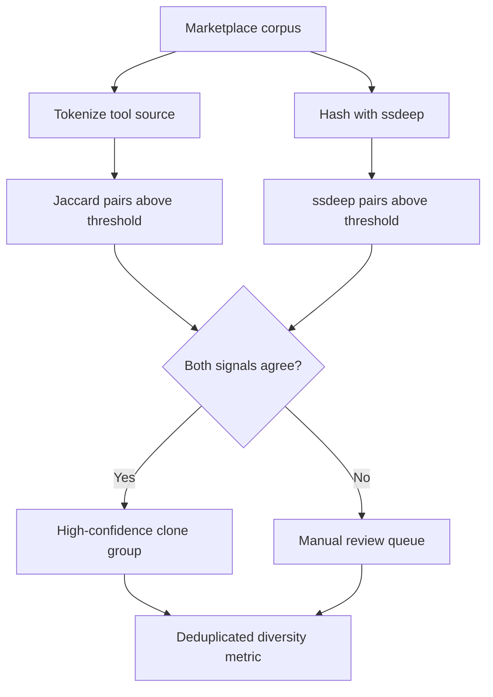

# Tool Cloning and Provenance Assessment

> Marketplace repository counts overstate tool diversity because many entries are clones or template-derived; assess provenance with lexical and fuzzy-structural similarity before trusting ecosystem numbers.

## Why Raw Counts Mislead

Agent tools reach users through public marketplaces. Smithery hosts 7,000+ MCP servers; MCPMarket lists 10,000+; aggregated directories index 20,000+ entries as of early 2026 ([TrueFoundry: Best MCP Registries 2026](https://www.truefoundry.com/blog/best-mcp-registries)). The official MCP registry is a metaregistry that indexes metadata only — code and binaries live on npm, PyPI, and Docker Hub — so deduplication has to run on artefact contents, not registry entries.

A measurement study by Kim, Jiang, Hu, Jia, and Gong sampled this surface directly: 7,508 MCP repositories containing 87,564 tools, plus 1,353 Skills repositories containing 12,447 tools — 8,861 repositories and 100,011 tools in total ([arxiv 2605.09817](https://arxiv.org/abs/2605.09817)). Manual verification on the highest-similarity tiers in MCP produced clone confirmation rates of 60% for high-Jaccard candidates and 85% for high-ssdeep candidates. A meaningful share of the marketplace is cloned, lightly modified, or derived from shared templates.

## The Two-Signal Detection Approach

Single similarity metrics misclassify common ecosystem patterns. The Kim et al. study pairs two complementary signals ([arxiv 2605.09817](https://arxiv.org/abs/2605.09817)):

| Signal | Captures | Misses |
|--------|----------|--------|
| Jaccard similarity (token-level) | Outright copy, light text edits | Refactors that preserve structure but change identifiers |
| ssdeep (fuzzy hashing) | Near-duplicate structural similarity | Identical logic with different formatting |

Combining the two raises confidence on the highest-similarity tier: when both signals agree at high thresholds, manual verification confirms a clone in the large majority of cases. When the signals disagree, the candidate is closer to a legitimate fork or domain variant and warrants individual review rather than automatic deduplication.

## When Clone Detection Matters

The technique is informative at marketplace scale and when downstream decisions depend on the diversity number. Three usage contexts dominate:

- **Benchmark split construction.** Agent-tool benchmarks that sample by repository risk over-representing template families. Without provenance and similarity filtering, evaluation splits leak structure between train and test, inflating generalisation scores ([arxiv 2605.09817](https://arxiv.org/abs/2605.09817)).
- **Marketplace breadth claims.** A platform that advertises N servers should report deduped coverage alongside raw counts. Independent surveys of MCP registries already note that fork and variant entries inflate listing totals ([TrueFoundry](https://www.truefoundry.com/blog/best-mcp-registries)).
- **Security triage.** Cloned implementations propagate vulnerabilities across the ecosystem ([arxiv 2605.09817](https://arxiv.org/abs/2605.09817)). ReversingLabs found 534 of 3,984 skills on agent marketplaces contained critical vulnerabilities, including prompt injection ([ReversingLabs](https://www.reversinglabs.com/blog/how-ai-agents-upend-sscs)) — clone graphs tell a security team which downstream repos inherit a newly disclosed flaw.

## When Clones Are Not the Problem

Treating every near-duplicate as a defect over-corrects. In classical open-source ecosystems, fork diversity correlates positively with external contribution volume, pull-request acceptance rates, and bug reports — forks signal organisational diversity and sustainability, not noise ([Wang et al., arxiv 2205.09931](https://arxiv.org/abs/2205.09931); [Springer 2025](https://link.springer.com/article/10.1007/s10664-025-10668-4)). Three conditions where deduplication misleads:

- **Template-scaffolded ecosystems.** A `create-mcp-server` scaffold produces high baseline ssdeep similarity by design; deduping against the scaffold penalises legitimate publishing activity.
- **Domain-variant connectors.** Twenty "clones" of a Stripe MCP server that differ only in endpoint and field mapping serve genuinely distinct user populations; collapsing them removes real coverage from the diversity metric.
- **Small or internal registries.** Below roughly 50 servers, clone-rate analysis is dominated by sample variance.

The right framing is that clone-rate is a correction term on raw counts, not a defect score. The Kim et al. recommendation is explicit: "agent-tool datasets and benchmarks should account for repository provenance and implementation similarity when measuring tool diversity or constructing evaluation splits" ([arxiv 2605.09817](https://arxiv.org/abs/2605.09817)).

## Example

Applied to the Kim et al. measurement corpus: 7,508 MCP repositories containing 87,564 tools ([arxiv 2605.09817](https://arxiv.org/abs/2605.09817)). The two-signal pipeline runs Jaccard over tokenised tool source and ssdeep over the file bytes, then surfaces pairs above the per-metric high-similarity threshold for manual review. Verification on the high-similarity tier yields 60% clones by Jaccard and 85% clones by ssdeep — the disagreement between the two signals is the practitioner's signal to separate near-duplicates from healthy fork variants. The corpus-level interpretation is that the 87,564-tool count materially overstates the number of distinct tool implementations available to an agent; benchmark and marketplace conclusions drawn from the raw number need the correction term applied explicitly.

## Key Takeaways

- 60% of high-Jaccard and 85% of high-ssdeep clone candidates in MCP are manual-verified clones; raw repository counts overstate diversity by a meaningful factor ([arxiv 2605.09817](https://arxiv.org/abs/2605.09817)).
- Pair lexical (Jaccard) and fuzzy-structural (ssdeep) signals — single-metric detection misclassifies templates and refactors.
- Apply the correction when raw counts feed real decisions: benchmark splits, marketplace breadth claims, security triage.
- Do not generalise to "all clones are defects" — fork diversity is a sustainability signal in classical OSS and template scaffolding is by design in young ecosystems.

## Related

- [Skill Supply-Chain Poisoning](../security/skill-supply-chain-poisoning.md)
- [Tool Signing and Signature Verification](../security/tool-signing-verification.md)
- [Scoped MCP Server Discovery](scoped-mcp-server-discovery.md)
- [MCP Server Design](mcp-server-design.md)
