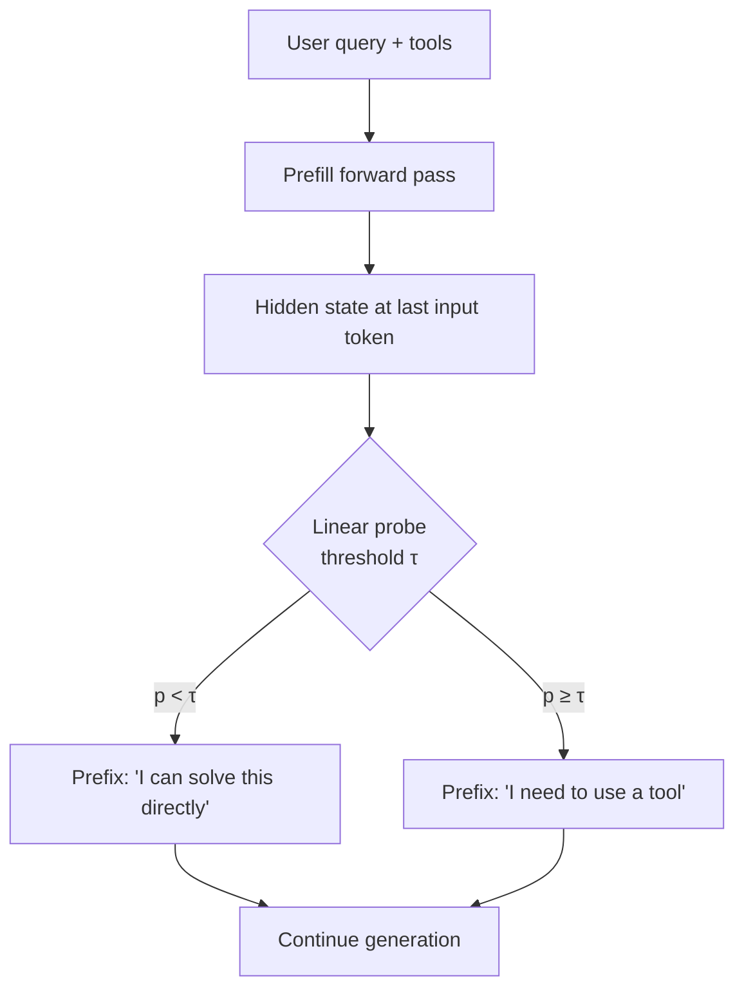

# Tool Necessity Probing

> A linear probe on the pre-generation hidden state predicts tool necessity at AUROC 0.89–0.96 — beating the model's verbalized reasoning ([Sun et al., 2026](https://arxiv.org/abs/2605.09252)).

## The Over-Calling Problem

Tool-augmented agents over-call: queries the base model could answer directly still trigger `web_search`, code scans, or MCP round-trips. The long tail dominates spend on tool-heavy harnesses ([Sun et al., 2026 — §1](https://arxiv.org/html/2605.09252v1)).

Two training-free baselines have known failure modes:

| Approach | Why it underperforms |
|---|---|
| Prompt-only ("only call a tool if needed") | Cuts calls uniformly — hard tasks pay disproportionate accuracy loss ([§3](https://arxiv.org/html/2605.09252v1)) |
| Reason-then-Act (forced chain-of-thought) | Llama-3.x accuracy collapses 79.5% → 31.2% — reasoning breaks tool calling on weaker instruction-followers ([§3](https://arxiv.org/html/2605.09252v1)) |

Verbalized reasoning is the wrong control point: training pressure produces plausible chains of thought, not calibrated tool decisions.

## What the Hidden State Knows

A logistic-regression probe on the hidden state at the **last input token** — extracted during the standard prefill, before any generation — hits AUROC 0.89–0.96 across six models: Qwen3 1.7B/4B/14B/32B, Llama-3.1 8B, Llama-3.3 70B ([§4](https://arxiv.org/html/2605.09252v1)).

The probe reads the un-committed representation, not the surface chain of thought. The AUROC gap measures *what the model knows* vs *what generation lets out*. Two parallel 2026 papers replicate the finding for multi-class tool selection ([arXiv:2605.07990](https://arxiv.org/abs/2605.07990)) and decision-theoretic need/utility ([arXiv:2605.00737](https://arxiv.org/abs/2605.00737)).

## Probe & Prefill

The control mechanism is two stages:

The probe is L2-regularized logistic regression on binary tool-necessity labels. At inference, the harness reads the prefill hidden state, runs the probe, and **prefills** the model's response with one of two steering sentences. The model continues autoregressively from that prefix.

Threshold τ exposes a smooth accuracy-efficiency tradeoff. At the operating point reported in the paper:

| Metric | Probe & Prefill | Best baseline at matched accuracy |
|---|---|---|
| Tool-call reduction | 48% | 6% |
| Accuracy loss | 1.7% | comparable |
| Tool-call reduction at matched accuracy loss | 48% | 5× higher accuracy loss for similar reduction |
| Added latency | < 0.7 ms (< 1% of one prefill pass) | varies |

On the real-world Search-o1 benchmark the method cuts API calls 20–56% with no accuracy degradation ([Sun et al., 2026 — §5](https://arxiv.org/html/2605.09252v1)).

## When the Pattern Applies

The mechanism is real but its scope is bounded. Use it when all four hold:

- **Open-weights inference.** The probe reads hidden states at a chosen layer and token position. Hosted Claude, GPT, and Gemini APIs do not expose that surface.
- **Heterogeneous workload.** The 48% reduction comes from skipping easy and medium tasks. Uniformly tool-heavy traffic has no slack to recover.
- **Base model follows the prefill.** Llama-3.x "partially ignores" the steering sentence; Qwen3 follows it cleanly ([Sun et al., 2026 — §5](https://arxiv.org/html/2605.09252v1)). Weaker instruction-followers need harder steering (logit bias or constrained decoding).
- **Model rotation slower than probe-retrain cadence.** Each base-model upgrade needs the probe retrained on representative labels.

## When It Backfires

The probe is a learned classifier with the brittleness profile of learned classifiers:

- **Distribution shift.** Truthfulness probes degrade under input perplexity (β = −1.76 on MMLU) ([Haller et al., 2025 — arXiv:2510.11905](https://arxiv.org/abs/2510.11905)). When2Tool-trained probes have not been validated on production traffic — novel repos, internal tools, and arbitrary user phrasing are exactly where probe calibration drifts.
- **Single-layer fragility.** The best probe layer varies across models and tasks; single-layer probes fail entirely on some task families and benefit from multi-layer ensembling ([Nordby et al., 2026 — arXiv:2604.13386](https://arxiv.org/abs/2604.13386)).
- **Closed APIs.** Hosted Claude, GPT, and Gemini expose no hidden states. On those stacks, fall back to a typed schema that makes "answer directly" a first-class action plus per-turn tool budgets.

## Composing With Other Patterns

Probe-based tool-call control sits next to, not in place of, three existing patterns on this site:

| Pattern | Slot | Composes with probing how |
|---|---|---|
| [Inference-time tool-call reviewer](../agent-design/inference-time-tool-call-reviewer.md) | Reviews each *provisional* call after the model emits it | Probing decides whether to emit; the reviewer decides whether to execute |
| [Heuristic effort scaling](../agent-design/heuristic-effort-scaling.md) | Encodes per-tier tool-call ceilings in the system prompt | Static budget upstream; probing is the dynamic per-query selector |
| [Cognitive reasoning-execution separation](../agent-design/cognitive-reasoning-execution-separation.md) | Routes reasoning to one model, execution to another | Probing supplies the reasoning model with a calibrated tool-necessity signal at no extra forward pass |

## Example

A research agent running Qwen3-14B answers two queries from a customer-support workflow:

**Query A**: "What's the SQL for joining `orders` and `customers` on `customer_id`?"

The prefill hidden state encodes that the answer is parametric knowledge. The probe returns p = 0.12 (below τ = 0.5). The harness prefills the response with `I can solve this directly` and the model emits the SQL without firing the `code_search` or `docs_lookup` tools. One forward pass, zero tool calls.

**Query B**: "What's the SQL for joining `orders` and `customers` in our staging schema?"

The hidden state encodes uncertainty about the schema-specific column names. The probe returns p = 0.84 (above τ). The harness prefills `I need to use a tool` and the model emits `schema_lookup(table="orders")`. One forward pass, one targeted tool call.

The same harness *without* the probe routinely fires `schema_lookup` on Query A — the wrong default, paid on every benign question.

## Key Takeaways

- The prefill hidden state predicts tool necessity at AUROC 0.89–0.96 across six models — a linear probe reads it cheaply ([Sun et al., 2026](https://arxiv.org/abs/2605.09252)).
- Verbalized reasoning is the wrong control surface: Reason-then-Act drops Llama-3.x accuracy from 79.5% to 31.2% on the same task the hidden state still classifies at AUROC > 0.9.
- Probe & Prefill — read the hidden state, then prefill `I can solve this directly` or `I need to use a tool` — cuts tool calls 48% at 1.7% accuracy loss.
- Open-weights only: hosted Claude, GPT, and Gemini expose no hidden states.
- Retrain probes on every model upgrade; expect distribution-shift drift ([arXiv:2510.11905](https://www.arxiv.org/pdf/2510.11905)) and single-layer fragility ([arXiv:2604.13386](https://arxiv.org/html/2604.13386)).

## Related

- [Inference-Time Tool-Call Reviewer](../agent-design/inference-time-tool-call-reviewer.md)
- [Heuristic Effort Scaling](../agent-design/heuristic-effort-scaling.md)
- [Cognitive Reasoning-Execution Separation](../agent-design/cognitive-reasoning-execution-separation.md)
- [Tool Minimalism](tool-minimalism.md)
- [Token-Efficient Tool Design](token-efficient-tool-design.md)
- [Abstention-Aware Memory Retrieval](../agent-design/abstention-aware-memory-retrieval.md)
- [Chance-Corrected Shortlist Depth Sizing](chance-corrected-shortlist-depth-sizing.md)
