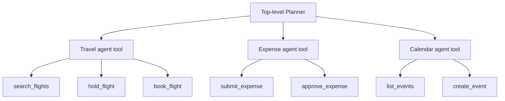

# Toolset Agentization

> Group frequently co-used tools into specialized sub-agents so the top-level planner chooses among fewer, coarser actions at each routing step.

## The Action-Space Problem

A flat tool catalog forces the planner to select 1-of-N at every turn. Selection accuracy degrades as N grows: [LongFuncEval (2025)](https://arxiv.org/abs/2505.10570) reports 7–85% accuracy drops as tool catalogs expand, driven by the [lost-in-the-middle](../context-engineering/lost-in-the-middle.md) effect ([Liu et al., 2023](https://arxiv.org/abs/2307.03172)) — correct tools become harder to locate among distractors. At hundreds of tools, a single planner cannot reliably reason about which combination achieves the goal.

## The Pattern

Identify tools that are *frequently co-used* in production trajectories. Encapsulate each group behind a single **agent tool** — a sub-agent exposing one high-level interface to the planner, and orchestrating its owned leaf tools internally.



The planner's action space shrinks from N leaf tools to K agent tools (K ≪ N). Each sub-agent then faces a small local catalog where selection accuracy is high. This is the core proposal of [HTAA (Huang et al., 2026)](https://arxiv.org/abs/2604.10917), which pairs the agentization step with **Asymmetric Planner Adaptation** — a trajectory-based fine-tuning method that aligns the planner's expected invocation signature with the new agent tools via backward reconstruction and forward refinement.

The authors report — against flat baselines — "higher task success rates, shorter tool calling trajectories, and significantly reduced context overhead" on public benchmarks, plus production deployment at a ride-hailing platform that "substantially reduces manual validation effort and operational cost" ([source](https://arxiv.org/abs/2604.10917)).

## Positioning Versus Adjacent Patterns

Three existing patterns address the same scaling problem with different mechanisms:

| Pattern | Mechanism | When it fits |
|---------|-----------|--------------|
| [Tool Search](advanced-tool-use.md) | Dynamic, stateless lazy discovery — planner queries a search tool on demand | Any library size; no pre-grouping; works without fine-tuning |
| [Filesystem-Based Tool Discovery](filesystem-tool-discovery.md) | Filesystem-organised lazy loading from a directory tree | Large MCP tool collections; directory structure mirrors domains |
| [Consolidate Agent Tools](consolidate-agent-tools.md) | Merge always-co-called leaves into one tool | Tools always called together with no independent use |
| **Toolset Agentization** | Wrap co-used groups behind a sub-agent interface | Hundreds of tools clustered into reusable sub-capabilities; you can fine-tune the planner |

Agentization is intermediate between consolidation (collapses the leaves) and full multi-agent orchestration (independent agents negotiating): the sub-agent is still called as one tool, but internally it retains a full sub-catalog and its own reasoning step.

## Why It Works

Agentization reduces the **effective action space** visible to the top-level planner at each decision. [Anthropic's advanced tool use benchmarks](https://www.anthropic.com/engineering/advanced-tool-use) show the same mechanism at work in a different form: deferring tools until search lifts Opus 4.5 from 79.5% to 88.1% selection accuracy — the model chooses among 3–5 surfaced tools rather than the full catalog. Agentization achieves the smaller-surface effect statically, at design time, instead of dynamically per request. The asymmetric adaptation training step closes the gap that static grouping alone leaves open: without it, the planner invokes the agent tool with the signature it learned on flat catalogs ([HTAA, 2026](https://arxiv.org/abs/2604.10917)).

## When This Backfires

Agentization is a commitment to a static partition. Specific conditions invert its benefits:

- **Usage patterns drift** — "frequently co-used" today need not hold in six months. A stale partition forces the planner to route around wrappers or invoke multiple agent tools where one flat call would have sufficed.
- **Sub-agent opacity on failure** — the planner sees an aggregate error, not which leaf failed. Debugging and error recovery regress versus a flat catalog, mirroring the opacity trap flagged in [Consolidate Agent Tools](consolidate-agent-tools.md).
- **Training dependency** — Asymmetric Planner Adaptation requires fine-tuning access. Teams using frontier proprietary models (Claude, GPT-4) cannot apply the training half and inherit only the structural change.
- **Cross-agent coordination** — when two agent tools both need a shared leaf (calendar, auth), the hierarchy forces either leaf duplication or inter-agent coupling the planner must now resolve. [Research on multi-agent system failures](https://arxiv.org/html/2503.13657v1) shows agents frequently disobey role specifications; sub-agent tools inherit this risk.
- **Small-to-moderate libraries** — HTAA targets "hundreds of tools." Below ~30–50 tools, the overhead of defining sub-agents and their interfaces exceeds the gains [Tool Search](advanced-tool-use.md) or [Consolidate Agent Tools](consolidate-agent-tools.md) deliver with less infrastructure.

## Example

A customer-service agent starts with 120 leaf tools spanning billing, shipping, returns, and account management. The flat catalog consumes roughly 40K tokens in definitions and produces frequent wrong-tool selections on boundary cases (e.g., `update_shipping_address` invoked for a billing change).

**Before — flat catalog:**

```yaml
tools:
  - get_invoice
  - list_invoices
  - refund_charge
  - dispute_charge
  - track_shipment
  - update_shipping_address
  - initiate_return
  - accept_return
  # ... 112 more
```

**After — agentized:**

```yaml
tools:
  - name: billing_agent
    description: Resolve invoice, refund, and dispute questions. Handles all charge-related workflows end to end.
  - name: shipping_agent
    description: Track shipments, update delivery addresses, handle carrier issues.
  - name: returns_agent
    description: Initiate and process product returns, including RMA generation and refund handoff.
  - name: account_agent
    description: Profile, subscription, and authentication changes.
```

The planner now chooses among four agent tools per turn. Each sub-agent internally selects from a scoped local catalog (15–40 leaves) where "lost-in-the-middle" pressure is negligible. The top-level definition footprint drops substantially; wrong-domain selections collapse because there is no billing leaf visible when the model is routing a shipping intent.

## Key Takeaways

- Agentization reduces the planner's effective action space at each step by one structural level — from leaf tools to sub-agent capabilities.
- Pair structural grouping with Asymmetric Planner Adaptation when fine-tuning is available; structure alone leaves invocation drift unresolved.
- Prefer dynamic discovery ([Tool Search](advanced-tool-use.md)) when tool usage patterns shift or when you cannot fine-tune — static partitions calcify.
- Sub-agent wrappers inherit the opacity-on-failure trap — aggregate errors mask which leaf actually failed.
- At 20–50 tools, cheaper patterns (Consolidate, Tool Search) deliver the scaling gain without the sub-agent infrastructure.

## Related

- [Advanced Tool Use](advanced-tool-use.md)
- [Consolidate Agent Tools](consolidate-agent-tools.md)
- [Filesystem-Based Tool Discovery](filesystem-tool-discovery.md)
- [Tool Minimalism and High-Level Prompting](tool-minimalism.md)
- [Specialized Agent Roles](../agent-design/specialized-agent-roles.md)
- [Orchestrator-Worker Pattern](../multi-agent/orchestrator-worker.md)
- [Token-Efficient Tool Design](token-efficient-tool-design.md)
- [Self-Healing Tool Routing](self-healing-tool-routing.md)
