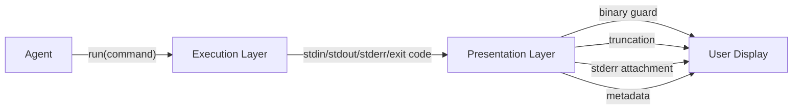

# Unix CLI as the Native Tool Interface for AI Agents

> A single `run(command)` tool backed by Unix CLI can replace large function catalogs, leveraging the model's dense pretraining on shell usage and Unix's built-in discovery, error reporting, and composition primitives.

## Core Concept

Most agent frameworks register many typed tools — `read_file`, `search_code`, `list_directory` — each with its own schema and error handling. The alternative: expose one execution primitive and let the agent compose Unix commands directly. Models trained on large code corpora have extensive exposure to shell commands, man pages, and CLI documentation, making Unix primitives a high-alignment action space.

This is the extreme end of the [tool minimalism](tool-minimalism.md) spectrum: where tool consolidation reduces overlap, the single-tool hypothesis eliminates tool selection entirely.

## How It Works

The agent receives one tool:

```python
def run(command: str, timeout: int = 30) -> str:
    """Execute a shell command. Returns stdout, stderr, and exit code."""
```

Three techniques replace typed tool schemas:

1. **`--help` discovery** -- the agent runs `tool --help` to learn capabilities on demand. Lazy tool discovery using the OS's own mechanism — no upfront schema loading.

2. **Error messages as navigation** -- stderr guides the next action. `command not found` → try an alternative; `permission denied` → adjust approach.

3. **Consistent output format** -- every invocation returns the same structure (`stdout`, `stderr`, `exit code`), letting the agent build success/failure patterns across commands.

Pipes, `&&`, `||`, and `;` combine search, filter, and transform in a single call.

## Two-Layer Architecture

Separate execution from presentation. The agent works in raw CLI; results are formatted afterward.



**Execution layer** -- pure Unix semantics: raw output, exit codes, error streams.

**Presentation layer** -- handles what the agent should not:

- **Binary guard** -- detects non-text output (e.g., PNG) and returns a placeholder
- **Overflow mode** -- truncates large outputs, preserving head and tail
- **Stderr attachment** -- surfaces stderr alongside stdout

Without these, binary output fills the context window with uninterpretable content, and silent stderr hides failure signals that the agent needs to route to the next action.

## Trade-offs

| Aspect | Single `run(command)` | Typed tool catalog |
|--------|----------------------|-------------------|
| Tool selection overhead | None -- one tool | Scales with catalog size |
| Schema validation | None -- free-form string | Strong typing, enums, constraints |
| Pretraining alignment | High -- models trained on CLI | Varies by tool naming |
| Error handling | Built-in (stderr + exit codes) | Custom per tool |
| Security surface | Broad -- arbitrary execution | Constrained per tool |
| Discoverability | `--help`, `man`, `--version` | Tool descriptions in schema |
| Structured output | Requires `--json` or `jq` | Native structured returns |

**Where typed tools win**: strongly-typed interactions, high-security environments needing parameter constraints, and multimodal processing (images, audio).

## The Spectrum in Practice

The [CodeAct paper (Wang et al., ICML 2024)](https://arxiv.org/abs/2402.01030) shows executable code actions outperform JSON function calls by up to 20% success rate across 17 LLMs — though CodeAct uses Python as the action space, not shell. Manus itself uses ~27 tools in production — not a single tool.

Five well-designed tools plus shell access captures most of the benefit without unrestricted execution risk.

## Designing CLIs for Agent Consumption

Design CLI tools for machine consumption:

- **`--json` flag** for structured output agents can parse without `awk`/`sed`
- **Distinct exit codes** beyond 0/1 to signal specific failure modes
- **`--dry-run`** for safe mutation preview
- **`--yes`/`--force`** to eliminate interactive prompts that block agents
- **Batch operations** to reduce call count
- **`--schema`** for runtime introspection of accepted arguments

Example: `gh pr list --json number,title` returns structured JSON, `gh pr create --fill` skips prompts, and distinct exit codes distinguish auth from API errors.

Human DX optimizes for discoverability. Agent DX optimizes for predictability and [defense-in-depth](../security/defense-in-depth-agent-safety.md).

## Example

An agent using a single `run()` tool to investigate a codebase:

```
# Step 1: discover what tools are available
run("gh --help")
# → shows subcommands including 'pr', 'issue', 'repo'

# Step 2: compose a query
run("gh pr list --json number,title,state | jq '.[] | select(.state==\"OPEN\") | .title'")
# → returns structured list of open PR titles

# Step 3: handle stderr as navigation
run("gh pr diff 999")
# → stderr: "pull request not found", exit 1
# agent adjusts: checks list first, then re-requests with a valid PR number
```

No custom schema was needed. `--help` provided discovery; stderr provided error routing; pipes handled transformation.

## Sources

- Reddit post by u/MorroHsu (r/LocalLLaMA) -- single run(command) tool vs function catalogs
- [CodeAct: Executable Code Actions Elicit Better LLM Agents (Wang et al., ICML 2024)](https://arxiv.org/abs/2402.01030) -- code actions outperform JSON/text by 20%
- [CLI-Anything (HKU)](https://github.com/HKUDS/CLI-Anything) -- agent-native CLI generation pipeline
- [Manus architecture analysis](https://gist.github.com/renschni/4fbc70b31bad8dd57f3370239dccd58f) -- ~27 tools + CodeAct in practice

## Related

- [Tool Minimalism and High-Level Prompting](tool-minimalism.md)
- [CLI-First Skill Design](cli-first-skill-design.md)
- [Consolidate Agent Tools](consolidate-agent-tools.md)
- [Toolset Agentization: Wrapping Co-Used Tools as Sub-Agents](toolset-agentization.md)
- [Batch File Operations via Bash Scripts for AI Agents](batch-file-operations.md)
- [Token-Efficient Tool Design](token-efficient-tool-design.md)
- [Agent-Computer Interface](agent-computer-interface.md)
- [Filesystem-Based Tool Discovery](filesystem-tool-discovery.md)
- [CLI Scripts as Agent Tools](cli-scripts-as-agent-tools.md)
- [Semantic Tool Output](semantic-tool-output.md)
- [Override Interactive Commands](override-interactive-commands.md)
- [Cognitive Reasoning vs Execution: A Two-Layer Agent Architecture](../agent-design/cognitive-reasoning-execution-separation.md)
- [Typed Schemas at Agent Boundaries](typed-schemas-at-agent-boundaries.md)
- [Poka-Yoke for Agent Tools](poka-yoke-agent-tools.md)
- [Tool Description Quality](tool-description-quality.md)
- [Agent-First Software Design](../agent-design/agent-first-software-design.md)
