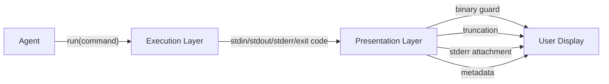

# Unix CLI as the Native Tool Interface for AI Agents

> A single `run(command)` tool backed by Unix CLI can replace large typed-function catalogs, exploiting the model's shell pretraining and Unix's discovery and composition primitives.

Learn it hands-on with the [guided lesson on the Unix CLI as a tool interface](https://learn.agentpatterns.ai/tool-engineering/unix-cli-as-tool-interface/), which includes quizzes.

## Core concept

Most agent frameworks register many typed tools — `read_file`, `search_code`, `list_directory` — each with its own schema and error handling. The alternative is to expose one execution primitive and let the agent compose Unix commands directly. Models trained on large code corpora have seen a lot of shell commands, man pages, and CLI documentation, which makes Unix primitives a high-alignment action space.

This is the extreme end of the [tool minimalism](tool-minimalism.md) spectrum: where tool consolidation reduces overlap, the single-tool hypothesis eliminates tool selection entirely.

## How it works

The agent receives one tool:

```python
def run(command: str, timeout: int = 30) -> str:
    """Execute a shell command. Returns stdout, stderr, and exit code."""
```

Three techniques replace typed tool schemas:

1. `--help` discovery — the agent runs `tool --help` to learn what a tool can do, on demand. This is lazy discovery through the OS's own mechanism, with no upfront schema loading.

2. Error messages as navigation — stderr guides the next action. `command not found` means try an alternative; `permission denied` means adjust the approach.

3. Consistent output format — every call returns the same structure (`stdout`, `stderr`, `exit code`), so the agent can build success and failure patterns across commands.

Pipes, `&&`, `||`, and `;` combine search, filter, and transform in a single call.

## Two-layer architecture

Separate execution from presentation. The agent works in raw CLI, and the presentation layer formats the results afterward.


```mermaid
graph LR
    A[Agent] -->|"run(command)"| B[Execution Layer]
    B -->|stdin/stdout/stderr/exit code| C[Presentation Layer]
    C -->|binary guard| D[User Display]
    C -->|truncation| D
    C -->|stderr attachment| D
    C -->|metadata| D
```

Execution layer — pure Unix semantics: raw output, exit codes, error streams.

Presentation layer — it handles what the agent should not:

- Binary guard — detects non-text output, for example a PNG, and returns a placeholder
- Overflow mode — truncates large output while keeping the head and tail, as in [Graceful Tool Output Truncation](graceful-tool-output-truncation.md)
- Stderr attachment — surfaces stderr alongside stdout

Without these guards, binary output fills the context window with content the model cannot read. Silent stderr also hides the failure signals the agent needs to choose its next action.

## Trade-offs

| Aspect | Single `run(command)` | Typed tool catalog |
|--------|----------------------|-------------------|
| Tool selection overhead | None -- one tool | Scales with catalog size |
| Schema validation | None -- free-form string | Strong typing, enums, constraints |
| Pretraining alignment | High -- models trained on CLI | Varies by tool naming |
| Error handling | Built-in (stderr + exit codes) | Custom per tool |
| Security surface | Broad -- arbitrary execution | Constrained per tool |
| Discoverability | `--help`, `man`, `--version` | Tool descriptions in schema |
| Structured output | Requires `--json` or `jq` | Native structured returns |

Typed tools win for strongly-typed interactions, high-security environments that need parameter constraints, and multimodal processing (images, audio).

## The spectrum in practice

The [CodeAct paper (Wang et al., ICML 2024)](https://arxiv.org/abs/2402.01030) shows executable code actions outperform JSON function calls by up to 20% success rate across 17 LLMs — though CodeAct uses Python as the action space, not shell. Manus itself integrates dozens of tools in production — not a single tool.

Five well-designed tools plus shell access captures most of the benefit without unrestricted execution risk.

## Designing CLIs for agent consumption

Design CLI tools for machine consumption:

- `--json` flag for structured output agents can parse without `awk` or `sed`
- Distinct exit codes beyond 0 and 1 to signal specific failure modes
- `--dry-run` for a safe preview of a mutation
- `--yes` or `--force` to remove interactive prompts that block agents
- Batch operations to reduce the call count
- `--schema` for runtime introspection of accepted arguments

Example: `gh pr list --json number,title` returns structured JSON, `gh pr create --fill` skips prompts, and distinct exit codes distinguish auth from API errors.

Human DX optimizes for discoverability. Agent DX optimizes for predictability and [defense-in-depth](../security/defense-in-depth-agent-safety.md).

## Example

An agent using a single `run()` tool to investigate a codebase:

```
# Step 1: discover what tools are available
run("gh --help")
# → shows subcommands including 'pr', 'issue', 'repo'

# Step 2: compose a query
run("gh pr list --json number,title,state | jq '.[] | select(.state==\"OPEN\") | .title'")
# → returns structured list of open PR titles

# Step 3: handle stderr as navigation
run("gh pr diff 999")
# → stderr: "pull request not found", exit 1
# agent adjusts: checks list first, then re-requests with a valid PR number
```

No custom schema was needed. `--help` provided discovery; stderr provided error routing; pipes handled transformation.

## Key Takeaways

- One `run(command)` tool exploits the model's dense pretraining on shell usage — high-alignment action space without bespoke schemas.
- Unix supplies discovery (`--help`), error routing (stderr + exit codes), and composition (pipes, `&&`, `||`) for free.
- Separate execution from presentation: a binary guard, overflow truncation, and stderr attachment prevent raw output from poisoning the context window.
- Typed tools still win for strong parameter constraints, high-security surfaces, and multimodal payloads — five well-designed tools plus shell access captures most of the upside.
- Design CLIs for agents with `--json`, distinct exit codes, `--dry-run`, `--yes`/`--force`, batch operations, and `--schema` introspection.

## Sources

- Reddit post by u/MorroHsu (r/LocalLLaMA) -- single run(command) tool vs function catalogs
- [CodeAct: Executable Code Actions Elicit Better LLM Agents (Wang et al., ICML 2024)](https://arxiv.org/abs/2402.01030) -- code actions outperform JSON/text by 20%
- [CLI-Anything (HKU)](https://github.com/HKUDS/CLI-Anything) -- agent-native CLI generation pipeline
- [Manus architecture analysis](https://gist.github.com/renschni/4fbc70b31bad8dd57f3370239dccd58f) -- dozens of tools + CodeAct in practice

## Related

- [Tool Minimalism and High-Level Prompting](tool-minimalism.md)
- [CLI-First Skill Design](cli-first-skill-design.md)
- [Consolidate Agent Tools](consolidate-agent-tools.md)
- [CLI Scripts as Agent Tools](cli-scripts-as-agent-tools.md)
- [Agent-Aware CLI via Environment Variable](agent-aware-cli-via-env-var.md) — orthogonal angle: a CLI adapting its output when an agent is detected, vs the output-filtering interface here
- [Rewriting a CLI Into a JSON Payload for Agents](../patterns/anti-patterns/cli-json-payload-rewrite.md) — the counter-case: measured evidence that replacing conventional args with a JSON input payload does not improve agent reliability and costs more
- [Agent-Computer Interface](agent-computer-interface.md)
- [Semantic Tool Output](semantic-tool-output.md)
- [Override Interactive Commands](override-interactive-commands.md)
- [Token-Efficient Tool Design](../token-engineering/token-efficient-tool-design.md)
- [Restricting a Coding Agent to a Single execute_code Tool](restrict-coding-agent-to-execute-code.md) — measures the cost of this single-bash surface against an interpreter-only surface, by task regime and agent
- [Terminal-First Agent Interfaces with Browser Escalation](terminal-first-browser-escalation.md) — the same interface applied to enterprise platform automation, with measured cost against browser and MCP-style agents and an explicit escalation list
- [MCP-vs-CLI Cost Ratios Are a Property of the Scaffolding](mcp-cli-cost-ratio-scaffolding-bound.md) — how much of the CLI cost advantage is the interface and how much is the harness around it
