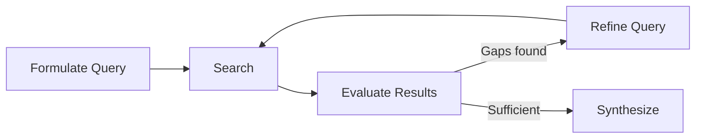
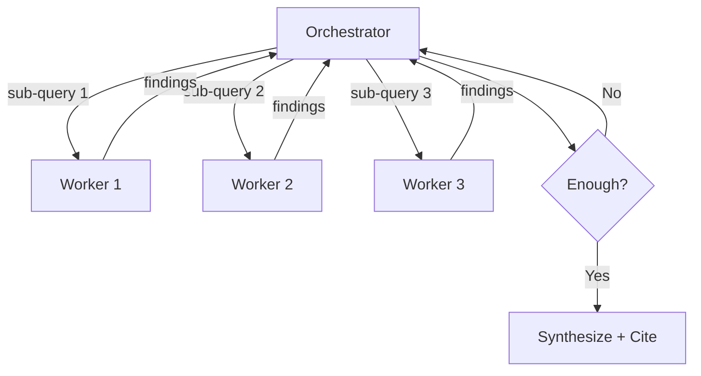

# Web Search Agent Loop

> An agent research loop wraps retrieval in a cycle of search, evaluate, refine, and synthesize — letting the agent decide when evidence is sufficient rather than firing a single query and hoping for the best.

## Pipeline vs. Control Loop

Classic search-augmented generation is a pipeline: retrieve, then generate, once. The agent research loop iterates until a termination condition fires.



Three decisions per iteration:

| Decision | Question |
|---|---|
| **Continue** | Are there gaps worth filling? |
| **Pivot** | Should the query strategy change? |
| **Stop** | Is evidence sufficient to answer? |

## Core Mechanics

### Query Formulation

- **Decomposition**: Break complex questions into independently searchable sub-queries
- **Plan-then-execute**: Generate queries per plan step, executing sequentially with prior-step results passed as context, as in [Perplexity Pro Search](https://www.langchain.com/breakoutagents/perplexity)
- **Broad-to-narrow**: Start broad; narrow on intermediate findings

### Result Evaluation

Filter results before they enter the agent's context:

| Signal | What to check |
|---|---|
| Relevance | Does it address the query or is it tangential? |
| Credibility | Primary source vs. aggregator; official docs vs. blog |
| Freshness | Current enough for the question? |
| Redundancy | New information or a duplicate of what is known? |

### Iterative Refinement

- **Gap-driven follow-ups**: Identify what is still unknown; target queries at the gaps
- **Context accumulation**: Pass earlier results into later iterations so follow-ups build on them
- **Query reformulation**: When results are poor, rephrase with different terms or narrower scope

### Synthesis

Combine findings into a coherent answer with source attribution. Flag uncertainty where evidence conflicts.

## Termination Strategies

From simplest to most sophisticated:

| Strategy | Mechanism | Tradeoff |
|---|---|---|
| **Budget cap** | Max iterations or tool calls | Simple; may stop too early or too late |
| **Plan completion** | Stop when all planned steps execute | Requires good upfront planning |
| **Evaluator decision** | A second LLM judges sufficiency | More accurate; adds cost and latency |
| **Diminishing returns** | Track information gain per iteration | Requires a gain metric |
| **Loop detection** | Detect repeated queries; terminate or pivot | Prevents wasted cycles |

Pair a hard budget cap with a softer quality signal. Anthropic's [multi-agent research system](https://www.anthropic.com/engineering/built-multi-agent-research-system) scales by query type: 1 agent with 3–10 tool calls for fact-finding, 2–4 subagents with 10–15 calls each for comparisons, 10+ subagents for complex research.

## Architecture Patterns

### Two-Tool Separation

Claude Code splits web research across two tools ([reference](https://mikhail.io/2025/10/claude-code-web-tools/)):

- **WebSearch**: Hits Anthropic's server-side search; returns page titles and URLs only
- **WebFetch**: Takes a URL plus a prompt; runs a secondary Claude Haiku pass to extract a targeted answer rather than raw HTML

Discovery stays cheap; deep reading is targeted and trimmed before reaching the main context.

### Orchestrator-Worker

An orchestrator spawns workers in parallel:



Anthropic's [research system](https://www.anthropic.com/engineering/built-multi-agent-research-system) uses this pattern: a lead researcher spawns subagents (typically 3–5 in parallel) that each operate in their own context window, then a separate citation agent attributes specific claims to sources.

### Breadth and Depth Parameters

LangChain's [Open Deep Research](https://blog.langchain.com/open-deep-research/) exposes **Breadth** (parallel queries per iteration) and **Depth** (refinement cycles) as explicit knobs. A supervisor spawns parallel researchers per breadth and recurses for more depth when gaps remain. Termination is deterministic: stop when breadth and depth caps — or a per-agent iteration cap — are hit.

## Why It Works

The first query reflects only what the agent knew before searching; each round surfaces evidence that reshapes what is worth asking next. Anthropic reports a [90.2% improvement over single-agent research](https://www.anthropic.com/engineering/built-multi-agent-research-system) from two mechanisms — parallel subagents expand the explored surface area, and each subagent's own context window lets findings compound without polluting the lead. Gap-driven reformulation also avoids "query lock-in," where one bad phrasing constrains every result.

## When This Backfires

Skip the loop and use a single query plus light validation when:

- **The answer lives on one page**: Official docs, a specific RFC, or a package README make iteration pure latency and token spend.
- **Fact-finding has a verifiable shape**: A short answer with a clear authority does not benefit from iteration.
- **Cost and latency dominate**: Anthropic notes multi-agent research uses [roughly 15× the tokens of single-turn chat](https://www.anthropic.com/engineering/built-multi-agent-research-system); unbounded depth/breadth multiplies this.
- **The question is subjective or contested**: More sources amplify disagreement; loops can manufacture false confidence from one-sided agreement.
- **Breadth beats depth**: For trend-spotting, a broad query with strong reranking often beats recursive refinement that narrows prematurely.

## Example: Configuring a Research Loop

A minimal research loop in pseudocode:

```
research(question, max_iterations=5):
    findings = []
    queries = decompose(question)

    for i in range(max_iterations):
        for q in queries:
            results = web_search(q)
            relevant = evaluate(results, question, findings)
            findings.extend(relevant)

        gaps = identify_gaps(question, findings)
        if not gaps:
            break
        queries = generate_followup_queries(gaps)

    return synthesize(question, findings)
```

The key design choices are in `evaluate` (what counts as relevant), `identify_gaps` (what is still missing), and the `max_iterations` budget.

## Key Takeaways

- The research loop is a control loop, not a pipeline — the agent decides when to continue, pivot, or stop
- Separate discovery (search) from deep reading (fetch) to keep costs predictable
- Always set a hard budget cap even when using quality-based stopping
- Gap-driven follow-ups outperform minor variations on the same query
- Repeated queries or diminishing result quality signal stagnation

## Related

- [Loop Detection](../observability/loop-detection.md) — detecting and breaking repetitive agent behavior
- [Retrieval-Augmented Agent Workflows](../context-engineering/retrieval-augmented-agent-workflows.md) — RAG as a foundation for agent-driven retrieval
- [Sub-Agents and Fan-Out](../multi-agent/sub-agents-fan-out.md) — parallel worker coordination pattern
- [Browser Automation as a Research Tool](browser-automation-for-research.md) — fallback when HTTP fetch is blocked
- [Evaluator-Optimizer](../agent-design/evaluator-optimizer.md) — iterative generate-evaluate loop pattern
- [Orchestrator-Worker](../multi-agent/orchestrator-worker.md) — multi-agent coordination architecture
- [LLM-as-Judge Evaluation with Human Spot-Checking](../workflows/llm-as-judge-evaluation.md) — using an LLM judge to evaluate agent outputs at scale
