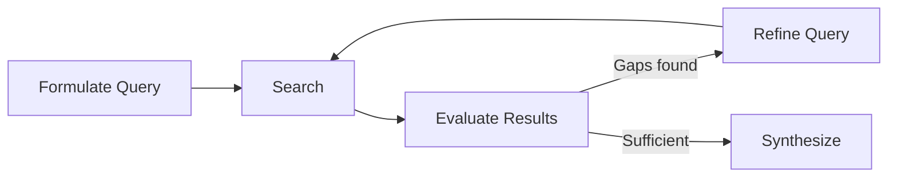
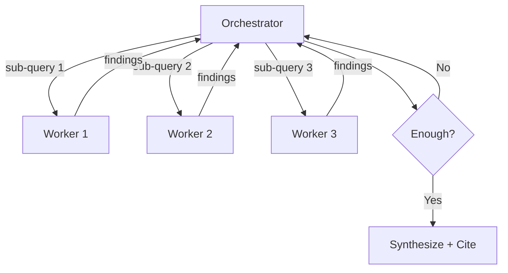

# Web Search Agent Loop

> Instead of firing a single search query and hoping for the best, an agent research loop wraps retrieval in a cycle of search, evaluate, refine, and synthesize — giving the agent autonomy to decide when evidence is sufficient.

## Pipeline vs. Control Loop

Classic search-augmented generation is a pipeline: retrieve, then generate, once. The agent research loop iterates until a termination condition is met.



Three decisions per iteration:

| Decision | Question |
|---|---|
| **Continue** | Are there information gaps worth filling? |
| **Pivot** | Should the query strategy change? |
| **Stop** | Is the evidence sufficient to answer? |

## Core Mechanics

### Query Formulation

- **Decomposition**: Break complex questions into independently searchable sub-queries
- **Plan-then-execute**: Generate queries per plan step, executing sequentially with prior-step context (Perplexity Pro Search) [unverified]
- **Broad-to-narrow**: Start broad, progressively narrow based on intermediate findings

### Result Evaluation

Filter raw results before they enter the agent's context:

| Signal | What to check |
|---|---|
| Relevance | Does the result address the query or is it tangential? |
| Credibility | Primary source vs. aggregator? Official docs vs. blog? |
| Freshness | Current enough for the question? |
| Redundancy | New information or duplicate of what is already known? |

### Iterative Refinement

- **Gap-driven follow-ups**: Identify what is still unknown; generate targeted queries for gaps
- **Context accumulation**: Pass earlier results into later iterations so follow-ups build on prior context
- **Query reformulation**: When results are poor, rephrase with different terminology or narrower scope

### Synthesis

Combine findings into a coherent answer with source attribution. Acknowledge uncertainty where evidence conflicts.

## Termination Strategies

From simplest to most sophisticated:

| Strategy | Mechanism | Tradeoff |
|---|---|---|
| **Budget cap** | Max iterations or max tool calls | Simple but may stop too early or too late |
| **Plan completion** | Stop when all planned steps execute | Requires good upfront planning |
| **Evaluator decision** | A second LLM judges evidence sufficiency | More accurate but adds cost and latency |
| **Diminishing returns** | Track information gain per iteration; stop when gain drops | Requires a gain metric |
| **Loop detection** | Track repeated queries or stagnating results; terminate or force a pivot | Prevents wasted cycles |

Combine a hard budget cap with a softer quality signal — simple fact-finding: 1 agent, 3-10 calls; complex research: 10+ subagents [unverified].

## Architecture Patterns

### Two-Tool Separation

Claude Code's web research uses two tools:

- **WebSearch**: Returns titles + URLs only (lightweight discovery) [unverified]
- **WebFetch**: Takes a URL + focused question, uses a smaller model to extract a targeted answer [unverified]

Discovery stays cheap; deep reading is targeted.

### Orchestrator-Worker

An orchestrator spawns multiple workers in parallel:



Anthropic's research system uses this pattern: a lead agent spawns 3-5 subagents, each searching iteratively, then routes output to a citation agent [unverified].

### Breadth and Depth Parameters

Open Deep Research (LangChain) exposes **Breadth** (parallel queries per iteration) and **Depth** (refinement cycles). Each iteration generates up to 3 follow-up questions and 3 key learnings [unverified]. Termination is deterministic — stop when max breadth and depth are reached.

## Example: Configuring a Research Loop

A minimal research loop in pseudocode:

```
research(question, max_iterations=5):
    findings = []
    queries = decompose(question)

    for i in range(max_iterations):
        for q in queries:
            results = web_search(q)
            relevant = evaluate(results, question, findings)
            findings.extend(relevant)

        gaps = identify_gaps(question, findings)
        if not gaps:
            break
        queries = generate_followup_queries(gaps)

    return synthesize(question, findings)
```

The key design choices are in `evaluate` (what counts as relevant), `identify_gaps` (what is still missing), and the `max_iterations` budget.

## Key Takeaways

- The research loop is a control loop, not a pipeline — the agent decides when to continue, pivot, or stop
- Separate discovery (search) from deep reading (fetch) to keep costs predictable
- Always set a hard budget cap even when using quality-based stopping
- Gap-driven follow-ups outperform minor variations on the same query
- Repeated queries or diminishing result quality signal stagnation

## Related

- [Loop Detection](../observability/loop-detection.md) — detecting and breaking repetitive agent behavior
- [Retrieval-Augmented Agent Workflows](../context-engineering/retrieval-augmented-agent-workflows.md) — RAG as a foundation for agent-driven retrieval
- [Sub-Agents and Fan-Out](../multi-agent/sub-agents-fan-out.md) — parallel worker coordination pattern
- [Browser Automation as a Research Tool](browser-automation-for-research.md) — fallback when HTTP fetch is blocked
- [Evaluator-Optimizer](../agent-design/evaluator-optimizer.md) — iterative generate-evaluate loop pattern
- [Orchestrator-Worker](../multi-agent/orchestrator-worker.md) — multi-agent coordination architecture
- [LLM-as-Judge Evaluation with Human Spot-Checking](../workflows/llm-as-judge-evaluation.md) — using an LLM judge to evaluate agent outputs at scale
