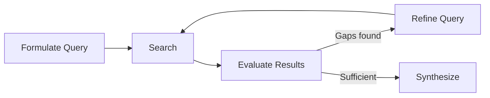
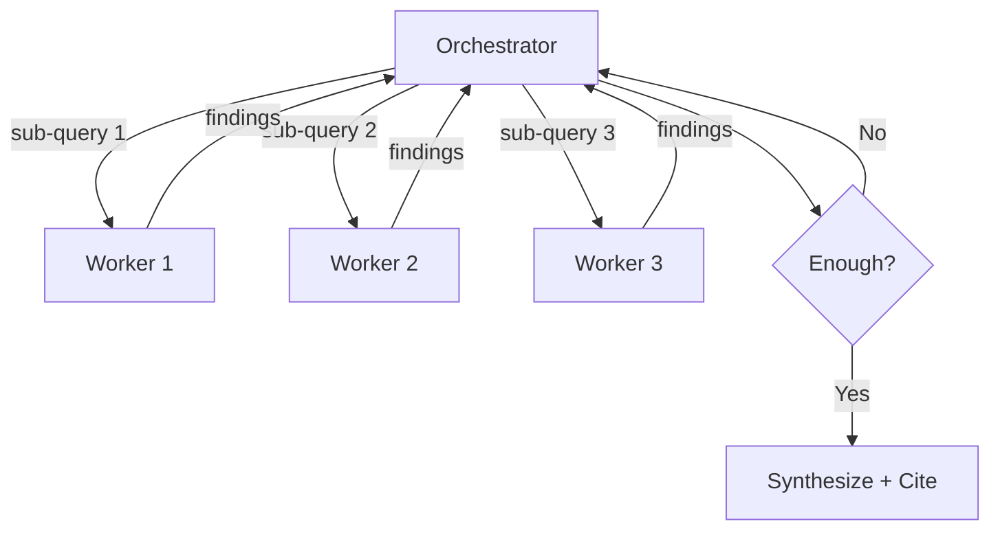

# Web Search Agent Loop

> A web search agent loop wraps retrieval in a cycle of search, evaluate, refine, and synthesize, letting the agent decide when evidence is sufficient.

## Pipeline versus control loop

Classic search-augmented generation retrieves once, then generates. The agent loop iterates until a termination condition fires, with [loop detection](../observability/loop-detection.md) guarding against cycles that never settle.


```mermaid
flowchart LR
    A[Formulate Query] --> B[Search]
    B --> C[Evaluate Results]
    C -->|Gaps found| D[Refine Query]
    D --> B
    C -->|Sufficient| E[Synthesize]
```

Three decisions per iteration:

| Decision | Question |
|---|---|
| Continue | Are there gaps worth filling? |
| Pivot | Should the query strategy change? |
| Stop | Is evidence sufficient to answer? |

## Core mechanics

### Query formulation

- Decomposition: split complex questions into independent sub-queries
- Plan-then-execute: generate queries for each plan step, passing prior results as context, as in [Perplexity Pro Search](https://www.langchain.com/breakoutagents/perplexity)
- Broad-to-narrow: start broad, then narrow on intermediate findings

### Result evaluation

Filter results before they enter context:

| Signal | What to check |
|---|---|
| Relevance | Addresses the query or tangential? |
| Credibility | An arxiv paper or official docs (primary) over an aggregator or blog |
| Freshness | Current enough for the question? |
| Redundancy | New information or a duplicate? |

### Iterative refinement

- Gap-driven follow-ups: target queries at what is still unknown
- Context accumulation: feed earlier results into later iterations
- Query reformulation: when results are poor, rephrase or narrow

### Synthesis

Combine findings with source attribution. Flag conflicting evidence.

## Termination strategies

| Strategy | Mechanism | Tradeoff |
|---|---|---|
| Budget cap | Max iterations or tool calls | Simple; may stop early or late |
| Plan completion | Stop when all planned steps execute | Requires good upfront planning |
| Evaluator decision | A second LLM judges sufficiency | More accurate; adds cost and latency |
| Diminishing returns | Track information gain per iteration | Requires a gain metric |
| Loop detection | Detect repeated queries; terminate or pivot | Prevents wasted cycles |

Pair a hard cap with a softer quality signal. Anthropic's [multi-agent research system](https://www.anthropic.com/engineering/built-multi-agent-research-system) scales by query type: one agent at 3–10 tool calls for fact-finding, 2–4 subagents at 10–15 calls for comparisons, 10+ for complex research.

## Architecture patterns

### Two-tool separation

Claude Code splits web research across two tools ([reference](https://mikhail.io/2025/10/claude-code-web-tools/)):

- WebSearch: server-side search that returns titles and URLs only
- WebFetch: a URL plus prompt, where a Claude Haiku pass extracts a targeted answer instead of raw HTML

Discovery stays cheap. The loop trims deep reading before it reaches context.

### Orchestrator-worker

An orchestrator spawns workers in parallel:


```mermaid
flowchart TD
    O[Orchestrator] -->|sub-query 1| W1[Worker 1]
    O -->|sub-query 2| W2[Worker 2]
    O -->|sub-query 3| W3[Worker 3]
    W1 -->|findings| O
    W2 -->|findings| O
    W3 -->|findings| O
    O --> E{Enough?}
    E -->|No| O
    E -->|Yes| S[Synthesize + Cite]
```

Anthropic's [research system](https://www.anthropic.com/engineering/built-multi-agent-research-system) runs a lead researcher with 3–5 parallel subagents in their own contexts, then a separate citation agent attributes claims to sources.

### Breadth and depth parameters

LangChain's [Open Deep Research](https://blog.langchain.com/open-deep-research/) exposes two settings: breadth (parallel queries per iteration) and depth (refinement cycles). A supervisor spawns researchers for breadth and recurses for depth. Termination is deterministic: it stops at the breadth, depth, or per-agent cap.

## Why it works

The first query reflects only what the agent knew before searching. Each round surfaces evidence that reshapes what is worth asking next. Anthropic reports a [90.2% improvement over single-agent research](https://www.anthropic.com/engineering/built-multi-agent-research-system) from two mechanisms. Parallel subagents widen the explored surface. Each subagent's own context lets findings compound without polluting the lead. Gap-driven reformulation also avoids "query lock-in."

## When this backfires

Skip the loop and use a single query plus light validation when:

- The answer lives on one page: official docs, an RFC, or a README make iteration pure latency and token spend
- Fact-finding has a verifiable shape: a short answer with a clear authority does not benefit from iteration
- Cost and latency dominate: Anthropic notes multi-agent research uses [~15× the tokens of single-turn chat](https://www.anthropic.com/engineering/built-multi-agent-research-system), and unbounded depth or breadth multiplies this
- The question is subjective or contested: more sources amplify disagreement and can manufacture false confidence
- Breadth beats depth: for trend-spotting, a broad query with strong reranking often beats recursive narrowing
- Sequential reasoning dominates: Google Research's [180-configuration scaling study](https://research.google/blog/towards-a-science-of-scaling-agent-systems-when-and-why-agent-systems-work/) found multi-agent coordination degrades sequential-reasoning tasks by 39–70% while improving parallelizable ones by ~81% — the win depends on task shape
- Coordination breaks down at scale: [CIO (March 2026)](https://www.cio.com/article/4143420/true-multi-agent-collaboration-doesnt-work.html) reports that adding agents amplifies planning paralysis, instruction-ignoring, and redo-loops — chain agents deterministically rather than letting them collaborate

## Example: configuring a research loop

A minimal research loop in pseudocode:

```
research(question, max_iterations=5):
    findings = []
    queries = decompose(question)

    for i in range(max_iterations):
        for q in queries:
            results = web_search(q)
            relevant = evaluate(results, question, findings)
            findings.extend(relevant)

        gaps = identify_gaps(question, findings)
        if not gaps:
            break
        queries = generate_followup_queries(gaps)

    return synthesize(question, findings)
```

The main design choices are in `evaluate` (what counts as relevant), `identify_gaps` (what is still missing), and the `max_iterations` budget.

## Key Takeaways

- The research loop is a control loop, not a pipeline — the agent decides when to continue, pivot, or stop
- Separate discovery (search) from deep reading (fetch) to keep costs predictable
- Always set a hard budget cap even when using quality-based stopping
- Gap-driven follow-ups outperform minor variations on the same query
- Repeated queries or diminishing result quality signal stagnation

## Related

- [Loop Detection](../observability/loop-detection.md) — detecting and breaking repetitive agent behavior
- [Retrieval-Augmented Agent Workflows](../context-engineering/retrieval-augmented-agent-workflows.md) — RAG as a foundation for agent-driven retrieval
- [Sub-Agents and Fan-Out](../multi-agent/sub-agents-fan-out.md) — parallel worker coordination pattern
- [Browser Automation as a Research Tool](browser-automation-for-research.md) — fallback when HTTP fetch is blocked
- [Lexical-First Retrieval for Agentic Search](lexical-first-retrieval-for-agentic-search.md) — when a strong loop lets a tuned BM25 index match dense retrieval on deep-research benchmarks
- [Evaluator-Optimizer](../agent-design/evaluator-optimizer.md) — iterative generate-evaluate loop pattern
- [Orchestrator-Worker](../multi-agent/orchestrator-worker.md) — multi-agent coordination architecture
- [LLM-as-Judge Evaluation with Human Spot-Checking](../workflows/llm-as-judge-evaluation.md) — using an LLM judge to evaluate agent outputs at scale
