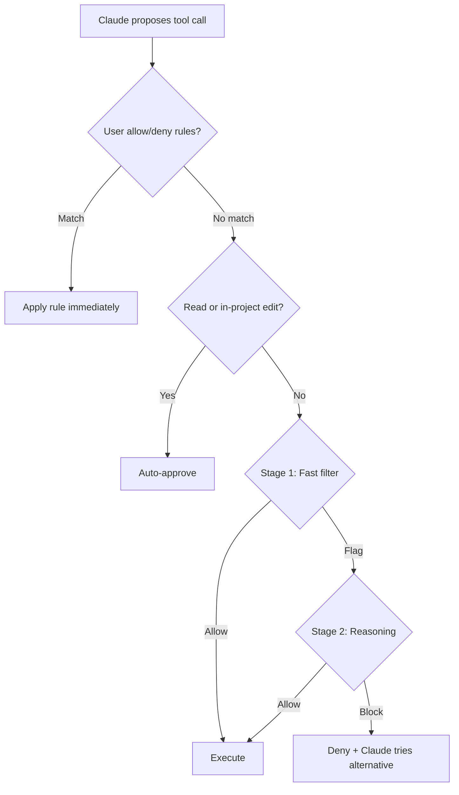

# Claude Code Auto Mode

> A two-stage classifier evaluates each tool call before execution, automatically approving safe operations and blocking destructive patterns.

## The Permission Friction Problem

Agentic sessions force a tradeoff: manual approval (slow, invites rubber-stamping) or `--dangerously-skip-permissions` (fast, unsafe). Auto mode fills the gap with a classifier that decides per action ([Anthropic blog](https://claude.com/blog/auto-mode)).

## How the Classifier Works

A classifier model sits between tool calls and execution, running on Sonnet 4.6 regardless of session model ([Claude Code docs](https://code.claude.com/docs/en/permission-modes)).



**Three-tier evaluation order** — first matching step wins ([Claude Code docs](https://code.claude.com/docs/en/permission-modes)):

1. **User rules**: explicit allow/deny in permissions settings resolve immediately
2. **Safe operations**: reads and working-directory edits auto-approve (except [protected paths](https://code.claude.com/docs/en/permission-modes#protected-paths))
3. **Classifier**: everything else runs the two-stage pipeline

### Two-Stage Pipeline

The classifier design trades cost against accuracy ([Anthropic engineering](https://www.anthropic.com/engineering/claude-code-auto-mode)):

| Stage | Method | Purpose |
|-------|--------|---------|
| **Stage 1** | Single-token filter, no chain-of-thought | Fast screen; tuned for high recall |
| **Stage 2** | Chain-of-thought reasoning | Fires only when Stage 1 flags; reduces false positives |

Stage 2 reuses Stage 1's prompt with a different final instruction — almost entirely a cache hit, keeping reasoning cheap.

**Performance on real traffic** ([Anthropic engineering](https://www.anthropic.com/engineering/claude-code-auto-mode)):

| Metric | Stage 1 | Full pipeline |
|--------|---------|---------------|
| False positive rate (n=10,000) | 8.5% | 0.4% |
| False negative rate (overeager, n=52) | 6.6% | 17% |
| False negative rate (synthetic exfil, n=1,000) | 1.8% | 5.7% |

The 17% overeager false-negative rate reflects consent-scope misjudgement — the classifier spots danger but assumes intent. Safer than `bypassPermissions`, not a review substitute.

### What the Classifier Sees

Inputs: user messages, tool call commands, CLAUDE.md. Tool results are stripped — hostile file or web content cannot reach the classifier. A separate input-layer probe scans tool results for injection patterns before Claude reads them ([Anthropic engineering](https://www.anthropic.com/engineering/claude-code-auto-mode)).

Entering auto mode drops broad allow rules ([Claude Code docs](https://code.claude.com/docs/en/permission-modes)):

- Blanket `Bash(*)`
- Wildcarded interpreters (`Bash(python*)`)
- Package-manager run commands
- `Agent` allow rules

Narrow rules like `Bash(npm test)` carry over and restore on exit.

## Default Allow and Block Lists

Only the working directory and configured remotes are trusted by default ([Claude Code docs](https://code.claude.com/docs/en/permission-modes)):

**Allowed**: working-directory file ops, declared-dependency installs, reading `.env` and sending credentials to its matching API, read-only HTTP, pushing to the current or Claude-created branch.

**Blocked**: `curl | bash`, exfil to external endpoints, production deploys and migrations, mass cloud deletion, IAM or repo-permission grants, shared-infra changes, destroying pre-session files, force push, pushing to `main`.

Inspect the full lists with `claude auto-mode defaults`.

## Escalation and Fallback

Blocked actions return a reason; Claude tries an alternative. Denied actions show in `/permissions` under Recently denied — press `r` to retry with manual approval ([Claude Code docs](https://code.claude.com/docs/en/permission-modes)).

**Escalation thresholds** (not configurable):

- **3 consecutive blocks**: pause, prompt user
- **20 total blocks per session**: pause, prompt user
- Any allowed action resets the consecutive counter; total persists

Headless (`-p`) aborts on repeated blocks.

## Subagent Oversight

The classifier checks [subagent](sub-agents.md) work at three points ([Claude Code docs](https://code.claude.com/docs/en/permission-modes)):

1. **Spawn**: task description evaluated; dangerous tasks blocked
2. **Runtime**: each action runs the classifier; subagent `permissionMode` is ignored
3. **Return**: action history reviewed; flagged concerns prepend a warning

## Enterprise Configuration

Admins set trust boundaries via `autoMode.environment` in [managed settings](managed-settings-drop-in.md) — specifying trusted domains, buckets, git orgs, services ([Claude Code permissions docs](https://code.claude.com/docs/en/permissions)).

| Setting | Effect |
|---------|--------|
| `autoMode.environment` | Extends trust to specified repos, buckets, services |
| `permissions.disableAutoMode: "disable"` | Locks auto mode off org-wide |

Start from `claude auto-mode defaults`; remove only rules covering risks already mitigated elsewhere.

## When This Backfires

Predictable failure modes:

- **Consent-scope misjudgement**: the 17% overeager false-negative rate means roughly one in six unsanctioned destructive actions gets through. For production configs or shared branches, manual review is still safer.
- **Plan and provider gating**: unavailable on Pro, Max, Bedrock, Vertex, Foundry — mixed environments must fall back to explicit allowlists.
- **Power-user flow disruption**: entering auto mode silently drops blanket `Bash(*)`, wildcarded interpreter, and `Agent` rules until exit.
- **Classifier is an LLM**: a narrow allowlist is deterministic; the classifier is probabilistic and fails on novel injection patterns and unusual tool combinations.

## Requirements and Activation

Auto mode requires ([Claude Code docs](https://code.claude.com/docs/en/permission-modes)):

- **Plan**: Team, Enterprise, or API (not Pro/Max)
- **Model**: Sonnet 4.6 or Opus 4.6
- **Provider**: Anthropic API (not Bedrock, Vertex, Foundry)
- **Version**: Claude Code v2.1.83+

Enable:

```bash
claude --enable-auto-mode    # adds auto to the Shift+Tab cycle
```

Set as default in `.claude/settings.json`:

```json
{
  "permissions": {
    "defaultMode": "auto"
  }
}
```

## Example

A CI pipeline runs Claude Code in headless mode to process documentation updates. Without auto mode, the operator chooses between `--dangerously-skip-permissions` (no safety checks) or pre-authorizing every tool call via `dontAsk` mode (brittle and verbose).

**Before** — bypass all safety checks:

```bash
claude -p "Update API docs from openapi.yaml" \
  --permission-mode bypassPermissions
```

**After** — classifier-gated automation:

```bash
claude --enable-auto-mode \
  -p "Update API docs from openapi.yaml" \
  --permission-mode auto
```

The classifier allows file reads, code generation, and writes within the project directory. If Claude attempts to push to `main` or run an unrecognized deployment script, the classifier blocks the action and the headless session aborts — failing safe instead of failing open.

## Key Takeaways

- Auto mode uses a two-stage classifier (fast filter + reasoning) to gate tool calls without human prompts
- The three-tier evaluation order (user rules → safe operations → classifier) minimizes latency for common actions
- False positive rate is 0.4% on real traffic; false negative rate is 5.7-17% depending on threat type — safer than `bypassPermissions` but not infallible
- Enterprise admins control trust boundaries via `autoMode.environment` and can disable the feature entirely
- Broad allow rules are automatically dropped on entering auto mode to prevent the classifier from being bypassed

## Related

- [Progressive Autonomy](../../human/progressive-autonomy-model-evolution.md) — graduated autonomy levels across AI coding tools
- [Defense-in-Depth Agent Safety](../../security/defense-in-depth-agent-safety.md) — layered safety mechanisms
- [Confirmation Gates](../../security/human-in-the-loop-confirmation-gates.md) — human-in-the-loop approval pattern
- [Hooks & Lifecycle](hooks-lifecycle.md) — deterministic automation at lifecycle events
- [Extension Points](extension-points.md) — choosing between CLAUDE.md, rules, hooks, and more
- [Blast Radius Containment](../../security/blast-radius-containment.md) — scoping agent permissions and file access
- [Plan Mode](../../workflows/plan-mode.md) — read-only exploration before implementation
- [Channels Permission Relay](channels-permission-relay.md) — remote approval when the classifier pauses for user input
- [Bare Mode](bare-mode.md) — the minimal-permission counterpart to auto mode
- [Managed Settings Drop-in](managed-settings-drop-in.md) — enterprise rollout of `autoMode.environment`
- [Sub-Agents](sub-agents.md) — classifier coverage of spawned worker agents
