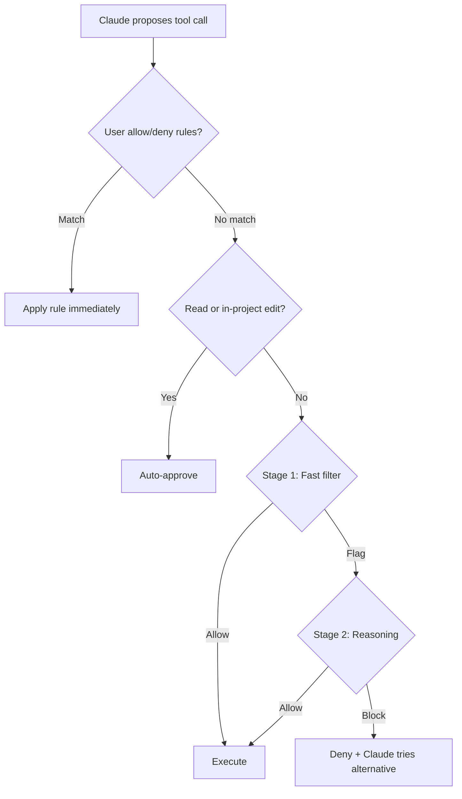

# Claude Code Auto Mode

> A two-stage classifier evaluates each tool call before execution, automatically approving safe operations and blocking destructive patterns.

## The Permission Friction Problem

Every agentic coding session hits the same tradeoff: approve each action manually (safe but slow) or skip all checks with `--dangerously-skip-permissions` (fast but dangerous). Manual approval causes fatigue-driven rubber-stamping on long tasks. Blanket bypass removes all safety. Auto mode fills the gap with a classifier that makes per-action safety decisions without human intervention ([Anthropic blog](https://claude.com/blog/auto-mode)).

## How the Classifier Works

Auto mode interposes a separate classifier model between Claude's tool calls and their execution. The classifier runs on Sonnet 4.6 regardless of the session model ([Claude Code docs](https://code.claude.com/docs/en/permission-modes)).



**Three-tier evaluation order** — the first matching step wins ([Claude Code docs](https://code.claude.com/docs/en/permission-modes)):

1. **User rules**: explicit allow or deny rules in permissions settings resolve immediately
2. **Safe operations**: reads and file edits within the working directory auto-approve (except [protected paths](https://code.claude.com/docs/en/permission-modes#protected-paths))
3. **Classifier**: everything else goes through the two-stage pipeline

### Two-Stage Pipeline

The classifier uses a two-stage design optimized for cost and accuracy ([Anthropic engineering](https://www.anthropic.com/engineering/claude-code-auto-mode)):

| Stage | Method | Purpose |
|-------|--------|---------|
| **Stage 1** | Single-token filter, no chain-of-thought | Fast screening; tuned for high recall (catches most threats) |
| **Stage 2** | Chain-of-thought reasoning | Activated only when Stage 1 flags an action; reduces false positives |

Stage 2 reuses Stage 1's prompt with a different final instruction, making it almost entirely a cache hit. This keeps the cost of the reasoning layer low.

**Performance on real traffic** ([Anthropic engineering](https://www.anthropic.com/engineering/claude-code-auto-mode)):

| Metric | Stage 1 | Full pipeline |
|--------|---------|---------------|
| False positive rate (n=10,000) | 8.5% | 0.4% |
| False negative rate (overeager, n=52) | 6.6% | 17% |
| False negative rate (synthetic exfil, n=1,000) | 1.8% | 5.7% |

The 17% false-negative rate on overeager behaviors means the classifier sometimes misjudges user consent scope — it correctly identifies danger but assumes the user intended the action. Auto mode is safer than `bypassPermissions` but not a replacement for review on sensitive operations.

### What the Classifier Sees (and Does Not See)

The classifier receives user messages, tool call commands, and CLAUDE.md content. Tool results are deliberately stripped — hostile content in a file or web page cannot manipulate the classifier directly. A separate input-layer probe scans incoming tool results for injection-like content and flags suspicious patterns before Claude reads them ([Anthropic engineering](https://www.anthropic.com/engineering/claude-code-auto-mode)).

On entering auto mode, broad allow rules that grant arbitrary code execution are dropped ([Claude Code docs](https://code.claude.com/docs/en/permission-modes)):

- Blanket `Bash(*)` rules
- Wildcarded interpreters (`Bash(python*)`)
- Package-manager run commands
- `Agent` allow rules

Narrow rules like `Bash(npm test)` carry over. Dropped rules are restored when you leave auto mode.

## Default Allow and Block Lists

The classifier trusts only the working directory and the repo's configured remotes by default ([Claude Code docs](https://code.claude.com/docs/en/permission-modes)):

**Allowed by default**: local file operations in the working directory, installing declared dependencies, reading `.env` and sending credentials to their matching API, read-only HTTP requests, pushing to the current or Claude-created branch.

**Blocked by default**: downloading and executing code (`curl | bash`), sending data to external endpoints, production deploys and migrations, mass cloud deletion, granting IAM or repo permissions, modifying shared infrastructure, destroying pre-session files, force push, pushing directly to `main`.

Run `claude auto-mode defaults` to inspect the full rule lists.

## Escalation and Fallback

When the classifier blocks an action, Claude receives the reason and attempts an alternative approach. Denied actions appear in `/permissions` under the Recently denied tab, where pressing `r` retries with manual approval ([Claude Code docs](https://code.claude.com/docs/en/permission-modes)).

**Escalation thresholds** (not configurable):

- **3 consecutive blocks**: auto mode pauses, prompts user
- **20 total blocks in a session**: auto mode pauses, prompts user
- Any allowed action resets the consecutive counter; the total counter persists until its own limit triggers

In headless mode (`-p`), repeated blocks abort the session since no user is available to prompt.

## Subagent Oversight

The classifier checks subagent work at three points ([Claude Code docs](https://code.claude.com/docs/en/permission-modes)):

1. **Spawn**: the delegated task description is evaluated; dangerous tasks are blocked before the subagent starts
2. **Runtime**: each subagent action goes through the same classifier rules; `permissionMode` in the subagent's frontmatter is ignored
3. **Return**: the classifier reviews the subagent's full action history; flagged concerns prepend a security warning to results

## Enterprise Configuration

Administrators configure trust boundaries through `autoMode.environment` in managed settings, defining which domains, cloud buckets, git organizations, and internal services the classifier treats as trusted ([Claude Code permissions docs](https://code.claude.com/docs/en/permissions)).

| Setting | Effect |
|---------|--------|
| `autoMode.environment` | Extends trust to specified repos, buckets, services |
| `permissions.disableAutoMode: "disable"` | Locks auto mode off for the organization |

Start with `claude auto-mode defaults`, copy the rules, and adjust per your infrastructure. Only remove rules for risks your infrastructure already mitigates.

## Requirements and Activation

Auto mode requires all of the following ([Claude Code docs](https://code.claude.com/docs/en/permission-modes)):

- **Plan**: Team, Enterprise, or API (not Pro or Max)
- **Model**: Sonnet 4.6 or Opus 4.6
- **Provider**: Anthropic API only (not Bedrock, Vertex, or Foundry)
- **Version**: Claude Code v2.1.83+

Enable and cycle to it:

```bash
claude --enable-auto-mode    # adds auto to the Shift+Tab cycle
```

Set as default in `.claude/settings.json`:

```json
{
  "permissions": {
    "defaultMode": "auto"
  }
}
```

## Example

A CI pipeline runs Claude Code in headless mode to process a batch of documentation updates. Without auto mode, the operator must choose between `--dangerously-skip-permissions` (no safety checks) or pre-authorizing every possible tool call via `dontAsk` mode (brittle and verbose).

**Before** — bypass all safety checks:

```bash
claude -p "Update API docs from openapi.yaml" \
  --permission-mode bypassPermissions
```

**After** — classifier-gated automation:

```bash
claude --enable-auto-mode \
  -p "Update API docs from openapi.yaml" \
  --permission-mode auto
```

The classifier allows file reads, code generation, and writes within the project directory. If Claude attempts to push to `main` or run an unrecognized deployment script, the classifier blocks the action and the headless session aborts — failing safe instead of failing open.

## Key Takeaways

- Auto mode uses a two-stage classifier (fast filter + reasoning) to gate tool calls without human prompts
- The three-tier evaluation order (user rules → safe operations → classifier) minimizes latency for common actions
- False positive rate is 0.4% on real traffic; false negative rate is 5.7-17% depending on threat type — safer than `bypassPermissions` but not infallible
- Enterprise admins control trust boundaries via `autoMode.environment` and can disable the feature entirely
- Broad allow rules are automatically dropped on entering auto mode to prevent the classifier from being bypassed

## Related

- [Progressive Autonomy](../../human/progressive-autonomy-model-evolution.md) — graduated autonomy levels across AI coding tools
- [Defense-in-Depth Agent Safety](../../security/defense-in-depth-agent-safety.md) — layered safety mechanisms
- [Confirmation Gates](../../security/human-in-the-loop-confirmation-gates.md) — human-in-the-loop approval pattern
- [Hooks & Lifecycle](hooks-lifecycle.md) — deterministic automation at lifecycle events
- [Extension Points](extension-points.md) — choosing between CLAUDE.md, rules, hooks, and more
- [Blast Radius Containment](../../security/blast-radius-containment.md) — scoping agent permissions and file access
- [Plan Mode](../../workflows/plan-mode.md) — read-only exploration before implementation
