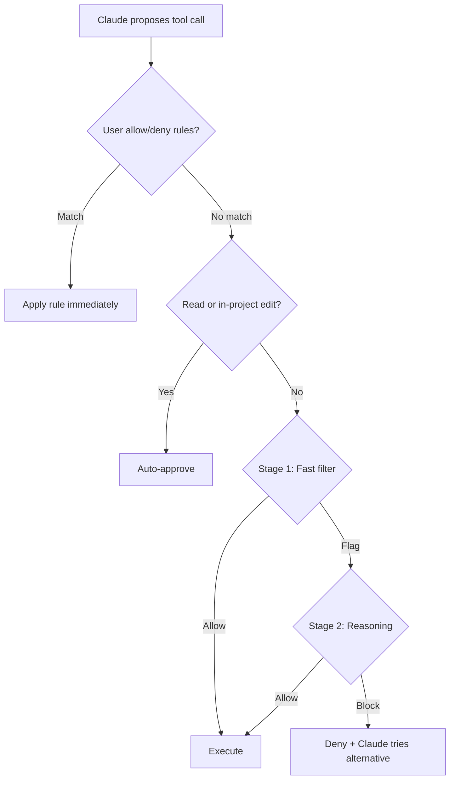

# Claude Code Auto Mode

> Auto mode gates each tool call through a two-stage classifier, and becomes the default for new Pro, Max, and Team sessions.

Related lesson: [Permissions and Safety Boundaries](https://learn.agentpatterns.ai/harness-engineering/permissions-and-safety-boundaries/) — a hands-on lesson with quizzes that covers this concept.

## The default flips on August 14, 2026

Auto mode stops being a mode you opt into. From August 14, 2026 it is the default permission mode for new sessions on Pro, Max, and Team plans ([Claude Code docs](https://code.claude.com/docs/en/permission-modes)). Three qualifiers scope the change:

- It applies to new sessions. A session already running keeps its mode.
- A `defaultMode` you set yourself stays unless you accept the one-time switch prompt.
- A default your organization manages is unchanged.

Eligibility widened ahead of the switch. The requirements list now reads "All plans", and auto mode is available on every provider, including Bedrock, Google Cloud's Agent Platform, and Microsoft Foundry, where v2.1.207 retired the `CLAUDE_CODE_ENABLE_AUTO_MODE` opt-in. Availability is not the starting mode: on those providers auto mode only joins the `Shift+Tab` cycle, and sessions still start in your `defaultMode`. What stays gated is the model, scoped by provider: Opus 4.6 or later, Sonnet 4.6 or later, or Fable 5 on the Anthropic API and Claude Platform on AWS; only Sonnet 5, Opus 4.7 or later, and Fable 5 elsewhere ([Claude Code docs](https://code.claude.com/docs/en/permission-modes)).

## How the classifier works


```mermaid
graph TD
    A[Claude proposes tool call] --> B{User allow/deny rules?}
    B -->|Match| C[Apply rule immediately]
    B -->|No match| D{Read or in-project edit?}
    D -->|Yes| E[Auto-approve]
    D -->|No| F{Stage 1: Fast filter}
    F -->|Allow| G[Execute]
    F -->|Flag| H{Stage 2: Reasoning}
    H -->|Allow| G
    H -->|Block| I[Deny + Claude tries alternative]
```

First match wins. Reads and working-directory edits auto-approve except on [protected paths](https://code.claude.com/docs/en/permission-modes#protected-paths); everything else runs the pipeline. The classifier itself runs on Claude Sonnet 5 rather than your `/model` selection, falling back to the session model when that is Sonnet 4.6 or when `availableModels` excludes Sonnet 5 ([Claude Code docs](https://code.claude.com/docs/en/permission-modes)).

Measured performance on real traffic ([Anthropic engineering](https://www.anthropic.com/engineering/claude-code-auto-mode)):

| Metric | Stage 1 | Full pipeline |
|--------|---------|---------------|
| False positive rate (n=10,000) | 8.5% | 0.4% |
| False negative (overeager, n=52) | 6.6% | 17% |
| False negative (synthetic exfil, n=1,000) | 1.8% | 5.7% |

## Why it works

The two-stage split buys precision without paying for it on every call. Stage 1 is a "fast single-token filter (deciding 'yes' to block or 'no' to allow)" tuned for recall, which alone flags 8.5% of real traffic falsely. Stage 2 fires only on flagged actions, "re-evaluating the same input with chain-of-thought reasoning to reduce false positives", bringing the pipeline to 0.4% ([Anthropic engineering](https://www.anthropic.com/engineering/claude-code-auto-mode)). Stage 2 reuses Stage 1's prompt, so the second call is largely a cache hit.

What the gate reads matters as much as how it reasons. Its inputs are user messages, tool calls, and CLAUDE.md; tool results are stripped, so hostile content in a file or fetched page cannot address it directly ([Claude Code docs](https://code.claude.com/docs/en/permission-modes)). The residual risk follows from the same design: in most misses the classifier spots the danger and misjudges whether a consent signal in the session covers the action ([Anthropic engineering](https://www.anthropic.com/engineering/claude-code-auto-mode)).

## What it allows and blocks

The classifier trusts your working directory and the remotes configured when the session started. Allowed by default: working-directory file operations, declared-dependency installs, `.env` credentials to the matching API, read-only HTTP, and pushes to any branch of the repository you are working in, including the default branch. A branch named as a deploy target, such as `production` or `gh-pages`, is judged on its own terms instead. Blocked by default: `curl | bash`, exfiltration to external endpoints, production deploys, mass cloud deletion, IAM grants, force push, and `git reset --hard`. Print both lists with `claude auto-mode defaults`.

A blocked action returns a reason and Claude tries an alternative. Three consecutive blocks or 20 in a session pause the agent and restore prompting, and headless runs (`-p`) abort instead; neither threshold is configurable. The classifier also checks [subagent](sub-agents.md) work at spawn, at runtime, and on return, ignoring any `permissionMode` in its frontmatter ([Claude Code docs](https://code.claude.com/docs/en/permission-modes)).

## Turning it off or fencing it in

Four mechanisms, ordered by how firmly they hold ([Claude Code docs](https://code.claude.com/docs/en/auto-mode-config)):

1. A boundary stated in conversation blocks matching actions, but the classifier re-reads it from the transcript on every check, so compaction can drop it.
2. `permissions.ask` rules are evaluated before the classifier and always prompt.
3. `permissions.deny` in [managed settings](managed-settings-drop-in.md) blocks before the classifier runs and cannot be overridden.
4. `permissions.disableAutoMode: "disable"` in managed settings removes the mode for the whole organization.

Two scope traps catch teams that configure through the repository. Claude Code has ignored `defaultMode: "auto"` in `.claude/settings.json` and `.claude/settings.local.json` since v2.1.142, and the classifier reads the `autoMode` block from neither, having dropped `.claude/settings.local.json` in v2.1.207. Both keys belong in `~/.claude/settings.json` or managed settings, so a repository cannot grant itself auto mode. A developer-added `allow` entry can also override an organization `soft_deny` entry, because the combination is additive rather than a policy boundary ([Claude Code docs](https://code.claude.com/docs/en/auto-mode-config)).

To switch one session back, cycle with `Shift+Tab` or start with `claude --permission-mode manual`, an alias for `default` from v2.1.200 ([Claude Code docs](https://code.claude.com/docs/en/permission-modes)).

## When this backfires

- Ops state inside the repository root. In-project edits auto-approve without reaching the classifier, so Terraform state, sealed secrets, and Kubernetes manifests under the working directory sit outside the gate. An independent stress test measured 36.8% of state-changing actions bypassing classification this way ([Ji et al., Measuring the Permission Gate](https://arxiv.org/abs/2604.04978v2)).
- Ambiguous prompts on operations work. The same study measured an 81.0% end-to-end false-negative rate (95% CI 73.8%–87.4%) across 128 deliberately ambiguous DevOps prompts. Its authors caution the numbers "should not be extrapolated to production-traffic performance", so read the gap as workload sensitivity rather than a refutation of the 17%.
- Consent-scope misjudgment on a population that never opted in. That 17% overeager rate now applies to developers who inherited the mode.
- Narrow allow rules the classifier never sees. Broad rules like `Bash(*)` are suspended on entry, but a narrow rule such as `Bash(npm test)` carries over and can pass a destructive argument. Setting `autoMode.classifyAllShell` closes that, at one classifier call per command.
- Workflows built on default-branch pushes being blocked. From v2.1.211 those pushes are allowed by default and the protected-branch setting was removed ([Claude Code docs](https://code.claude.com/docs/en/auto-mode-config)).
- Metered accounts. On Enterprise plans and on Claude API, Bedrock, Agent Platform, and Foundry accounts, every classifier check counts toward token usage ([Claude Code docs](https://code.claude.com/docs/en/permission-modes)).

## Example

Keeping a human checkpoint on pushes while staying in auto mode.

**Before** — a conversational boundary, which the classifier re-reads from the transcript and compaction can drop:

```text
Don't push anything until I've reviewed the diff.
```

**After** — an ask rule in `~/.claude/settings.json`, evaluated before the classifier on every call:

```json
{
  "permissions": {
    "ask": [
      "Bash(git push *)",
      "Bash(gh pr create *)"
    ]
  }
}
```

The rule forces a prompt for those commands and leaves auto mode governing everything else ([Claude Code docs](https://code.claude.com/docs/en/auto-mode-config)).

## Key Takeaways

- From August 14, 2026 auto mode is the default for new Pro, Max, and Team sessions; a default you already set survives unless you accept the switch prompt
- Plan gating is gone and provider gating is nearly gone, so the remaining eligibility question is which model the session runs
- The reasoning pass runs only on flagged actions and reuses the first pass's prompt, which is why 0.4% precision is affordable
- In-project file edits skip the classifier entirely, and that is where an independent stress test found most of its misses
- Only `permissions.deny` and `disableAutoMode` in managed settings are hard guarantees; conversational boundaries and developer-scope rules are not

## Related

- [Hard-Deny Classifier Rule](hard-deny-classifier-rule.md) — `autoMode.hard_deny` provides an unconditional floor beneath the classifier
- [Classifier-Gated Auto-Permission](../../patterns/agent-design/classifier-gated-auto-permission.md) — the tool-agnostic pattern and when it earns its complexity
- [Bare Mode](bare-mode.md) — the minimal-permission counterpart to auto mode
- [Managed Settings Drop-in](managed-settings-drop-in.md) — enterprise rollout of `autoMode.environment` and deny rules
- [Sub-Agents](sub-agents.md) — classifier coverage of spawned worker agents
- [Blast Radius Containment](../../security/blast-radius-containment.md) — scoping agent permissions and file access
