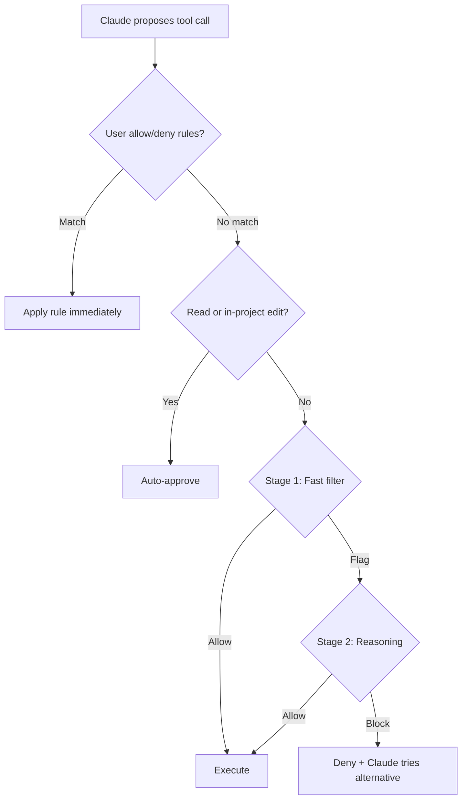

# Claude Code Auto Mode

> A two-stage classifier evaluates each tool call before execution, automatically approving safe operations and blocking destructive patterns.

Related lesson: [Permissions and Safety Boundaries](https://learn.agentpatterns.ai/harness-engineering/permissions-and-safety-boundaries/) — a hands-on lesson with quizzes that covers this concept.

## The permission friction problem

Agentic sessions force a tradeoff. Manual approval invites rubber-stamping. The `--dangerously-skip-permissions` flag removes safety. Auto mode decides each action with a classifier ([Anthropic blog](https://claude.com/blog/auto-mode)).

## How the classifier works

The classifier runs on Sonnet 4.6 regardless of session model ([Claude Code docs](https://code.claude.com/docs/en/permission-modes)).


```mermaid
graph TD
    A[Claude proposes tool call] --> B{User allow/deny rules?}
    B -->|Match| C[Apply rule immediately]
    B -->|No match| D{Read or in-project edit?}
    D -->|Yes| E[Auto-approve]
    D -->|No| F{Stage 1: Fast filter}
    F -->|Allow| G[Execute]
    F -->|Flag| H{Stage 2: Reasoning}
    H -->|Allow| G
    H -->|Block| I[Deny + Claude tries alternative]
```

Three-tier evaluation order, first match wins ([Claude Code docs](https://code.claude.com/docs/en/permission-modes)):

1. User rules: explicit allow/deny resolve immediately.
2. Safe operations: reads and working-directory edits auto-approve, except [protected paths](https://code.claude.com/docs/en/permission-modes#protected-paths).
3. Classifier: everything else runs the two-stage pipeline.

### Two-stage pipeline

| Stage | Method | Purpose |
|-------|--------|---------|
| Stage 1 | Single-token filter, no chain-of-thought | Fast screen, high recall |
| Stage 2 | Chain-of-thought reasoning | Fires only when Stage 1 flags |

Stage 2 reuses Stage 1's prompt — almost entirely a cache hit.

Performance on real traffic ([Anthropic engineering](https://www.anthropic.com/engineering/claude-code-auto-mode)):

| Metric | Stage 1 | Full pipeline |
|--------|---------|---------------|
| False positive rate (n=10,000) | 8.5% | 0.4% |
| False negative (overeager, n=52) | 6.6% | 17% |
| False negative (synthetic exfil, n=1,000) | 1.8% | 5.7% |

The 17% overeager rate reflects consent-scope misjudgment — the classifier spots danger but assumes intent.

### What the classifier sees

Inputs are user messages, tool call commands, and CLAUDE.md. The classifier strips tool results. A separate input-layer probe scans those results for injection patterns before Claude reads them ([Anthropic engineering](https://www.anthropic.com/engineering/claude-code-auto-mode)).

Conversational boundaries block matching actions. A boundary like "don't push" holds until you lift it; Claude's judgment does not. Boundaries re-read from the transcript on each check, so compaction can drop them. For a hard guarantee, add a [deny rule](https://code.claude.com/docs/en/permissions#permission-rule-syntax) ([Claude Code docs](https://code.claude.com/docs/en/permission-modes#eliminate-prompts-with-auto-mode)).

Entering auto mode drops broad allow rules — `Bash(*)`, wildcarded interpreters, package-manager run commands, `Agent` rules. Narrow rules like `Bash(npm test)` carry over and restore on exit.

## Default allow and block lists

By default, auto mode trusts only the working directory and configured remotes ([Claude Code docs](https://code.claude.com/docs/en/permission-modes)).

Allowed: working-directory file ops, declared-dependency installs, `.env` credentials to the matching API, read-only HTTP, and pushing to the current or Claude-created branch.

Blocked: `curl | bash`, exfil to external endpoints, production deploys and migrations, mass cloud deletion, IAM grants, shared-infra changes, destroying pre-session files, force push, and pushing to `main`.

Inspect the full lists with `claude auto-mode defaults`.

## Escalation and fallback

Blocked actions return a reason, and Claude tries an alternative. Denials appear in `/permissions` under Recently denied — press `r` to retry with manual approval. Two thresholds pause the agent, neither configurable: 3 consecutive blocks, or 20 in a session. Allowed actions reset the consecutive counter, but the session total persists. Headless mode (`-p`) aborts on repeated blocks ([Claude Code docs](https://code.claude.com/docs/en/permission-modes)).

## Subagent oversight

The classifier checks [subagent](sub-agents.md) work at spawn (dangerous tasks blocked), runtime (each action evaluated; subagent `permissionMode` ignored), and return (action history reviewed; flagged concerns prepend a warning) ([Claude Code docs](https://code.claude.com/docs/en/permission-modes)).

## Enterprise configuration

Admins set trust boundaries via `autoMode.environment` in [managed settings](managed-settings-drop-in.md). Setting `permissions.disableAutoMode: "disable"` locks the feature off org-wide ([Claude Code permissions docs](https://code.claude.com/docs/en/permissions)). Start from `claude auto-mode defaults` and remove only rules covering risks mitigated elsewhere.

## When this backfires

- Consent-scope misjudgment: the 17% overeager rate lets roughly one in six unsanctioned destructive actions through. Manual review is still safer for production configs or shared branches.
- Plan and provider gating: unavailable on Pro, Bedrock, Vertex, and Foundry; Max is restricted to Opus 4.7.
- Power-user flow disruption: broad `Bash(*)`, wildcarded interpreter, and `Agent` rules silently drop until exit.
- Probabilistic, not deterministic: the classifier fails on novel injection patterns and unusual tool combinations.

## Requirements and activation

Auto mode requires Max, Team, Enterprise, or API plans (not Pro); Team/Enterprise admins enable it in [admin settings](https://claude.ai/admin-settings/claude-code). Models: Sonnet 4.6, Opus 4.6, or Opus 4.7 (Max limited to Opus 4.7). Anthropic API only (not Bedrock, Vertex, Foundry). Claude Code v2.1.83+ ([Claude Code docs](https://code.claude.com/docs/en/permission-modes)).

When eligible, auto mode appears in the `Shift+Tab` cycle after `plan`. Start directly via the permission-mode flag — `--enable-auto-mode` was removed in v2.1.111 ([CLI reference](https://code.claude.com/docs/en/cli-reference)):

```bash
claude --permission-mode auto
```

Set as a persistent default in `.claude/settings.json`:

```json
{
  "permissions": {
    "defaultMode": "auto"
  }
}
```

## Example

A CI pipeline runs Claude Code in headless mode for documentation updates. Without auto mode, the operator chooses between `--dangerously-skip-permissions` or pre-authorizing every tool call via `dontAsk` (brittle and verbose).

Before — bypass all safety checks:

```bash
claude -p "Update API docs from openapi.yaml" \
  --permission-mode bypassPermissions
```

After — classifier-gated automation:

```bash
claude -p "Update API docs from openapi.yaml" \
  --permission-mode auto
```

The classifier allows file reads, code generation, and writes within the project directory. If Claude attempts to push to `main` or run an unrecognized deployment script, the classifier blocks the action and the headless session aborts — failing safe.

## Key Takeaways

- Auto mode uses a two-stage classifier (fast filter + reasoning) to gate tool calls without human prompts
- The three-tier evaluation order (user rules → safe operations → classifier) minimizes latency for common actions
- False positive rate is 0.4% on real traffic; false negative rate is 5.7-17% — safer than `bypassPermissions` but not infallible
- Enterprise admins control trust boundaries via `autoMode.environment` and can disable the feature entirely
- Broad allow rules drop on entering auto mode to prevent classifier bypass

## Related

- [Hard-Deny Classifier Rule](hard-deny-classifier-rule.md) — `autoMode.hard_deny` provides an unconditional floor beneath the classifier
- [Bare Mode](bare-mode.md) — the minimal-permission counterpart to auto mode
- [Channels Permission Relay](channels-permission-relay.md) — remote approval when the classifier pauses for user input
- [Managed Settings Drop-in](managed-settings-drop-in.md) — enterprise rollout of `autoMode.environment`
- [Sub-Agents](sub-agents.md) — classifier coverage of spawned worker agents
- [Plan Mode](plan-mode.md) — read-only exploration before implementation
- [Defense-in-Depth Agent Safety](../../security/defense-in-depth-agent-safety.md) — layered safety mechanisms
- [Blast Radius Containment](../../security/blast-radius-containment.md) — scoping agent permissions and file access
