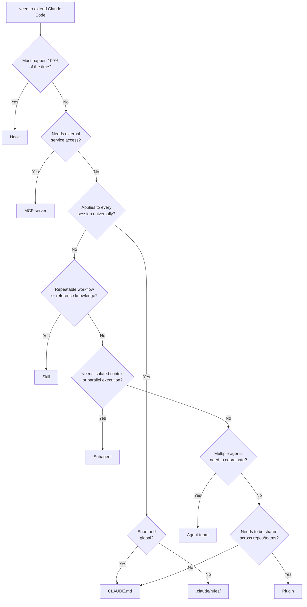

# Claude Code Extension Points: When to Use What

> Choose the right extension point — CLAUDE.md, rules, skills, hooks, subagents, MCP servers, or plugins — based on enforcement needs, context cost, and portability.

## At a Glance

| Extension point | Purpose | Loads when | Context cost |
|---|---|---|---|
| [CLAUDE.md](https://code.claude.com/docs/en/memory) | Project conventions | Session start | Full content every turn |
| [`.claude/rules/`](https://code.claude.com/docs/en/memory) | Path-targeted rules | Session start or file match | Path-scoped |
| [Skills](https://code.claude.com/docs/en/skills) | Workflows and reference knowledge | Descriptions at start; full on invoke | Progressive |
| [Hooks](https://code.claude.com/docs/en/hooks) | Deterministic shell commands at lifecycle events | On trigger | Zero (external) |
| [MCP servers](https://code.claude.com/docs/en/features-overview) | External tool and service access | Session start | Schemas only |
| [Subagents](https://code.claude.com/docs/en/sub-agents) | Isolated agents for focused tasks | On spawn | Zero (isolated) |
| [Agent teams](https://code.claude.com/docs/en/agent-teams) | Multi-agent coordination | On session creation | Zero per teammate |
| [Plugins](https://code.claude.com/docs/en/plugins) | Distribution bundles | On install | Varies |

## Decision Framework

Based on the [official features overview](https://code.claude.com/docs/en/features-overview) and community models ([Ottmann](https://marioottmann.com/articles/claude-code-customization-guide), [GenAI Unplugged](https://genaiunplugged.substack.com/p/claude-code-skills-commands-hooks-agents)).

## CLAUDE.md vs .claude/rules/ vs Skills

All three deliver instructions, but differ in scope and context cost.

| | CLAUDE.md | .claude/rules/ | Skills |
|---|---|---|---|
| **When to use** | Core conventions, under ~200 lines | Domain rules scoped to file paths | On-demand reference or `/name` workflows |
| **Loads** | Every session, unconditionally | Session start or on file-path match | Descriptions at start; full on invocation |
| **Context cost** | High — always present | Medium — path-targeted | Low — progressive |
| **Typical content** | Architecture, test commands, conventions | Lint rules for `frontend/`, API rules for `api/` | Procedures, checklists, templates |

Keep CLAUDE.md lean: path-specific rules go in `.claude/rules/`, detailed procedures go in skills. See [Hierarchical CLAUDE.md](../../instructions/hierarchical-claude-md.md) and [Progressive Disclosure](../../agent-design/progressive-disclosure-agents.md).

## Deterministic vs Probabilistic

**Deterministic** — model cannot override:

- **Hooks**: fire at [18 lifecycle events](hooks-lifecycle.md). The agent cannot skip or override them.
- **CLAUDE.md loading**: loaded unconditionally at session start ([memory docs](https://code.claude.com/docs/en/memory)).

**Probabilistic** — model decides when to invoke:

- **Skills**: Claude invokes based on description relevance ([skills docs](https://code.claude.com/docs/en/skills)). Set `disable-model-invocation: true` for explicit-only.
- **Subagent delegation**: the parent decides when to spawn.

For non-negotiable rules, prefer hooks. See [Hooks vs Prompts](../../verification/hooks-vs-prompts.md).

## When Extension Points Combine

- **CLAUDE.md + hooks**: CLAUDE.md states the rule; a `PreToolUse` hook enforces it. See [Hooks for Enforcement vs Prompts for Guidance](../../verification/hooks-vs-prompts.md).
- **Skills + subagents**: a skill defines the procedure; a [subagent](sub-agents.md) executes it in isolation.
- **MCP + skills**: MCP exposes external tools; a skill provides the workflow using them.
- **Plugins**: [bundle](../../standards/plugin-packaging.md) agents, skills, hooks, and MCP configs for distribution. Plugins solve distribution, not logic.

Commands are [merged into skills](https://code.claude.com/docs/en/skills) — existing `.claude/commands/` files continue to work.

## Why the Determinism Boundary Matters

Hooks are shell processes spawned by the Claude Code CLI at lifecycle events, independent of the model's token stream. The model never sees the hook script and has no mechanism to suppress execution. Skills, subagents, and `.claude/rules/` instructions are text delivered into the model's context — a sufficiently confusing context can cause them to be skipped. Anything routed through model reasoning is probabilistic; anything executed at the infrastructure layer is deterministic.

CLAUDE.md's high context cost follows: injected into every request's context window unconditionally. Skills avoid this by loading full content only on invocation.

## When This Backfires

- **Overlapping extension points**: A path-scoped rule that also needs enforcement requires both a `.claude/rules/` entry and a hook. Maintaining the rule in two places creates drift.
- **Hook proliferation**: Applying hooks to stylistic preferences rather than non-negotiable compliance accumulates startup latency and failure modes.
- **CLAUDE.md bloat**: At 500+ lines, unconditional injection degrades instruction-following on unrelated tasks. Move domain content to rules or skills early.
- **Premature plugins**: Bundling before two or more repos need the config adds release overhead; a shared git subtree is cheaper at small scale.

## Security: Per-Server MCP Trust

Prior to v2.1.69, `.mcp.json` silently trusted all servers without approval dialogs. Claude Code now shows a per-server trust dialog on first session ([changelog](https://code.claude.com/docs/en/changelog)). Automated setups relying on silent enablement will see a prompt per server after updating.

## Deprecation: /output-style → /config

The `/output-style` command was deprecated in v2.1.73, replaced by `/config` ([changelog](https://code.claude.com/docs/en/changelog)). Output style is now fixed at session start to improve [prompt cache hit rates](../../context-engineering/static-content-first-caching.md) — mid-session changes invalidated the cache. Custom style directories (`~/.claude/output-styles/` and `.claude/output-styles/`) still work. See [System Prompt Replacement](../../instructions/system-prompt-replacement.md) for the pattern of using output styles to substitute a domain-specific identity for the default engineering persona.

## Example

A team wants to enforce that all SQL migrations include a `DOWN` migration. They also want a reusable database review workflow and access to their internal schema registry.

| Requirement | Extension point | Why |
|---|---|---|
| Every migration file must contain `DOWN` | **Hook** (`PreToolUse` on `Write`) | Non-negotiable — must fire 100% of the time, not skip-able by the model |
| "Review this migration" workflow | **Skill** (`.claude/skills/review-migration.md`) | On-demand procedure with steps; loads only when invoked |
| "All SQL uses snake_case" convention | **`.claude/rules/db.md`** with glob `db/migrations/**` | Path-scoped rule; only loads when touching migration files |
| Schema registry lookup | **MCP server** | External service access; exposes `get_schema` tool |
| Share all of the above across repos | **Plugin** | Bundles the hook, skill, rule, and MCP config for `npm install` distribution |

The hook script (`hooks/check-down-migration.sh`) runs deterministically. The skill and rule are probabilistic but scoped. The MCP server bridges to an external system. The plugin packages everything for distribution.

## Key Takeaways

- Start with the decision flowchart: enforcement need, service access, scope, and portability each point to a different extension point
- CLAUDE.md is for short, universal conventions; `.claude/rules/` for path-targeted rules; skills for on-demand knowledge
- Hooks are the only fully deterministic extension point — use them when compliance is non-negotiable
- Skills load progressively; hooks and subagents have zero context cost — choose based on context budget
- Plugins are distribution packaging, not a separate logic layer
- MCP servers now require per-server trust approval (v2.1.69) — silent bulk enablement is no longer supported
- `/output-style` is deprecated in favor of `/config` (v2.1.73) — output style is fixed at session start for cache efficiency

## Related

- [Claude Code Hooks](hooks-lifecycle.md)
- [Sub-Agents](sub-agents.md)
- [Agent Teams](agent-teams.md)
- [Hooks for Enforcement vs Prompts for Guidance](../../verification/hooks-vs-prompts.md)
- [Hook Catalog](../../tool-engineering/hook-catalog.md)
- [Hierarchical CLAUDE.md](../../instructions/hierarchical-claude-md.md)
- [Progressive Disclosure for Agent Definitions](../../agent-design/progressive-disclosure-agents.md)
- [Separation of Knowledge and Execution](../../agent-design/separation-of-knowledge-and-execution.md)
- [Permission-Gated Commands](../../security/permission-gated-commands.md)
- [Plugin Packaging](../../standards/plugin-packaging.md)
- [Claude Agent SDK](agent-sdk.md)
- [Feature Flags and Environment Variables](feature-flags.md)
- [Session Scheduling](session-scheduling.md)
- [Claude Code Auto Mode](auto-mode.md)
- [Managed Settings Drop-In Directory](managed-settings-drop-in.md)
- [Skill Eval Loop](skill-eval-loop.md)
- [Channels Permission Relay](channels-permission-relay.md)
