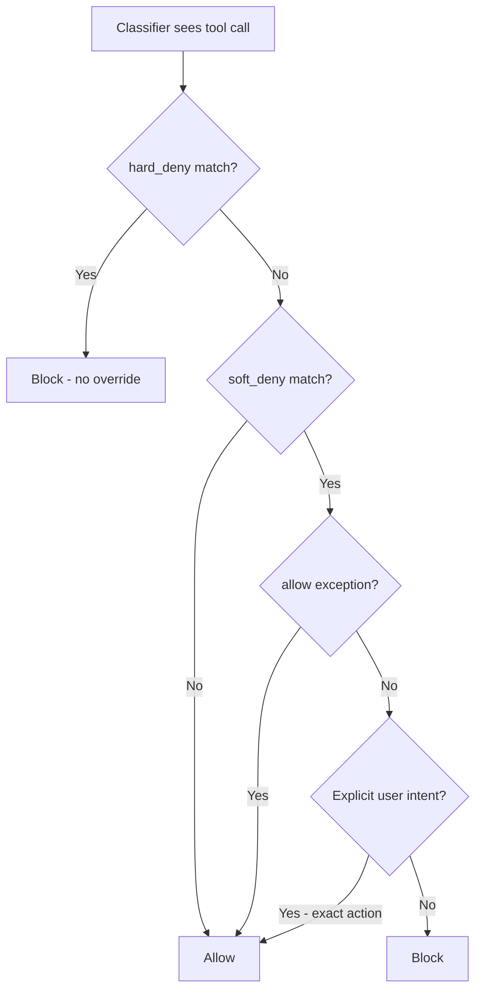

# Hard-Deny Classifier Rule

> The `autoMode.hard_deny` field blocks tool calls unconditionally inside the auto-mode classifier — user intent and allow exceptions do not apply.

## Three deny layers, not one

Claude Code stacks three distinct deny mechanisms. They run at different stages and offer different guarantees:

| Mechanism | Layer | Override path |
|---|---|---|
| [`permissions.deny`](https://code.claude.com/docs/en/permissions) | Pre-classifier | None — deny-first precedence, evaluated before the classifier |
| `autoMode.hard_deny` | Inside classifier | None — user intent and `allow` do not apply |
| `autoMode.soft_deny` | Inside classifier | Overridable by `allow` exceptions or explicit user intent |

`hard_deny` shipped in Claude Code 2.1.136 (2026-05-08): "Added `settings.autoMode.hard_deny` for auto mode classifier rules that block unconditionally regardless of user intent or allow exceptions" ([Claude Code changelog](https://code.claude.com/docs/en/changelog)).

`permissions.deny` is the deterministic, pre-classifier floor. `hard_deny` is the inside-classifier floor — still evaluated by an LLM, but unaffected by the argument that can lift a `soft_deny`. For actions that must never run regardless of intent or classifier config, the [permissions docs](https://code.claude.com/docs/en/permissions) direct you to `permissions.deny` in managed settings; it blocks before the classifier is consulted.

## Precedence inside the classifier

Auto mode's classifier evaluates its four list fields in this order ([Configure auto mode](https://code.claude.com/docs/en/auto-mode-config)):



> "`hard_deny` rules block unconditionally. User intent and `allow` exceptions do not apply." ([Configure auto mode](https://code.claude.com/docs/en/auto-mode-config))

"Explicit user intent" means the user's message describes the exact action — asking Claude to "force-push this branch" counts; asking to "clean up the repo" does not.

## Syntax and the `$defaults` sentinel

Each list field is an array of prose strings. Entries are natural-language rules, not regex or tool patterns:

```json
{
  "autoMode": {
    "hard_deny": [
      "$defaults",
      "Never send repository contents to third-party code-review APIs",
      "Never read or copy production database credentials, even when listed in a config file"
    ]
  }
}
```

The literal `"$defaults"` splices in Anthropic's built-in rules at that position. Omitting `"$defaults"` replaces the entire default list — the [auto-mode config docs](https://code.claude.com/docs/en/auto-mode-config) flag this with a Danger callout: "A `hard_deny` array without `"$defaults"` discards the built-in data exfiltration and auto-mode bypass rules." Adding one custom rule without the sentinel silently deletes that floor. Print the built-ins with `claude auto-mode defaults` before you take full ownership.

## Where the classifier reads `autoMode`

The classifier merges `autoMode` from these scopes ([Configure auto mode](https://code.claude.com/docs/en/auto-mode-config)):

| Scope | File | Use for |
|---|---|---|
| One developer | `~/.claude/settings.json` | Personal trusted infrastructure |
| One project, one developer | `.claude/settings.local.json` | Per-project, gitignored |
| Organization-wide | [Managed settings](managed-settings-drop-in.md) | Distributed policy |
| Inline | `--settings` flag or Agent SDK | Per-invocation overrides |

The classifier does not read `autoMode` from shared `.claude/settings.json`, so a checked-in repo cannot inject its own allow rules. Entries are additive across scopes: a developer can extend `hard_deny` with personal entries but cannot remove entries that managed settings provide.

## When `hard_deny` is the right tool

Use `hard_deny` when the rule is classifier-shaped — it describes intent or destination ("never exfiltrate to third-party code-review APIs"), not a tool-pattern match. LLM-mediated interpretation is acceptable, and you want the rule to join the classifier's reasoning without being argued out of it.

Use `permissions.deny` instead when the rule is tool-shaped — it matches a specific command or domain pattern (`Bash(rm -rf /*)`, `WebFetch(domain:internal.example.com)`), compliance needs deterministic pre-classifier enforcement, or the block must apply even when auto mode is disabled. Tool-shaped rules now reach below the tool name: Claude Code added `Tool(param:value)` parameter-scoped permission rules that match on a specific tool parameter value rather than only the tool name ([Claude Code changelog](https://code.claude.com/docs/en/changelog)), tightening the deterministic floor for cases where the danger lives in an argument, not the verb.

Use OS-level [sandboxing](https://code.claude.com/docs/en/sandboxing) as a third layer when blast-radius containment matters at the process boundary, not just the agent decision boundary.

## Inspect and validate

Three CLI subcommands check what the classifier sees ([Configure auto mode](https://code.claude.com/docs/en/auto-mode-config)):

```bash
claude auto-mode defaults    # built-in rules, before any merge
claude auto-mode config      # effective rules with "$defaults" expanded
claude auto-mode critique    # AI feedback on custom allow/deny rules
```

Run `claude auto-mode config` after saving settings to confirm the merged result is what you expect. `claude auto-mode critique` flags entries that are ambiguous, redundant, or likely to cause false positives — useful before you commit a fragment to managed settings.

## When this backfires

- Treating `hard_deny` as deterministic — the classifier is an LLM. Rule interpretation is probabilistic; a novel re-framing can still slip through. Compliance-grade enforcement belongs in `permissions.deny` or the sandbox layer.
- Auto mode disabled or unavailable — `hard_deny` is part of `autoMode`. On Pro plans or Bedrock/Vertex/Foundry providers, auto mode is unavailable ([Configure auto mode](https://code.claude.com/docs/en/auto-mode-config)) and the rules never run. Settings with `permissions.disableAutoMode: "disable"` produce the same silent no-op.
- Replacement without `$defaults` — the single most common configuration mistake. Always include `"$defaults"` unless you have explicitly chosen to take full ownership of the list.
- Solo developer settings — `hard_deny` only delivers organizational guarantees when an admin owns managed settings. In user or local settings, the same developer can remove the rule they added.
- In-project file writes skip the classifier entirely — auto mode tiers its actions: file writes and edits inside the project directory run without a classifier call ([How we built Claude Code auto mode](https://www.anthropic.com/engineering/claude-code-auto-mode)). A `hard_deny` rule like "never write production credentials to a file" never fires when the write lands inside the repo. Only operations the classifier sees — shell commands, web fetches, out-of-project writes — are subject to it.

## Example

A security team wants to ensure repository contents never reach external code-review APIs, even when a developer's prompt could plausibly justify it. The rule is destination-shaped (third-party APIs), so a tool-pattern `permissions.deny` would be brittle — every new code-review service would need a new entry.

Deploy via [managed settings](managed-settings-drop-in.md) so developers cannot remove the rule:

```json
{
  "autoMode": {
    "environment": [
      "$defaults",
      "Source control: github.example.com/acme-corp and all repos under it"
    ],
    "hard_deny": [
      "$defaults",
      "Never send repository contents — including diffs, files, or paste buffers — to any third-party code-review or AI code-analysis API not on the approved list",
      "Never write to or read from production credential stores (AWS Secrets Manager, GCP Secret Manager) regardless of which environment variable references them"
    ]
  }
}
```

Two properties hold:

1. A developer adding `"Sending diffs to review-service.example.com is allowed"` to their local `allow` list cannot override the managed `hard_deny` — `allow` does not apply to `hard_deny`.
2. A user prompt of "send the current diff to review-service.example.com for analysis" — explicit intent that would lift a `soft_deny` — still hits the block.

Failures appear in `/permissions` under Recently denied. To react programmatically, the [`PermissionDenied` hook](https://code.claude.com/docs/en/hooks) fires on classifier denials and can append a distinct rejection class to confirmation-gate logs.

## Key Takeaways

- `hard_deny` is the unconditional layer inside the auto-mode classifier — distinct from `permissions.deny` (pre-classifier, deterministic) and `soft_deny` (overridable by `allow` or explicit intent)
- User intent and `allow` exceptions do not lift a `hard_deny` match
- Entries are prose, read as natural-language rules — not tool patterns or regex
- Omitting `"$defaults"` from any `autoMode` list replaces the entire default — including built-in exfiltration and safety-check rules
- The classifier is still an LLM; `hard_deny` is a strong floor, not a deterministic one — pair with `permissions.deny` or sandboxing for compliance-grade enforcement

## Related

- [Auto Mode](auto-mode.md) — Classifier architecture, evaluation order, false-negative rates
- [Managed Settings Drop-In Directory](managed-settings-drop-in.md) — Deploying `autoMode` policy across an org
- [Confirmation Gates](../../security/human-in-the-loop-confirmation-gates.md) — Human-in-the-loop checks for consequential actions
- [Parameter-Level Permission Rules](tool-param-value-permission-rules.md) — Deterministic `Tool(param:value)` rules outside the classifier layer
