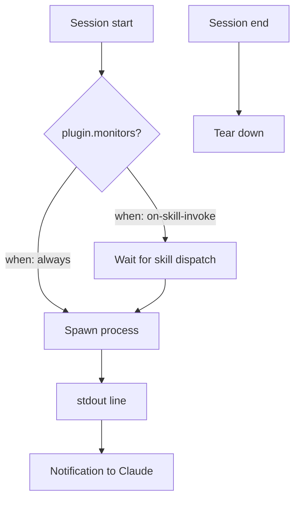

# Plugin Background Monitors: Declarative Supervision Auto-Armed at Session Start

> Plugins declare a top-level `monitors` manifest key; Claude Code arms each monitor automatically at session start or on skill invoke for the lifetime of the session.

Plugin-declared background monitors landed in Claude Code v2.1.105: "Added background monitor support for plugins via a top-level `monitors` manifest key that auto-arms at session start or on skill invoke" ([Claude Code changelog](https://code.claude.com/docs/en/changelog)). The plugin author ships the watcher; the harness arms it. Consumers do not write boilerplate to register supervision.

## The Manifest Contract

A plugin declares monitors at the top level of `plugin.json`, or in `monitors/monitors.json` at the plugin root. Each entry is one persistent background process whose stdout becomes notifications to Claude.

```json
[
  {
    "name": "error-log",
    "command": "tail -F ./logs/error.log",
    "description": "Application error log"
  },
  {
    "name": "deploy-status",
    "command": "${CLAUDE_PLUGIN_ROOT}/scripts/poll-deploy.sh ${user_config.api_endpoint}",
    "description": "Deployment status changes"
  }
]
```

Required fields are `name` (unique within the plugin), `command` (shell command run as a persistent background process in the session working directory), and `description` (shown in the task panel and notification summaries) ([Plugins reference — Monitors](https://code.claude.com/docs/en/plugins-reference#monitors)).

The optional `when` field controls trigger:

| Value | When the monitor starts |
|---|---|
| `"always"` (default) | Session start and on plugin reload |
| `"on-skill-invoke:<skill-name>"` | First time the named plugin skill is dispatched |

`command` accepts `${CLAUDE_PLUGIN_ROOT}`, `${CLAUDE_PLUGIN_DATA}`, `${user_config.*}`, and any `${ENV_VAR}` from the environment ([Plugins reference — Monitors](https://code.claude.com/docs/en/plugins-reference#monitors)).

## How It Differs From Hooks and the Monitor Tool

Three Claude Code primitives observe sessions; they fire at different points and carry different guarantees.

| Primitive | Trigger | Lifetime | Can block |
|---|---|---|---|
| [Hooks](hooks-lifecycle.md) | Tool-call boundaries (`PreToolUse`, `PostToolUse`, `Stop`, etc.) | Per event, synchronous | Yes (`PreToolUse`) |
| [Monitor tool](monitor-tool.md) | Claude calls it imperatively in-session | Until cancelled or session end | No |
| Plugin background monitor | Auto-armed at session start or on skill invoke | Whole session | No |



Hooks enforce at the tool-call boundary and can deny. Monitor tool calls require Claude to think to start the watch. Plugin monitors remove the "did the agent remember to arm the watcher?" failure mode by moving the trigger out of model reasoning into the harness ([Create plugins — Add background monitors](https://code.claude.com/docs/en/plugins#add-background-monitors-to-your-plugin)).

## Lifetime and Trust

- **Session-scoped.** Monitors stop only when the session ends. "Disabling a plugin mid-session does not stop monitors that are already running. They stop when the session ends." ([Plugins reference — Monitors](https://code.claude.com/docs/en/plugins-reference#monitors)).
- **Unsandboxed.** They "run unsandboxed at the same trust level as hooks" ([Plugins reference — Monitors](https://code.claude.com/docs/en/plugins-reference#monitors)). Treat marketplace-supplied monitors with the same scrutiny as installing arbitrary shell scripts — the [PromptArmor](https://www.promptarmor.com/resources/hijacking-claude-code-via-injected-marketplace-plugins) and [SentinelOne](https://www.sentinelone.com/blog/marketplace-skills-and-dependency-hijack-in-claude-code/) marketplace-injection disclosures apply directly.
- **Interactive CLI only.** Monitors run only in interactive sessions and reuse the [Monitor tool's](https://code.claude.com/docs/en/tools-reference#monitor-tool) availability constraints. They are skipped on Amazon Bedrock, Google Vertex AI, Microsoft Foundry, and when `DISABLE_TELEMETRY` or `CLAUDE_CODE_DISABLE_NONESSENTIAL_TRAFFIC` is set ([Tools reference — Monitor tool](https://code.claude.com/docs/en/tools-reference#monitor-tool)).

## What This Primitive Replaces

Before plugin monitors, cross-cutting supervision required per-project ceremony: a `SessionStart` hook spawning a background script, a [`/loop`](session-scheduling.md) the user remembered to run, or CLAUDE.md asking Claude to invoke the [Monitor tool](monitor-tool.md). The manifest key collapses the contract — a plugin embeds the watcher once, every consumer auto-arms it at session start.

## When This Backfires

- **Cross-session enforcement is impossible.** Persistent cost accounting, compliance audit logs, and reboot-surviving guardrails need systemd, cron, or an external supervisor, not a session-scoped monitor.
- **Silent auto-arm failures already shipped.** Issue [anthropics/claude-code#52245](https://github.com/anthropics/claude-code/issues/52245) reports that on 2.1.118 (macOS), `monitors/monitors.json` spawns zero child processes at session start with no error logged; manual `Monitor` calls still work. Plugin authors relying on auto-arm get no coverage without realizing it.
- **Chatty processes are auto-killed.** Plugin monitors share the [Monitor tool's](monitor-tool.md) behavior — monitors that produce too many events are stopped automatically. A verbose test runner or webpack rebuild leaves a silent gap until restart with a tighter filter.
- **Stderr and exit codes are invisible.** Monitor forwards stdout only. A watcher that errors to stderr or exits non-zero looks healthy.
- **Pipe buffering delays events.** When piping through `grep` or similar, use `--line-buffered` — block buffering can hold output for minutes on low-traffic streams.
- **Three hosting providers are a no-op.** Bedrock, Vertex AI, and Foundry skip monitors entirely — a plugin shipping monitors as a primary feature ships dead code there.
- **Mid-session disable does not stop running monitors.** Disabling the plugin leaves the process running until session end ([Plugins reference — Monitors](https://code.claude.com/docs/en/plugins-reference#monitors)).

## Example

A plugin that ships a protected-path tripwire — file writes under `/etc/` or to anything matching `*.pem` are flagged in real time without the consumer wiring up anything beyond installing the plugin.

**`my-tripwire-plugin/.claude-plugin/plugin.json`**:

```json
{
  "name": "tripwire",
  "version": "1.0.0",
  "description": "Surface writes to protected paths during a session",
  "monitors": "./monitors/monitors.json"
}
```

**`my-tripwire-plugin/monitors/monitors.json`**:

```json
[
  {
    "name": "protected-path-writes",
    "command": "${CLAUDE_PLUGIN_ROOT}/bin/watch-protected.sh",
    "description": "Writes to /etc/ or *.pem files"
  }
]
```

**`my-tripwire-plugin/bin/watch-protected.sh`** (uses `fswatch` or `inotifywait`, line-buffered):

```bash
#!/usr/bin/env bash
fswatch --event Updated --event Created /etc "$HOME" 2>/dev/null \
  | grep --line-buffered -E '^/etc/|\.pem$' \
  | while IFS= read -r path; do
      printf 'TRIPWIRE %s %s\n' "$(date -Iseconds)" "$path"
    done
```

A consumer installs the plugin once. Every subsequent session arms the watcher at start; any matched write surfaces as a notification mid-conversation. No `SessionStart` hook, no `/loop` invocation, no instruction in CLAUDE.md.

## Key Takeaways

- The `monitors` manifest key is the third declarative supervision primitive in Claude Code, alongside hooks (tool-boundary) and CLAUDE.md (instructions) — distinct from both
- Auto-armed at session start by default, or on first dispatch of a named skill via `when: "on-skill-invoke:<skill>"`
- Session-scoped and torn down at session end — not a substitute for systemd, cron, or external supervisors for cross-session enforcement
- Unsandboxed at hook trust level — treat marketplace monitors the same as arbitrary shell scripts
- Skipped on Bedrock, Vertex AI, Foundry, and when telemetry is disabled
- Each stdout line becomes a notification; chatty monitors are auto-killed and stderr-only failures are invisible

## Related

- [Monitor Tool: Event Streaming from Background Scripts](monitor-tool.md)
- [Hooks and Lifecycle](hooks-lifecycle.md)
- [Hooks and Lifecycle Events](../../tool-engineering/hooks-lifecycle-events.md)
- [Session Initialization Ritual](../../agent-design/session-initialization-ritual.md)
- [Session Scheduling](session-scheduling.md)
- [Plugin and Extension Packaging](../../standards/plugin-packaging.md)
- [Extension Points](extension-points.md)
- [Observability](../../observability/index.md)
