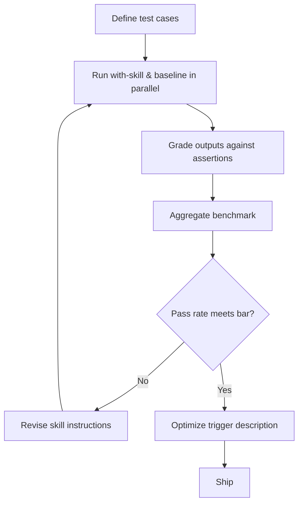

# Skill Eval Loop

> Define test cases, benchmark pass rates, A/B-compare skill versions, and optimize trigger descriptions — bringing eval-driven development to skill authoring without writing code.

Skills fail on two independent axes: **output quality** (does the skill produce good results?) and **trigger precision** (does it activate at the right time?). The skill-creator eval framework addresses both with a structured loop: define evals, run benchmarks, compare versions, and optimize descriptions. [Source: [Improving skill-creator](https://claude.com/blog/improving-skill-creator-test-measure-and-refine-agent-skills)]

---

## The Eval Loop



### Step 1: Define Test Cases

Each eval has three parts stored in `evals/evals.json`:

- **Prompt** — a realistic user message with concrete details (file paths, column names, context)
- **Expected output** — a human-readable description of success
- **Input files** (optional) — files the skill needs to work with

Start with 2-3 test cases. Add assertions after the first run — you often cannot define "good" until you see what the skill produces. [Source: [Evaluating skill output quality](https://agentskills.io/skill-creation/evaluating-skills)]

```json
{
  "skill_name": "csv-analyzer",
  "evals": [
    {
      "id": 1,
      "prompt": "I have a CSV of monthly sales data in data/sales_2025.csv. Find the top 3 months by revenue and make a bar chart.",
      "expected_output": "A bar chart showing the top 3 months by revenue with labeled axes.",
      "files": ["evals/files/sales_2025.csv"]
    }
  ]
}
```

### Step 2: Run Evals in Parallel

The skill-creator spawns independent agents for each eval — one with the skill, one without (or with the previous version). Each agent operates in a clean context with isolated token and timing metrics. This prevents context bleeding between runs and produces comparable measurements. [Source: [Improving skill-creator](https://claude.com/blog/improving-skill-creator-test-measure-and-refine-agent-skills)]

Workspace structure after a run:

```
csv-analyzer-workspace/
└── iteration-1/
    ├── eval-1/
    │   ├── with_skill/
    │   │   ├── outputs/
    │   │   ├── timing.json
    │   │   └── grading.json
    │   └── without_skill/
    │       ├── outputs/
    │       ├── timing.json
    │       └── grading.json
    └── benchmark.json
```

### Step 3: Grade and Benchmark

Assertions are verifiable statements about what the output should contain. Good assertions are specific and observable ("The bar chart has labeled axes"), not vague ("The output is good"). Grade with code-based checks for deterministic properties, LLM-as-judge for nuanced quality, or human review as the gold standard. [Source: [Demystifying evals](https://www.anthropic.com/engineering/demystifying-evals-for-ai-agents)]

Benchmark aggregation produces three metrics per configuration:

```json
{
  "with_skill": {
    "pass_rate": { "mean": 0.83, "stddev": 0.06 },
    "time_seconds": { "mean": 45.0, "stddev": 12.0 },
    "tokens": { "mean": 3800, "stddev": 400 }
  },
  "without_skill": {
    "pass_rate": { "mean": 0.33, "stddev": 0.10 }
  },
  "delta": { "pass_rate": 0.50, "time_seconds": 13.0, "tokens": 1700 }
}
```

The delta quantifies what the skill costs (more time, more tokens) and what it buys (higher pass rate). A 13-second overhead for a 50-point pass rate improvement is a different trade-off than doubling tokens for a 2-point gain. [Source: [Evaluating skill output quality](https://agentskills.io/skill-creation/evaluating-skills)]

### Step 4: Analyze and Iterate

After each iteration, examine the results for actionable patterns: [Source: [Evaluating skill output quality](https://agentskills.io/skill-creation/evaluating-skills)]

- **Assertions that always pass in both configurations** — not discriminating; remove or replace them
- **Assertions that always fail in both** — broken assertion or impossible task; fix before next iteration
- **Pass with skill, fail without** — where the skill adds clear value; understand why
- **High variance across runs** — ambiguous instructions; add examples or tighten guidance

Revise `SKILL.md` based on failed assertions, human feedback, and execution transcripts. Generalize fixes rather than patching individual test cases. Rerun in `iteration-N+1/` and compare.

---

## Blind A/B Comparison

When iterating on prompts or instructions, sequential evaluation introduces anchoring bias — the second version is judged relative to the first. The skill-creator's comparator agents eliminate this: a separate agent receives outputs from version A and version B without labels and grades which is better on each criterion. [Source: [Improving skill-creator](https://claude.com/blog/improving-skill-creator-test-measure-and-refine-agent-skills)]

This applies beyond skill-vs-no-skill. Compare two skill versions, two different skills that solve the same problem, or the same skill running on two different models.

---

## Trigger Description Optimization

Output quality evals only matter if the skill triggers. The description optimization loop tests and improves trigger precision:

1. **Generate trigger queries** — ~20 queries: 8-10 that should trigger the skill, 8-10 that should not. Should-trigger queries use varied phrasings (casual, formal, implicit). Should-not-trigger queries are near-misses with shared keywords but different intent. [Source: [Skill-creator SKILL.md](https://github.com/anthropics/skills/blob/main/skills/skill-creator/SKILL.md)]

2. **Run the optimization loop** — the skill-creator analyzes the current description against sample prompts and suggests edits to reduce false positives and false negatives.

3. **Apply and verify** — update the `description` field in `SKILL.md` frontmatter and rerun the trigger eval set.

Testing across public document-creation skills showed improved triggering on 5 of 6 skills. [Source: [Improving skill-creator](https://claude.com/blog/improving-skill-creator-test-measure-and-refine-agent-skills)]

Effective trigger queries are realistic and detailed, not generic:

**Weak**: `"Format this data"` — too vague; could match many skills.

**Strong**: `"my boss sent me Q4_sales_final_v2.xlsx and wants a profit margin column — revenue is in C and costs are in D"` — concrete details, casual tone, no skill name mentioned.

---

## Model Upgrade Eval Strategies

The two skill categories require different eval approaches on model upgrades: [Source: [Improving skill-creator](https://claude.com/blog/improving-skill-creator-test-measure-and-refine-agent-skills)]

- **Capability uplift** skills encode techniques the base model cannot do consistently. Compare the skill-augmented agent against the raw model — if the raw model matches or exceeds the skill, retire it.
- **Encoded preference** skills sequence capabilities according to team-specific workflows. Verify workflow fidelity (step ordering, output format, required checks) rather than raw output quality — the model cannot infer your process.

---

## Key Takeaways

- Skills have two independent failure surfaces: output quality and trigger precision — eval both
- Start with 2-3 test cases; add assertions after the first run, not before
- Run with-skill and baseline evals in parallel with isolated agent contexts to prevent cross-contamination
- Use blind A/B comparison (comparator agents) to eliminate anchoring bias when iterating
- Benchmark delta (pass rate, time, tokens) quantifies the cost-benefit trade-off of a skill
- Optimize trigger descriptions with should-trigger and should-not-trigger query sets
- On model upgrades, capability uplift skills may become obsolete; encoded preference skills need workflow fidelity checks

## Related

- [Extension Points](extension-points.md) — choosing between skills, hooks, rules, and other Claude Code mechanisms
- [Sub-Agents](sub-agents.md) — the isolated execution model that powers parallel eval runs
- [Skill Authoring Patterns](../../tool-engineering/skill-authoring-patterns.md) — description craft, implementation patterns, and troubleshooting
- [The Eval-First Development Loop](../../training/eval-driven-development/eval-first-loop.md) — the general eval-first workflow this technique specializes
- [What Evals Are](../../training/eval-driven-development/what-evals-are.md) — foundational concepts on agent evaluations and non-determinism
- [Enterprise Skill Marketplace](../../workflows/enterprise-skill-marketplace.md) — skill lifecycle including eval-gated publishing at scale
- [Skill Library Evolution](../../tool-engineering/skill-library-evolution.md) — managing skill lifecycle and deprecation
