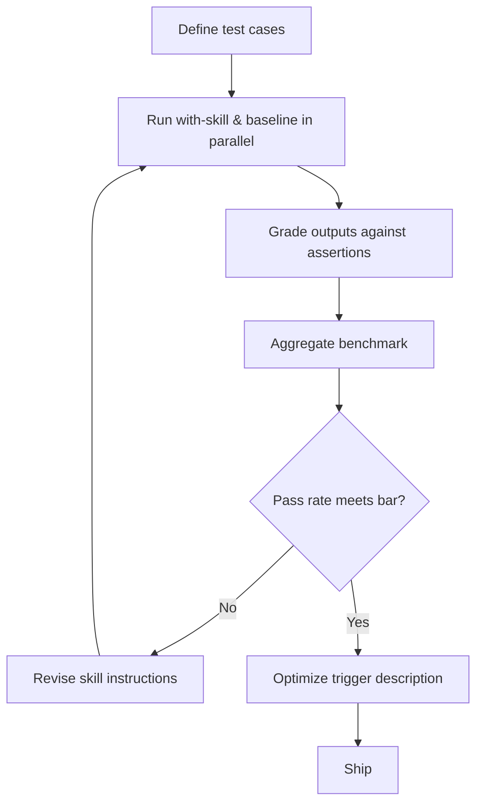

# Skill Eval Loop

> Define test cases, benchmark pass rates, A/B-compare skill versions, and optimize trigger descriptions — bringing [eval-driven development](../../workflows/eval-driven-development.md) to skill authoring without writing code.

Skills fail on two independent axes: **output quality** (does it produce good results?) and **trigger precision** (does it activate at the right time?). The skill-creator framework addresses both through a structured loop. [Source: [Improving skill-creator](https://claude.com/blog/improving-skill-creator-test-measure-and-refine-agent-skills)]

---

## The Eval Loop



### Step 1: Define Test Cases

Each eval in `evals/evals.json` has three parts: a realistic **prompt** with concrete details (paths, columns, context), an **expected output** description, and optional **input files**. Start with 2-3 cases; add assertions after the first run — you often cannot define "good" until you see what the skill produces. [Source: [Evaluating skill output quality](https://agentskills.io/skill-creation/evaluating-skills)]

```json
{
  "skill_name": "csv-analyzer",
  "evals": [
    {
      "id": 1,
      "prompt": "I have a CSV of monthly sales data in data/sales_2025.csv. Find the top 3 months by revenue and make a bar chart.",
      "expected_output": "A bar chart showing the top 3 months by revenue with labeled axes.",
      "files": ["evals/files/sales_2025.csv"]
    }
  ]
}
```

### Step 2: Run Evals in Parallel

skill-creator spawns independent agents per eval — one with the skill, one without (or the prior version). Each runs in an isolated context, preventing bleed between runs. [Source: [Improving skill-creator](https://claude.com/blog/improving-skill-creator-test-measure-and-refine-agent-skills)]

Workspace structure after a run:

```
csv-analyzer-workspace/
└── iteration-1/
    ├── eval-1/
    │   ├── with_skill/
    │   │   ├── outputs/
    │   │   ├── timing.json
    │   │   └── grading.json
    │   └── without_skill/
    │       ├── outputs/
    │       ├── timing.json
    │       └── grading.json
    └── benchmark.json
```

### Step 3: Grade and Benchmark

Assertions should be specific and observable ("The bar chart has labeled axes"), not vague ("The output is good"). Grade with code-based checks for deterministic properties, LLM-as-judge for nuanced quality, or human review as the gold standard. [Source: [Demystifying evals](https://www.anthropic.com/engineering/demystifying-evals-for-ai-agents)]

Benchmark aggregation produces three metrics per configuration:

```json
{
  "with_skill": {
    "pass_rate": { "mean": 0.83, "stddev": 0.06 },
    "time_seconds": { "mean": 45.0, "stddev": 12.0 },
    "tokens": { "mean": 3800, "stddev": 400 }
  },
  "without_skill": {
    "pass_rate": { "mean": 0.33, "stddev": 0.10 }
  },
  "delta": { "pass_rate": 0.50, "time_seconds": 13.0, "tokens": 1700 }
}
```

The delta quantifies skill cost (time, tokens) vs benefit (pass rate). A 13-second overhead for a 50-point gain is a different trade-off than doubling tokens for a 2-point gain. [Source: [Evaluating skill output quality](https://agentskills.io/skill-creation/evaluating-skills)]

### Step 4: Analyze and Iterate

Examine each iteration for actionable patterns: [Source: [Evaluating skill output quality](https://agentskills.io/skill-creation/evaluating-skills)]

- **Always pass in both** — not discriminating; remove or replace
- **Always fail in both** — broken assertion or impossible task; fix before next iteration
- **Pass with skill, fail without** — where the skill adds clear value; understand why
- **High variance across runs** — ambiguous instructions; add examples or tighten guidance

Revise `SKILL.md` from failed assertions and transcripts. Generalize fixes rather than patching individual cases. Rerun in `iteration-N+1/` and compare.

---

## Blind A/B Comparison

Sequential evaluation introduces anchoring bias — the second version is judged relative to the first. Comparator agents eliminate this: a grader receives A and B outputs without labels and scores each criterion blindly. [Source: [Improving skill-creator](https://claude.com/blog/improving-skill-creator-test-measure-and-refine-agent-skills)] This extends beyond skill-vs-no-skill to comparing versions, competing skills, or the same skill across models.

---

## Trigger Description Optimization

Output quality evals only matter if the skill triggers. The description optimization loop:

1. **Generate ~20 trigger queries** — 8-10 should-trigger (varied phrasings: casual, formal, implicit) and 8-10 should-not-trigger (near-misses with shared keywords, different intent). [Source: [Skill-creator SKILL.md](https://github.com/anthropics/skills/blob/main/skills/skill-creator/SKILL.md)]
2. **Run the loop** — skill-creator scores the current description against the queries and suggests edits that cut false positives and false negatives.
3. **Apply and verify** — update the `description` field in `SKILL.md` frontmatter and rerun the set.

Testing across public document-creation skills improved triggering on 5 of 6. [Source: [Improving skill-creator](https://claude.com/blog/improving-skill-creator-test-measure-and-refine-agent-skills)]

Queries must be realistic and detailed. **Weak**: `"Format this data"` — too vague. **Strong**: `"my boss sent me Q4_sales_final_v2.xlsx and wants a profit margin column — revenue is in C, costs in D"` — concrete, casual, no skill name mentioned.

---

## Model Upgrade Eval Strategies

Two skill categories need different eval approaches on model upgrades: [Source: [Improving skill-creator](https://claude.com/blog/improving-skill-creator-test-measure-and-refine-agent-skills)]

- **Capability uplift** — encodes techniques the base model cannot do consistently. Compare skill-augmented vs raw model; if raw matches or exceeds, retire the skill.
- **Encoded preference** — sequences capabilities to fit team workflows. Verify workflow fidelity (step order, output format, required checks) rather than raw quality — the model cannot infer your process.

---

## When This Backfires

The loop has real overhead and fails predictably:

- **Rarely-triggered or single-use skills** — harness cost (parallel runs, grading, bookkeeping) can exceed lifetime savings; ad-hoc manual QA may win.
- **Same-model LLM-as-judge grading** — grader agents inherit the target model's biases, inflating pass rates on outputs the model itself would not critique. Prefer code-based assertions and human spot-checks for subjective quality. [Source: [Demystifying evals](https://www.anthropic.com/engineering/demystifying-evals-for-ai-agents)]
- **Assertion over-fitting** — a fixed eval set can tune the skill to that set while drifting on real traffic. Refresh cases from production prompts.
- **Subjective skills** — writing style, design, and taste resist objective assertions; force-fitting produces a green benchmark that tells you nothing. [Source: [Evaluating skill output quality](https://agentskills.io/skill-creation/evaluating-skills)]

---

## Key Takeaways

- Skills have two independent failure surfaces: output quality and trigger precision — eval both
- Start with 2-3 test cases; add assertions after the first run, not before
- Run with-skill and baseline evals in parallel with isolated agent contexts to prevent cross-contamination
- Use blind A/B comparison (comparator agents) to eliminate anchoring bias when iterating
- Benchmark delta (pass rate, time, tokens) quantifies the cost-benefit trade-off of a skill
- Optimize trigger descriptions with should-trigger and should-not-trigger query sets
- On model upgrades, capability uplift skills may become obsolete; encoded preference skills need workflow fidelity checks

## Related

- [Extension Points](extension-points.md) — choosing between skills, hooks, rules, and other Claude Code mechanisms
- [Sub-Agents](sub-agents.md) — the isolated execution model that powers parallel eval runs
- [Skill Authoring Patterns](../../tool-engineering/skill-authoring-patterns.md) — description craft, implementation patterns, and troubleshooting
- [The Eval-First Development Loop](../../training/eval-driven-development/eval-first-loop.md) — the general eval-first workflow this technique specializes
- [What Evals Are](../../training/eval-driven-development/what-evals-are.md) — foundational concepts on agent evaluations and non-determinism
- [Enterprise Skill Marketplace](../../workflows/enterprise-skill-marketplace.md) — skill lifecycle including eval-gated publishing at scale
- [Skill Library Evolution](../../tool-engineering/skill-library-evolution.md) — managing skill lifecycle and deprecation
