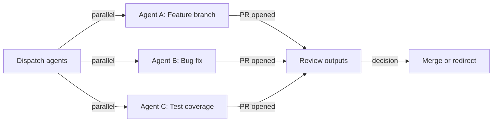

# Agent Mission Control

> GitHub's centralized dashboard for assigning, steering, and tracking Copilot coding agent tasks across repositories.

[Announced October 2025](https://github.blog/changelog/2025-10-28-a-mission-control-to-assign-steer-and-track-copilot-coding-agent-tasks/), Mission Control consolidates task creation, monitoring, steering, and review into a single view. In practice, this moves the workflow from managing one agent at a time in an IDE terminal to dispatching multiple agents across repositories and reviewing their outputs from a single page.

## Access Points

Tasks can be created from multiple entry points:

- **github.com/copilot/agents** — dedicated agents dashboard
- **github.com/copilot** — type `/task` in the chat interface to create a task
- **Issues page** — assign to Copilot directly from an issue
- **GitHub Mobile** — dispatch and monitor on the go

## Parallel Orchestration

Mission Control supports running multiple agents simultaneously rather than sequentially [unverified — based on dashboard UI; GitHub has not documented explicit concurrency guarantees].

For task decomposition guidance — what runs well in parallel vs. what should stay sequential, and the bottleneck shift it creates — see [Parallel Agent Sessions](../../workflows/parallel-agent-sessions.md).

## Real-Time Steering

Two surfaces for steering a session mid-run:

1. **Chat panel** — send a redirect message while the session runs; Copilot applies it after its current tool call completes [unverified — queuing behavior may vary]
2. **Files Changed view** — comment directly on specific lines to correct implementation details

**Session logs** expose Copilot's reasoning alongside the Overview and Files Changed tabs. Check logs before reviewing code — a reasoning error caught in the log is cheaper to correct than one traced through a diff.

For the general steering framework — when to intervene, how to phrase corrections, and what early intervention costs vs. late — see [Steering Running Agents](../../agent-design/steering-running-agents.md).

## Drift Detection

Signs to look for in session logs and the Files Changed view:

| Signal | Where to catch it |
|--------|------------------|
| Unexpected files in diff | Files Changed tab |
| Changes beyond requested scope | Files Changed tab |
| Reasoning doesn't match the task intent | Session logs tab |
| Circular behavior (repeating failed approach) | Session logs tab |

When drift is detected, redirect via chat with a specific correction. For a systematic diagnostic framework, see [Task List Divergence Diagnostic](../../verification/task-list-divergence-diagnostic.md).

## Enterprise Session Filters

[Added March 2026](https://github.blog/changelog/2026-03-05-discover-and-manage-agent-activity-with-new-session-filters/), Enterprise AI Controls adds session filtering across the organization:

| Filter | Values |
|--------|--------|
| Status | queued, in progress, completed, failed, idle (waiting for user), timed out, cancelled |
| Repository | any repo in the org |
| User | any member who triggered a session |

These complement search by agent and organization, letting admins filter sessions across the org — useful for tracking agent utilization, identifying blocked sessions, and reviewing usage patterns.

## Custom Agents + Mission Control

[Custom agents](custom-agents-skills.md) defined in `.github/agents/` compose naturally with Mission Control — assign a task to a specialized agent rather than Copilot's default persona. A `security-reviewer` agent with focused instructions produces more consistent outputs across Mission Control sessions than re-specifying context in every task prompt.

Custom agents reduce the prompt engineering overhead per task: write the agent once, reference it across as many concurrent tasks as needed.

## Review Workflow

When a session completes and a PR is opened:

1. **Check session logs first** — identify reasoning errors before reviewing code
2. **Scan files changed** — flag unexpected modifications and changes to shared or critical code paths
3. **Verify CI** — all checks should pass; investigate failures before merging
4. **Request self-review** — ask Copilot to review edge cases and boundary conditions (see [Agent Self-Review Loop](../../agent-design/agent-self-review-loop.md))
5. **Batch similar reviews** — group PRs from related tasks to maintain context between reviews

## Example

A team uses Mission Control to parallelize a feature rollout across three concerns:

1. **Create tasks** from `github.com/copilot/agents`:
    - Task 1: "Add rate limiting middleware to the payments API" → assign to `@copilot` in `payments-service`
    - Task 2: "Write integration tests for the new rate limiter" → assign to `test-writer` custom agent in `payments-service`
    - Task 3: "Update API docs to reflect rate limit headers" → assign to `@copilot` in `api-docs`

2. **Monitor from the dashboard** — all three sessions appear in the Mission Control view. Task 2 enters "idle (waiting for user)" because the test agent needs clarification on expected status codes.

3. **Steer Task 2 mid-run** — open the chat panel for Task 2 and send: "Use 429 Too Many Requests with a `Retry-After` header. See RFC 6585." The agent resumes after its current tool call completes.

4. **Review outputs** — Task 1 and Task 3 complete with PRs. Check session logs for Task 1 before reviewing its diff — the log shows the agent considered two middleware placement options and chose the one closest to the route handler. Scan Files Changed for Task 3 to confirm only documentation files were modified.

5. **Batch review** — review Task 1 and Task 2 PRs together since they modify the same service, then merge Task 3 independently.

## Key Takeaways

- Mission Control provides a single view for dispatching and monitoring multiple agent sessions concurrently
- Session logs reveal agent reasoning; read them before the diff, not after
- Custom agents reduce per-task context overhead; define them once, reuse across sessions
- Enterprise session filters provide governance visibility across the organization

## Unverified Claims

- Mission Control supports running multiple agents simultaneously rather than sequentially [unverified — based on dashboard UI; GitHub has not documented explicit concurrency guarantees]
- Chat panel redirect messages are applied after the current tool call completes [unverified — queuing behavior may vary]

## Related

- [GitHub Copilot Agent Mode](agent-mode.md)
- [Agent HQ (Multi-Agent Platform)](agent-hq.md)
- [Coding Agent](coding-agent.md)
- [Custom Agents, Skills & Plugins](custom-agents-skills.md)
- [Steering Running Agents](../../agent-design/steering-running-agents.md)
- [Parallel Agent Sessions](../../workflows/parallel-agent-sessions.md)
- [Task List Divergence Diagnostic](../../verification/task-list-divergence-diagnostic.md)
- [Copilot CLI Agentic Workflows](copilot-cli-agentic-workflows.md)
