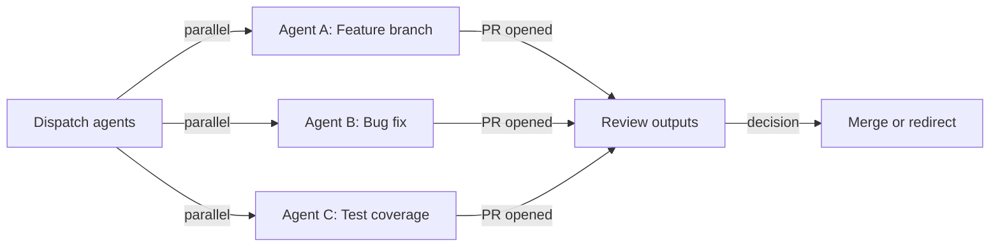

# Agent Mission Control

> GitHub's centralized dashboard for assigning, steering, and tracking Copilot coding agent tasks across repositories.

[Announced October 2025](https://github.blog/changelog/2025-10-28-a-mission-control-to-assign-steer-and-track-copilot-coding-agent-tasks/), Mission Control brings task creation, monitoring, steering, and review into one view. It shifts your workflow from managing one agent at a time in an IDE terminal to dispatching many agents across repositories and reviewing their outputs on a single page.

## Access points

You can create tasks from several entry points:

- github.com/copilot/agents — the dedicated agents dashboard
- github.com/copilot — type `/task` in the chat to create a task
- Issues page — assign a task to Copilot from an issue
- GitHub Mobile — dispatch and monitor from your phone

## Parallel orchestration

Mission Control lets you [start many tasks in minutes across one or many repositories](https://github.blog/ai-and-ml/github-copilot/how-to-orchestrate-agents-using-mission-control/) rather than managing one agent at a time.

```mermaid
graph LR
    A[Dispatch agents] -->|parallel| B[Agent A: Feature branch]
    A -->|parallel| C[Agent B: Bug fix]
    A -->|parallel| D[Agent C: Test coverage]
    B -->|PR opened| E[Review outputs]
    C -->|PR opened| E
    D -->|PR opened| E
    E -->|decision| F[Merge or redirect]
```

For task decomposition guidance — what runs well in parallel versus what should stay sequential, and the bottleneck shift it creates — see [Parallel Agent Sessions](../../workflows/parallel-agent-sessions.md).

## Real-time steering

You can steer a session mid-run from two surfaces:

1. Chat panel — send a redirect message while the session runs. Per GitHub, [Copilot adapts "as soon as its current tool call completes"](https://github.blog/changelog/2025-10-28-a-mission-control-to-assign-steer-and-track-copilot-coding-agent-tasks/).
2. Files Changed view — comment on specific lines to correct implementation details.

Session logs show Copilot's reasoning alongside the Overview and Files Changed tabs. Check the logs before reviewing code. A reasoning error caught in the log is cheaper to correct than one traced through a diff.

For the general steering framework — when to intervene, how to phrase corrections, and what early intervention costs versus late — see [Steering Running Agents](../../patterns/agent-design/steering-running-agents.md).

## Drift detection

Signs to look for in session logs and the Files Changed view:

| Signal | Where to catch it |
|--------|------------------|
| Unexpected files in diff | Files Changed tab |
| Changes beyond requested scope | Files Changed tab |
| Reasoning doesn't match the task intent | Session logs tab |
| Circular behavior (repeating failed approach) | Session logs tab |

When you spot drift, redirect via chat with a specific correction. For a systematic diagnostic framework, see [Task List Divergence Diagnostic](../../instructions/task-list-divergence-diagnostic.md).

## Enterprise session filters

[Added March 2026](https://github.blog/changelog/2026-03-05-discover-and-manage-agent-activity-with-new-session-filters/), Enterprise AI Controls adds session filtering across the organization:

| Filter | Values |
|--------|--------|
| Status | queued, in progress, completed, failed, idle (waiting for user), timed out, canceled |
| Repository | any repo in the org |
| User | any member who triggered a session |

These complement search by agent and organization, letting admins filter sessions across the organization. This helps you track agent use, find blocked sessions, and review usage patterns.

## Custom agents and Mission Control

[Custom agents](custom-agents-skills.md) defined in `.github/agents/` work well with Mission Control — assign a task to a specialized agent rather than Copilot's default persona. A `security-reviewer` agent with focused instructions produces more consistent outputs across Mission Control sessions than re-specifying context in every task prompt.

Custom agents cut the prompt engineering work per task: write the agent once, then reference it across as many concurrent tasks as needed.

## Review workflow

When a session completes and a PR is opened:

1. Check session logs first to find reasoning errors before reviewing code.
2. Scan files changed to flag unexpected modifications and changes to shared or critical code paths.
3. Verify CI — all checks should pass, so investigate failures before merging.
4. Request a self-review — ask Copilot to review edge cases and boundary conditions (see [Agent Self-Review Loop](../../code-review/agent-self-review-loop.md)).
5. Batch similar reviews — group PRs from related tasks to keep context between reviews.

## Example

A team uses Mission Control to parallelize a feature rollout across three concerns:

1. Create tasks from `github.com/copilot/agents`:
    - Task 1: "Add rate limiting middleware to the payments API" → assign to `@copilot` in `payments-service`
    - Task 2: "Write integration tests for the new rate limiter" → assign to `test-writer` custom agent in `payments-service`
    - Task 3: "Update API docs to reflect rate limit headers" → assign to `@copilot` in `api-docs`

2. Monitor from the dashboard. All three sessions appear in the Mission Control view. Task 2 enters "idle (waiting for user)" because the test agent needs clarification on expected status codes.

3. Steer Task 2 mid-run. Open the chat panel for Task 2 and send: "Use 429 Too Many Requests with a `Retry-After` header. See RFC 6585." The agent resumes after its current tool call completes.

4. Review outputs. Task 1 and Task 3 complete with PRs. Check session logs for Task 1 before reviewing its diff — the log shows the agent considered two middleware placement options and chose the one closest to the route handler. Scan Files Changed for Task 3 to confirm only documentation files were modified.

5. Batch review. Review the Task 1 and Task 2 PRs together since they modify the same service, then merge Task 3 independently.

## Key Takeaways

- Mission Control provides a single view for dispatching and monitoring multiple agent sessions concurrently
- Session logs reveal agent reasoning; read them before the diff, not after
- Custom agents reduce per-task context overhead; define them once, reuse across sessions
- Enterprise session filters provide governance visibility across the organization

## When this backfires

- Review is the bottleneck. Five parallel sessions only help if one reviewer can evaluate five concurrent PRs without rubber-stamping. Otherwise dispatch speeds up churn, not delivery (see [parallel agent sessions](../../workflows/parallel-agent-sessions.md)).
- Cloud-only feedback loop. Iteration latency is bound by round-trips to github.com. For tight inner-loop work, an IDE-attached session (Copilot agent mode or a local CLI) gives faster steering than a dashboard.
- Single-repo scoping. A Mission Control task scopes to one repository. Work that spans repositories still needs per-repo decomposition or a multi-repo harness.
- Silent drift. It is easy to dispatch more sessions than you have attention to read logs for, so abandoned sessions pile up unnoticed.

## Related

- [GitHub Copilot Agent Mode](agent-mode.md)
- [Agent HQ (Multi-Agent Platform)](agent-hq.md)
- [Coding Agent](coding-agent.md)
- [Copilot Cloud Agent Three-Phase Execution Model](cloud-agent-research-plan-code.md)
- [Copilot Cloud Agent Organization Controls](cloud-agent-org-controls.md)
- [Custom Agents, Skills & Plugins](custom-agents-skills.md)
- [Steering Running Agents](../../patterns/agent-design/steering-running-agents.md)
- [Parallel Agent Sessions](../../workflows/parallel-agent-sessions.md)
